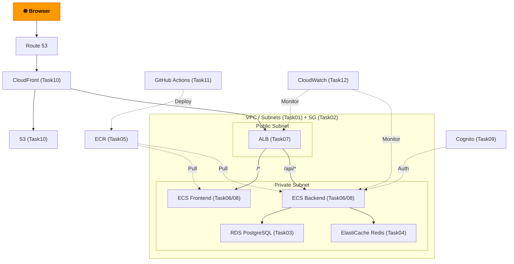
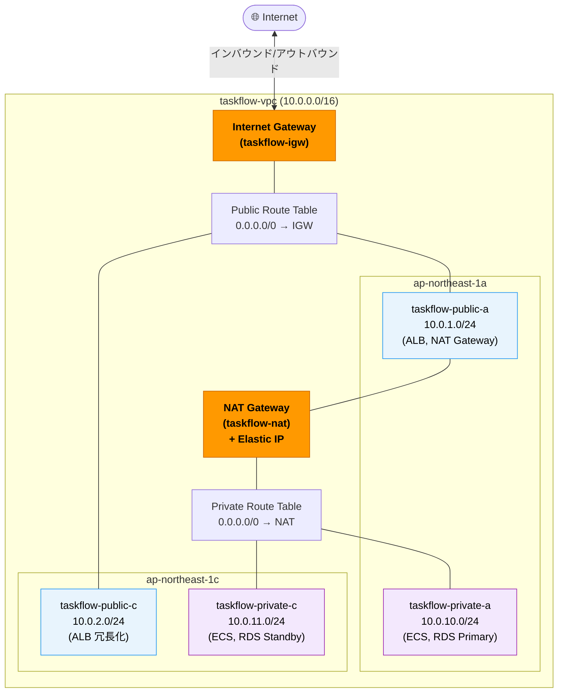

# Task 1: VPC・サブネット・ゲートウェイ構築（コンソール）

## 全体構成における位置づけ

> 図: TaskFlow全体アーキテクチャ（オレンジ色が今回構築するコンポーネント）

**今回構築する箇所:** VPC・サブネット・IGW・NAT Gateway（Task01）- 全リソースを収容するネットワーク基盤

---

> 図: VPCサブネット配置図（AZごとのパブリック/プライベート構成）

---

> 参照ナレッジ: [01_networking.md](../knowledge/01_networking.md)

## このタスクのゴール

TaskFlowアプリの全リソースを配置するネットワーク基盤を作る。

---

## ハンズオン手順

### Step 1: VPC の作成

1. AWSコンソール検索バーで **「VPC」** → VPCサービスを開く
2. 左メニュー → **「お使いのVPC」** → **「VPCを作成」**
3. 以下を入力して作成：

| 項目 | 値 | 判断理由 |
|------|----|---------|
| 名前タグ | `taskflow-vpc` | リソースが増えても識別できるよう命名 |
| IPv4 CIDR | `10.0.0.0/16` | /16で65,536個のIPを確保。サブネットで細分化する余裕を持たせる |
| IPv6 CIDRブロック | 設定しない | 今回はIPv4のみで十分。追加してもコスト・複雑さが増えるだけ |
| テナンシー | デフォルト | 専用テナンシー（Dedicated）はEC2インスタンスを物理ホストに専有する高コスト設定。通常は不要 |

#### タグの設定
| キー | 値 |
|------|-----|
| Name | taskflow-vpc |
| Environment | dev |
| Project | taskflow |
| ManagedBy | manual |

4. **「VPCを作成」** をクリック

### Step 2: サブネットの作成（4つ）

1. 左メニュー → **「サブネット」** → **「サブネットを作成」**
2. **VPC ID** で `taskflow-vpc` を選択
3. 「新しいサブネットを追加」で以下4つを一度に作成：

| 名前 | AZ | CIDR | 理由 |
|------|----|------|------|
| `taskflow-public-a` | ap-northeast-1a | 10.0.1.0/24 | ALB・NATを配置。外部公開が必要なリソース用 |
| `taskflow-public-c` | ap-northeast-1c | 10.0.2.0/24 | AZ-aが障害時にALBが継続稼働するための冗長化 |
| `taskflow-private-a` | ap-northeast-1a | 10.0.10.0/24 | ECS・RDS・Redisを配置。外部から直接到達不可 |
| `taskflow-private-c` | ap-northeast-1c | 10.0.11.0/24 | RDSのMulti-AZスタンバイ・ECSの冗長化用 |

各サブネットにタグを設定する（「サブネットを作成」画面の「タグ」セクション、またはサブネット作成後に個別編集）：

| キー | 値の例（サブネット名に合わせる） |
|------|------|
| Name | taskflow-public-a（各サブネット名） |
| Environment | dev |
| Project | taskflow |
| ManagedBy | manual |

> **なぜ1aと1cを使うのか：** 東京リージョンには1a・1c・1dがあるが、全インスタンスファミリーに対応しているのは1aと1cが多い。1dは一部のインスタンスタイプが使えない場合がある。

> **なぜCIDRをこの値にするのか：** パブリックは `10.0.1.x`/`10.0.2.x`（1〜9番台）、プライベートは `10.0.10.x`/`10.0.11.x`（10番台）と分けることで、IPアドレスを見ただけでパブリック/プライベートが分かる。

4. **「サブネットを作成」**

5. **パブリックサブネットのみ**「パブリックIP自動割り当て」を有効化：
   - `taskflow-public-a` を選択 → **「アクション」** → **「サブネットの設定を編集」**
   - **「パブリック IPv4 アドレスの自動割り当てを有効化」** にチェック → 保存
   - `taskflow-public-c` も同様

   > **プライベートサブネットには設定しない理由：** ECS・RDSにパブリックIPが付くとインターネットから到達できる経路が生まれてしまう。プライベートサブネットには設定しないことがセキュリティの基本。

### Step 3: インターネットゲートウェイの作成

1. 左メニュー → **「インターネットゲートウェイ」** → **「インターネットゲートウェイを作成」**
2. **名前タグ**: `taskflow-igw`

#### タグの設定
| キー | 値 |
|------|-----|
| Name | taskflow-igw |
| Environment | dev |
| Project | taskflow |
| ManagedBy | manual |

3. **「作成」**
4. 作成後 → **「アクション」** → **「VPCにアタッチ」** → `taskflow-vpc` を選択

> **IGW単体では通信できない理由：** IGWはVPCとインターネットをつなぐ「門」を設置するだけ。その門を通る「道（ルート）」をルートテーブルで設定して初めて通信できる。

### Step 4: NAT Gateway の作成

1. 左メニュー → **「NAT ゲートウェイ」** → **「NAT ゲートウェイを作成」**
2. 以下を設定：

| 項目 | 値 | 判断理由 |
|------|----|---------|
| 名前 | `taskflow-nat` | Name タグが自動作成される |
| アベイラビリティーモード | **ゾーナル** | devのシングルAZ構成に合わせる。リージョナルは本番向け（後述） |
| サブネット | `taskflow-public-a`（ap-northeast-1a） | NATはIGWへの経路があるパブリックに置く必要がある |
| 接続タイプ | **パブリック** | VPC内のリソースが外（インターネット）に出るため |
| Elastic IP 割り当て | **「Elastic IP を割り当て」** をクリック | NATには固定IPが必要。ボタン1クリックで新規割り当てされる |

> **アベイラビリティーモードの違い（2025年追加の新機能）：**
>
> AWSコンソールには「アベイラビリティーモード」という選択肢が表示されます。
>
> | モード | 選択後に表示される項目 | 特徴 |
> |--------|-----------------|------|
> | **リージョナル** | VPC選択UI | 全AZに自動スケール。AZをまたいだ冗長化を自動管理。本番向け |
> | **ゾーナル** | サブネット選択UI | 特定AZを指定して作成。1台構成で低コスト。dev向け |
>
> 今回は **ゾーナル** を選ぶと「サブネット」選択UIが現れます。リージョナルを選んだ場合は「VPC」を選択する画面に切り替わり、AZをまたいで自動的にEIPが3つ確保されます（= コスト3倍）。学習環境では不要なのでゾーナルを選んでください。

> **Elastic IP 割り当て方法（2025年追加の新機能）：**
>
> ゾーナルモードかつパブリック接続の場合、EIPの割り当て方法を選べます。
>
> | 方法 | 説明 |
> |------|------|
> | **自動** | AWSがEIPを自動管理。スケーリングしやすいが特定IPを固定できない |
> | **マニュアル** | コンプライアンス要件やIPホワイトリストで特定IPが必要なときに使う |
>
> 今回は制約がないため **「Elastic IP を割り当て」** ボタンをクリックして新規EIPを1つ割り当てれば十分です。

#### タグの設定（「新しいタグを追加」をクリックして入力）
| キー | 値 |
|------|-----|
| Name | taskflow-nat |
| Environment | dev |
| Project | taskflow |
| ManagedBy | manual |

3. **「NAT ゲートウェイを作成」** をクリック → ステータスが **「Pending」→「Available」** になるまで1〜2分待つ

> **なぜAZ-aだけにNATを作るのか：** AZ-cのプライベートサブネットも同じNATを使う。NATをAZごとに作ると高可用性は上がるが月額約33ドル×2台分のコストになる。学習環境や費用対効果が見合わない場合は1つで十分。本番で高可用性が必要な場合はAZごとに作成する（または本番ではリージョナルモードを検討）。

> **コスト警告（重要）：** NAT Gatewayは **作成しただけで時間課金** が始まる（約$0.045/時間 = 約**$33/月**）。学習を中断・完了したら必ず削除すること。
> - コンソールで削除: **NAT ゲートウェイ** → 選択 → **「アクション」** → **「NAT ゲートウェイを削除」**
> - TerraformのIaCタスクに進んだ場合: `terraform destroy` で一括削除できる
> - 削除後、紐づけたElastic IPも **「Elastic IP アドレス」** → **「アドレスの解放」** で解放すること（解放しなくても課金される）

### Step 5: ルートテーブルの設定

#### パブリック用ルートテーブル

1. 左メニュー → **「ルートテーブル」** → **「ルートテーブルを作成」**
2. **名前**: `taskflow-public-rt`、**VPC**: `taskflow-vpc`

#### タグの設定
| キー | 値 |
|------|-----|
| Name | taskflow-public-rt |
| Environment | dev |
| Project | taskflow |
| ManagedBy | manual |

3. **「作成」**
4. 選択 → **「ルート」タブ** → **「ルートを編集」** → **「ルートを追加」**
   - 送信先: `0.0.0.0/0`、ターゲット: `インターネットゲートウェイ` → `taskflow-igw`
   - 保存
4. **「サブネットの関連付け」タブ** → `taskflow-public-a` と `taskflow-public-c` を選択

> **`0.0.0.0/0` の意味：** 「その他の全ての宛先」。VPC内（10.0.0.0/16）向け以外の通信はIGW経由でインターネットへ出る、という設定。

#### プライベート用ルートテーブル

1. **「ルートテーブルを作成」** → **名前**: `taskflow-private-rt`、**VPC**: `taskflow-vpc`

#### タグの設定
| キー | 値 |
|------|-----|
| Name | taskflow-private-rt |
| Environment | dev |
| Project | taskflow |
| ManagedBy | manual |

2. **「ルート」タブ** → ルートを追加：
   - 送信先: `0.0.0.0/0`、ターゲット: `NATゲートウェイ` → `taskflow-nat`
3. **「サブネットの関連付け」タブ** → `taskflow-private-a` と `taskflow-private-c` を選択

> **なぜNATへのルートが必要か：** ECSがDockerイメージをECRから取得したり、外部APIを呼ぶためにアウトバウンド通信が必要。NATなしのプライベートサブネットのリソースは完全に外部から遮断されてしまう。

---

## 確認ポイント

1. **VPC** 一覧に `taskflow-vpc` (10.0.0.0/16) が表示されるか
2. **サブネット** 4つが存在し、パブリックにはパブリックIP自動割り当てが有効か
3. **IGW** のステータスが **Attached** か
4. **NAT Gateway** のステータスが **Available** か
5. **ルートテーブル** でパブリック→IGW、プライベート→NATの経路があるか（メインルートテーブルは使っていないことも確認）

---

**次のタスク:** [Task 2: セキュリティグループ設定](02_security_groups.md)
