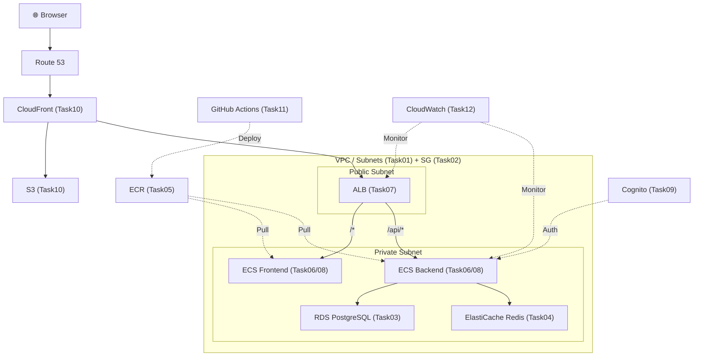
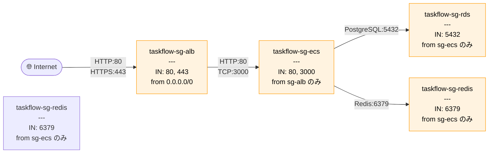

# Task 2: セキュリティグループ設定（コンソール）

## 全体構成における位置づけ

> 図: TaskFlow全体アーキテクチャ（オレンジ色が今回構築するコンポーネント）

**今回構築する箇所:** セキュリティグループ（Task02）- VPC内リソースの仮想ファイアウォール4つ

---

> 図: セキュリティグループ・チェーン図（通信の許可フロー）

---

> 参照ナレッジ: [02_security_groups.md](../knowledge/02_security_groups.md)

## このタスクのゴール

VPC内のリソースに付ける仮想ファイアウォールを4つ作る。

---

## ハンズオン手順

### Step 1: ALB 用セキュリティグループ

1. AWSコンソール → **「EC2」** → 左メニュー **「セキュリティグループ」** → **「セキュリティグループを作成」**

| 項目 | 値 | 判断理由 |
|------|----|---------|
| 名前 | `taskflow-sg-alb` | リソース名にSGの役割を明示する |
| 説明 | `ALB - Allow HTTP and HTTPS from internet` | 何を許可しているSGか一目で分かるように |
| VPC | `taskflow-vpc` | SGはVPCに紐づく。後から変更不可なので必ず確認 |

2. **インバウンドルール** → **「ルールを追加」**：

| タイプ | ポート | ソース | 理由 |
|--------|--------|--------|------|
| HTTP | 80 | `0.0.0.0/0` | ユーザーはブラウザからHTTPでアクセスしてくる。世界中から受け付ける必要がある |
| HTTPS | 443 | `0.0.0.0/0` | 本番はHTTPSが必要。今は設定だけしておく |

> **アウトバウンドはデフォルト（全許可）のまま：** ALBはECSコンテナへの返却通信が必要。宛先IPは動的に変わるので特定のIPに絞れない。また、SGはステートフルなのでインバウンドで許可した通信の応答は自動で通る。

#### タグの設定
| キー | 値 |
|------|-----|
| Name | taskflow-sg-alb |
| Environment | dev |
| Project | taskflow |
| ManagedBy | manual |

3. **「セキュリティグループを作成」**

### Step 2: ECS 用セキュリティグループ

1. **「セキュリティグループを作成」**

| 項目 | 値 | 判断理由 |
|------|----|---------|
| 名前 | `taskflow-sg-ecs` | |
| 説明 | `ECS - Allow traffic from ALB only` | |
| VPC | `taskflow-vpc` | |

2. **インバウンドルール**：

| タイプ | ポート | ソース | 理由 |
|--------|--------|--------|------|
| カスタムTCP | 3000 | `taskflow-sg-alb`（SGを選択） | Node.jsバックエンドのポート。ALBからのみ受け付ける |
| HTTP | 80 | `taskflow-sg-alb` | フロントエンドのNginxポート |

> **ソースにIPアドレスではなくSGを指定する理由：** ECSタスクを起動するたびにIPが変わる。ALBのIPも複数かつ変動する。SGのIDで指定すれば「そのSGを持つリソースからの通信」を動的に許可できるため、ルールの変更が不要になる。

> **なぜ0.0.0.0/0にしてはいけないか：** インターネットから直接ECSコンテナにアクセスできてしまう。ALBを経由させることでロギング・ヘルスチェック・SSL終端が機能する。

#### タグの設定
| キー | 値 |
|------|-----|
| Name | taskflow-sg-ecs |
| Environment | dev |
| Project | taskflow |
| ManagedBy | manual |

3. **「セキュリティグループを作成」**

### Step 3: RDS 用セキュリティグループ

1. **「セキュリティグループを作成」**

| 項目 | 値 |
|------|----|
| 名前 | `taskflow-sg-rds` |
| 説明 | `RDS - Allow PostgreSQL from ECS only` |
| VPC | `taskflow-vpc` |

2. **インバウンドルール**：

| タイプ | ポート | ソース | 理由 |
|--------|--------|--------|------|
| PostgreSQL | 5432 | `taskflow-sg-ecs` | DBはECSからのみアクセスされる。他のリソースから繋げる必要は一切ない |

> **VPC全体のCIDR（10.0.0.0/16）を指定しない理由：** VPC内の全リソース（将来追加するものも含む）からDBに接続できてしまう。ECSのSGに絞ることで、ECSが侵害されてもDB以外のリソースには横方向に波及しない。

#### タグの設定
| キー | 値 |
|------|-----|
| Name | taskflow-sg-rds |
| Environment | dev |
| Project | taskflow |
| ManagedBy | manual |

3. **「セキュリティグループを作成」**

### Step 4: Redis 用セキュリティグループ

1. **「セキュリティグループを作成」**

| 項目 | 値 |
|------|----|
| 名前 | `taskflow-sg-redis` |
| 説明 | `Redis - Allow traffic from ECS only` |
| VPC | `taskflow-vpc` |

2. **インバウンドルール**：

| タイプ | ポート | ソース | 理由 |
|--------|--------|--------|------|
| カスタムTCP | 6379 | `taskflow-sg-ecs` | RedisのデフォルトポートはTCP 6379。PostgreSQL同様ECSからのみ |

#### タグの設定
| キー | 値 |
|------|-----|
| Name | taskflow-sg-redis |
| Environment | dev |
| Project | taskflow |
| ManagedBy | manual |

3. **「セキュリティグループを作成」**

---

## 確認ポイント

1. **セキュリティグループ** 一覧に4つが表示されるか
2. `taskflow-sg-rds` のインバウンドソースが `taskflow-sg-ecs` のIDになっているか（`sg-xxxx` 形式）
3. `taskflow-sg-rds` に `0.0.0.0/0` が**絶対に含まれていないこと**を確認

---

**次のタスク:** [Task 3: RDS 構築](03_rds.md)
