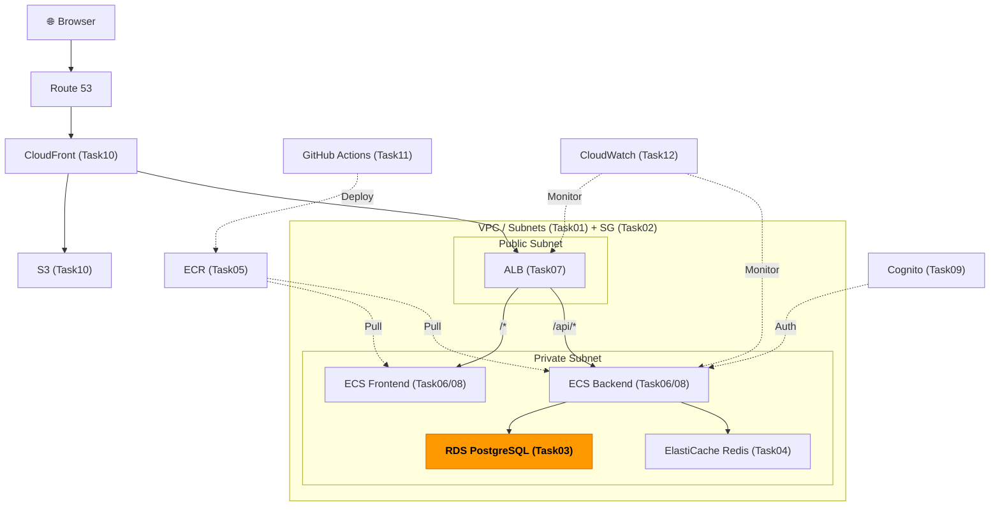
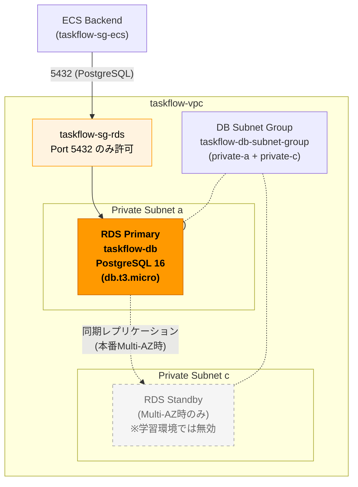

# Task 3: RDS PostgreSQL 構築（コンソール）

## 全体構成における位置づけ

> 図: TaskFlow全体アーキテクチャ（オレンジ色が今回構築するコンポーネント）

**今回構築する箇所:** RDS PostgreSQL（Task03）- タスクデータを永続化するリレーショナルDB

---

> 図: RDS配置図（プライベートサブネット内のMulti-AZ構成）

---

> 参照ナレッジ: [03_rds.md](../knowledge/03_rds.md)

## このタスクのゴール

TaskFlow のタスクデータを保存するPostgreSQLデータベースを構築する。

---

## ハンズオン手順

### Step 1: DB サブネットグループの作成

1. AWSコンソール → **「RDS」** → 左メニュー **「サブネットグループ」** → **「DBサブネットグループを作成」**

| 項目 | 値 | 判断理由 |
|------|----|---------|
| 名前 | `taskflow-db-subnet-group` | |
| 説明 | `Subnet group for TaskFlow RDS` | |
| VPC | `taskflow-vpc` | |
| サブネット | `taskflow-private-a`（AZ-a）+ `taskflow-private-c`（AZ-c） | DBはプライベートサブネットに配置。2AZ指定はRDSの要件かつMulti-AZ時の前提 |

> **パブリックサブネットを入れない理由：** パブリックに置くとIGW経由でインターネットからのアクセス経路が生まれる。DBはアプリ（ECS）からのみアクセスされるべきで、直接外部に公開する理由が一切ない。

2. **「作成」**

### Step 2: RDS インスタンスの作成

1. 左メニュー → **「データベース」** → **「データベースの作成」**

**基本設定：**

| 項目 | 値 | 判断理由 |
|------|----|---------|
| データベース作成方法 | 標準作成 | 簡単作成は設定を隠蔽するため学習には不向き。何を設定しているか把握するために標準を選ぶ |
| エンジン | PostgreSQL | 仕様書に指定あり |
| バージョン | PostgreSQL 16.x（最新の16系） | LTS相当の安定版。最新メジャーバージョンは成熟度に注意が必要だが16は実績十分 |
| テンプレート | 開発/テスト | 本番テンプレートはMulti-AZ・バックアップが強制されコストが上がる。学習段階では不要 |

**設定（認証情報）：**

| 項目 | 値 | 判断理由 |
|------|----|---------|
| DBインスタンス識別子 | `taskflow-db` | AWSコンソール上での識別名。接続URLとは別 |
| マスターユーザー名 | `taskflow_admin` | `postgres`（デフォルト）は攻撃者が最初に試すユーザー名なので変える |
| パスワード | 安全なパスワードを設定 | 必ずメモしておく。後で環境変数として使う |

**インスタンスの設定：**

| 項目 | 値 | 判断理由 |
|------|----|---------|
| DBインスタンスクラス | `db.t3.micro` | 学習用最小構成。無料利用枠の対象。本番では負荷に応じて選定 |
| ストレージタイプ | gp2 または gp3 | gp3の方が安くて高性能。コンソールでgp3が選べる場合はそちらを選ぶ |
| 割り当てストレージ | 20 GiB | 学習用最小値。アプリのデータ量に応じて設定 |
| ストレージの自動スケーリング | 無効 | 有効にすると自動で容量が増えてコストが予測しにくくなる。学習環境では無効 |

**可用性と耐久性：**

| 項目 | 値 | 判断理由 |
|------|----|---------|
| マルチAZ配置 | スタンバイインスタンスを作成しない | Multi-AZはコストが約2倍。学習環境では不要。本番では有効化する |

**接続：**

| 項目 | 値 | 判断理由 |
|------|----|---------|
| VPC | `taskflow-vpc` | |
| DBサブネットグループ | `taskflow-db-subnet-group` | Step 1で作成したもの |
| パブリックアクセス | **なし** | インターネットから直接接続不可に。ECS経由でのみアクセスする設計 |
| VPCセキュリティグループ | `taskflow-sg-rds`（既存のを選択、defaultは外す） | Task 2で作成した専用SG |
| アベイラビリティゾーン | ap-northeast-1a | 単一AZの場合はどちらでも可 |

**追加設定（展開して設定）：**

| 項目 | 値 | 判断理由 |
|------|----|---------|
| 最初のデータベース名 | `taskflow` | これを指定しないとDBが作成されない（インスタンスは作られるがDBは空） |
| バックアップ保持期間 | 7日 | 7日以内なら任意の時点に復元可能。0にすると無効化（非推奨） |
| バックアップウィンドウ | 任意 | トラフィックが最も少ない時間帯に設定するのが理想。学習環境では何でも良い |
| メンテナンスウィンドウ | 任意 | DBパッチが適用される時間帯。本番は影響を最小化する時間（深夜等）を指定 |
| 削除保護 | 無効 | 学習環境では削除できた方が良い。本番では有効化して誤削除を防ぐ |

**タグ：**（「追加設定」を展開した最下部「タグ」セクションに設定）

| キー | 値 |
|------|-----|
| Name | taskflow-rds-postgres |
| Environment | dev |
| Project | taskflow |
| ManagedBy | manual |

2. **「データベースの作成」** → 5〜10分待つ

### Step 3: エンドポイントの確認

データベース → `taskflow-db` → **「接続とセキュリティ」タブ**

- **エンドポイント**: `taskflow-db.xxxxxxxx.ap-northeast-1.rds.amazonaws.com`（これをメモ）
- **ポート**: `5432`

このエンドポイントはTask 8（ECSのタスク定義）で `DATABASE_URL` 環境変数として使う。

---

## 確認ポイント

1. ステータスが **「利用可能」** になっているか
2. **「接続とセキュリティ」** タブでパブリックアクセスが **「いいえ」** か
3. セキュリティグループが `taskflow-sg-rds` のみか（defaultが残っていないか確認）

---

**このタスクをコンソールで完了したら:** [Task 3: RDS（IaC版）](../iac/03_rds.md) でTerraformコードに置き換える

**次のタスク:** [Task 4: ElastiCache Redis 構築](04_elasticache.md)
