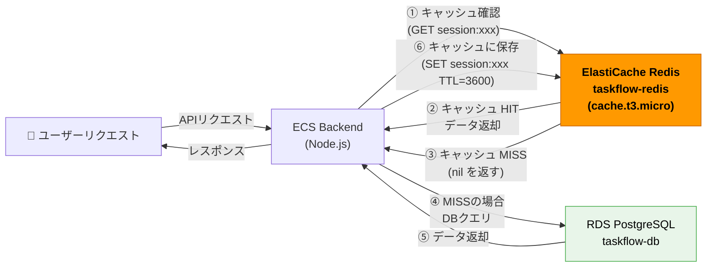

# Task 4: ElastiCache Redis 構築（コンソール）

## 全体構成における位置づけ

> 図: TaskFlow全体アーキテクチャ（オレンジ色が今回構築するコンポーネント）

**今回構築する箇所:** ElastiCache Redis（Task04）- セッション管理・APIレスポンスのキャッシュ

---

> 図: ElastiCacheキャッシュ動作フロー（Hit/Miss別の処理経路）

---

> 参照ナレッジ: [04_cache.md](../knowledge/04_cache.md)

## このタスクのゴール

TaskFlow のセッション管理・キャッシュ用のRedisを構築する。

---

## ハンズオン手順

### Step 1: サブネットグループの作成

1. AWSコンソール → **「ElastiCache」** → 左メニュー **「サブネットグループ」** → **「サブネットグループを作成」**

| 項目 | 値 | 判断理由 |
|------|----|---------|
| 名前 | `taskflow-redis-subnet-group` | |
| VPC | `taskflow-vpc` | |
| サブネット | `taskflow-private-a` + `taskflow-private-c` | RDS同様、Redisもプライベートサブネットに配置。外部から直接アクセスされるべきでない |

2. **「作成」**

### Step 2: Redis クラスターの作成

1. 左メニュー → **「Redis クラスター」** → **「Redisクラスターを作成」**

**クラスター設定：**

| 項目 | 値 | 判断理由 |
|------|----|---------|
| クラスター作成方法 | クラスターを設定 | 「簡単に作成」は設定が隠蔽される |
| クラスターモード | **無効** | 有効にするとデータがシャード分散される。複数GB〜TBのデータを扱う場合に使う。TaskFlowには不要 |
| 名前 | `taskflow-redis` | |
| ロケーション | AWS クラウド | Outpostsは自社データセンターへのAWS展開用。通常は不要 |

**クラスター情報：**

| 項目 | 値 | 判断理由 |
|------|----|---------|
| エンジンバージョン | 7.x（最新の7系） | Redis 6以降から重要な機能が追加されている。特定バージョンへの依存がなければ最新系を選ぶ |
| ポート | 6379 | Redisのデフォルトポート。変える理由は通常ない（セキュリティ的にもSGで制御するため効果薄） |
| ノードタイプ | `cache.t3.micro` | 学習用最小構成。本番はワークロードに応じてr系（メモリ最適化）を選ぶ |
| レプリカの数 | **0** | レプリカを追加するとフェイルオーバーや読み取り分散ができるが、コストが増える。学習環境では0 |

> **レプリカ数について：** 本番でセッション情報を保存する場合、Redisが落ちると全ユーザーがログアウトされる。可用性要件に応じてレプリカ1以上を検討する。

**接続：**

| 項目 | 値 | 判断理由 |
|------|----|---------|
| サブネットグループ | `taskflow-redis-subnet-group` | Step 1で作成 |
| アベイラビリティゾーンの配置 | 指定なし | シングルノードの場合はAWSに任せる |
| セキュリティグループ | `taskflow-sg-redis`（defaultを外す） | Task 2で作成した専用SG |

**バックアップ・詳細設定：**

| 項目 | 値 | 判断理由 |
|------|----|---------|
| バックアップ（自動) | 無効 | Redisに保存するデータはキャッシュ・セッションのため消えても再生成できる。バックアップコスト不要 |
| 転送中の暗号化 | 任意（有効推奨） | VPC内の通信だが、セキュリティポリシーによっては有効にする |
| 保管時の暗号化 | 任意（有効推奨） | 同上 |
| 認証トークン | 設定しない | VPC内のSGで制御しているため不要。外部公開されるRedisには設定を推奨 |

2. **「次へ」** → 設定確認 → **「作成」** → 3〜5分待つ

### Step 3: エンドポイントの確認

クラスター詳細 → **「プライマリエンドポイント」** をメモする。

形式: `taskflow-redis.xxxxxx.0001.apne1.cache.amazonaws.com:6379`

このエンドポイントはTask 8でECSの環境変数として使う。

---

## 確認ポイント

1. ステータスが **「available」** になっているか
2. セキュリティグループが `taskflow-sg-redis` のみになっているか
3. サブネットグループが `taskflow-redis-subnet-group` になっているか

---

**このタスクをコンソールで完了したら:** [Task 4: ElastiCache（IaC版）](../iac/04_elasticache.md)

**次のタスク:** [Task 5: ECR リポジトリ作成](05_ecr.md)
