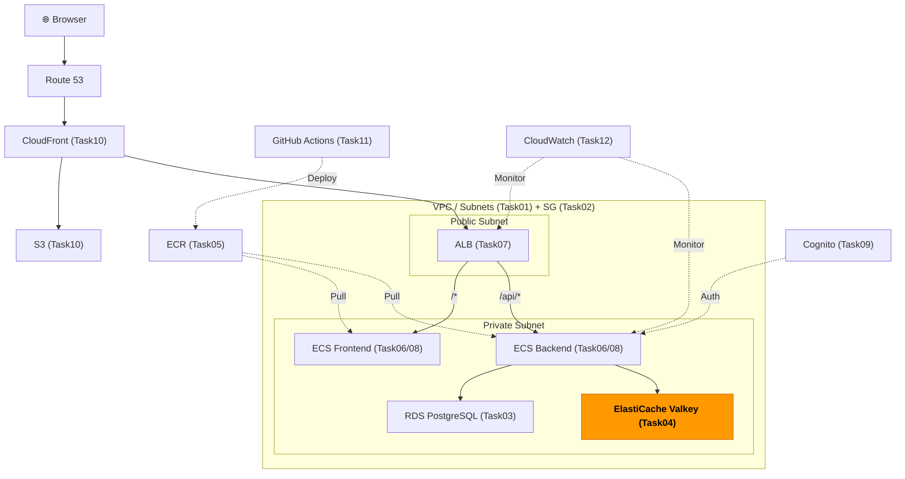
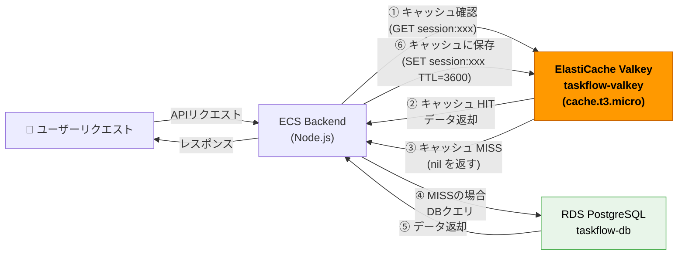

# Task 4: ElastiCache Valkey 構築（コンソール）

## Valkey とは？

**Valkey**（ヴァルキー）は、Redis OSS 7.2 からフォークされたオープンソースのインメモリデータストアです。2024年にLinux Foundationのもとで誕生し、AWSが積極的に推進しています。

| 比較項目 | Valkey | Redis OSS |
|---------|--------|-----------|
| ライセンス | BSD（永続的にオープンソース） | 7.2まではオープンソース。8.0以降はAGPLv3（商用利用に制限あり） |
| AWSのコスト | ノードあたり最大20%安い | 標準価格 |
| 互換性 | Redis OSS 7.2と完全互換 | - |
| 開発主体 | Linux Foundation | Redis Ltd. |

**一言で言うと**：ValkeyはRedisの後継として安価・オープンな選択肢です。新規構築では積極的にValkeyを選びましょう。

---

## 全体構成における位置づけ

> 図: TaskFlow全体アーキテクチャ（オレンジ色が今回構築するコンポーネント）



**今回構築する箇所:** ElastiCache Valkey（Task04）- セッション管理・APIレスポンスのキャッシュ

---

> 図: ElastiCacheキャッシュ動作フロー（Hit/Miss別の処理経路）



---

> 参照ナレッジ: [04_cache.md](../knowledge/04_cache.md)

## このタスクのゴール

TaskFlow のセッション管理・キャッシュ用のValkeyクラスターを構築する。

---

## ハンズオン手順

### Step 1: サブネットグループの作成

1. AWSコンソール → **「ElastiCache」** → 左メニュー **「サブネットグループ」** → **「サブネットグループを作成」**

| 項目 | 値 | 判断理由 |
|------|----|---------|
| 名前 | `taskflow-redis-subnet-group` | |
| VPC | `taskflow-vpc` | |
| サブネット | `taskflow-private-a` + `taskflow-private-c` | RDS同様、ValkeyもプライベートサブネットへAWSが外部から直接アクセスされるべきでない |

2. **「作成」**

---

### Step 2: Valkey キャッシュの新規作成

1. 左メニュー → **「Valkey キャッシュ」** を選択

> **注意**: 最新コンソールではエンジン別にメニューが分かれています。「Redis OSS キャッシュ」ではなく **「Valkey キャッシュ」** を選んでください。

2. 右上の **「Valkey キャッシュを作成」** ボタンをクリック

---

### Step 3: デプロイオプションの選択

作成画面の最上部で、デプロイオプションを選択します。

| 選択肢 | 特徴 | 今回の選択 |
|--------|------|-----------|
| **Serverless** | 容量を自動スケール。設定が少なく1分で作成可能。従量課金 | 選ばない |
| **ノードベースのキャッシュ** | ノードタイプ・台数などを細かく指定できる。学習に最適 | **こちらを選ぶ** |

**「ノードベースのキャッシュ」** を選択してください。

> **なぜServerlessを選ばないのか？** Serverlessは便利ですが「中身が見えない」設計です。学習目的では自分でノードを設計するオプションを選ぶことで、設定の意味を理解できます。

---

### Step 4: クラスターモードの選択

「ノードベースのキャッシュ」を選ぶと、次に **「クラスターモード」** の選択画面が表示されます。

| 選択肢 | 特徴 | 今回の選択 |
|--------|------|-----------|
| **有効** | データを複数のシャードに分散。水平スケール可能だが設定が複雑 | 選ばない |
| **無効** | シングルシャード構成。シンプルで設定項目が少ない | **こちらを選ぶ** |

**「無効」** を選択してください。

> **なぜ「無効」を選ぶのか？** クラスターモード有効は大規模分散環境向けの設定です。学習目的のdev環境ではシンプルな「無効」構成で十分です。設定項目が少ないため、各設定の意味を把握しやすくなります。

---

### Step 5: 作成方法の選択

クラスターモード「無効」を選ぶと、次に **「作成方法」** の3択が表示されます。

| 選択肢 | 特徴 | 今回の選択 |
|--------|------|-----------|
| **簡単な作成** | AWSが自動で推奨設定を選ぶ。設定内容がブラックボックスになる | 選ばない |
| **クラスターキャッシュ** | 全設定を自分で指定できる。学習目的に最適 | **こちらを選ぶ** |
| **バックアップから復元** | 既存バックアップから復元する場合に使用 | 選ばない |

**「クラスターキャッシュ」** を選択してください。

> **なぜ「クラスターキャッシュ」を選ぶのか？** 「簡単な作成」はAWSが設定を自動決定するため、どんな値が設定されたかが分かりにくくなります。「クラスターキャッシュ」を選ぶと、ノードタイプ・レプリカ数・暗号化などを自分で指定できるため、各設定の意味を学べます。

---

### Step 6: クラスター設定

| 項目 | 値 | 判断理由 |
|------|----|---------|
| クラスター名 | `taskflow-valkey` | |
| ロケーション | AWS クラウド | Outpostsは自社データセンターへのAWS展開用。通常は不要 |

---

### Step 7: クラスター情報（エンジン・ノード設定）

| 項目 | 値 | 判断理由 |
|------|----|---------|
| エンジンバージョン | 8.x（最新の8系） | Valkey 8.0以降はI/Oマルチスレッドによりパフォーマンスが向上。特定バージョンへの依存がなければ最新系を選ぶ |
| ポート | 6379 | Valkeyのデフォルトポート。変える理由は通常ない（セキュリティはSGで制御するため） |
| ノードタイプ | `cache.t3.micro` | 学習用最小構成。本番はワークロードに応じてr系（メモリ最適化）を選ぶ |
| レプリカ数 | **0** | レプリカを追加するとフェイルオーバーや読み取り分散ができるが、コストが増える。学習環境では0 |

> **レプリカ数について：** 本番でセッション情報を保存する場合、Valkeyが落ちると全ユーザーがログアウトされます。可用性要件に応じてレプリカ1以上を検討してください。

---

### Step 8: 接続設定（サブネットグループ・セキュリティグループ）

| 項目 | 値 | 判断理由 |
|------|----|---------|
| サブネットグループ | `taskflow-redis-subnet-group` | Step 1で作成 |
| アベイラビリティゾーンの配置 | 指定なし | シングルノードの場合はAWSに任せる |
| セキュリティグループ | `taskflow-sg-redis`（defaultを外す） | Task 2で作成した専用SG |

---

### Step 9: 詳細設定

「次へ」をクリックすると「詳細設定」ページに進みます。ここでは、セキュリティ・バックアップ・メンテナンス・ログを設定します。各設定の「なぜこう設定するのか」を理解しながら進めましょう。

---

#### セキュリティ設定

**保管中の暗号化（Encryption at rest）**

| 設定項目 | dev環境の推奨値 | WHY |
|---------|--------------|-----|
| 有効化 | ✅ **有効にする** | ディスクに書き込まれるデータ（バックアップ・ノード同期時のスナップショット）を暗号化する。本番同様の設定を学習目的でも体験することが重要 |
| 暗号化キー | **デフォルトキー（AWS所有キー）** | AWS が管理する暗号化キーを使用する。CMK（カスタマーマネージドキー）は自社コンプライアンス要件がある場合のみ使用する |

> **AWSマネージドキー vs CMK の違い**
> - **AWSマネージドキー（デフォルト）**: AWS が自動でキーを管理・ローテーションする。コスト追加なし。大多数のユースケースで十分
> - **CMK（カスタマーマネージドキー）**: KMS で自分でキーを作成・管理する。月額 $1/キー + API コストが発生。金融・医療など厳格なコンプライアンス要件がある場合に使用する
>
> **パフォーマンスへの影響**: 保管中の暗号化はバックアップ・ノード同期時に暗号化・復号処理が発生する。通常のキャッシュ読み書き（インメモリ操作）は影響を受けない。

---

**転送中の暗号化（Encryption in transit）**

| 設定項目 | dev環境の推奨値 | WHY |
|---------|--------------|-----|
| 有効化 | ✅ **有効にする** | ECS BackendとValkeyの間の通信をTLS 1.2以上で暗号化する |

> **なぜVPC内でも暗号化が必要か？**
> VPC内の通信は外部インターネットから隔離されていますが、ネットワーク盗聴（パケットキャプチャ）のリスクはゼロではありません。セッションデータなど機密情報を扱う場合は有効にすることをAWSのWell-Architectedフレームワークでも推奨しています。
>
> **パフォーマンスへの影響**: TLS接続の確立（ハンドシェイク）にわずかなオーバーヘッドが生じます。Node.js の `ioredis` のように TLS 接続を再利用（persistent connection）する実装であれば、影響は最小限です。
>
> **重要**: 2026年4月28日以降、ElastiCache for Valkey 7.2以上では最低TLSバージョンが1.2に更新されます。クライアント側もTLS 1.2以上を使用してください。

---

**アクセスコントロール**

| 設定項目 | dev環境の推奨値 | WHY |
|---------|--------------|-----|
| アクセスコントロール | **「アクセスコントロールがありません」のまま（デフォルト）** | VPCのプライベートサブネット + セキュリティグループで接続元ECSのみに制限しているため、追加の認証は不要 |

> **ElastiCacheのアクセスコントロール方式（3種類）**
>
> 1. **なし（デフォルト）**: ネットワークレベル（VPC + SG）のみで制御。接続できるホストを絞ることで保護する
> 2. **Redis AUTH token**: パスワード（トークン）でクライアントを認証する。転送中の暗号化が必須
> 3. **IAM認証 + RBAC（ロールベースアクセス制御）**: IAMロールと紐付けたユーザー/ユーザーグループでアクセス権限を制御する。Valkey/Redis OSS 7.0以上かつ転送中の暗号化が必須。最も細かいアクセス制御が可能
>
> dev環境では、ECSサービスのSG（`taskflow-sg-ecs-backend`）からValkeyのSG（`taskflow-sg-redis`）への6379番ポートのみ許可する構成で十分なセキュリティが確保できます。

---

**セキュリティグループ**

| 設定項目 | dev環境の推奨値 | WHY |
|---------|--------------|-----|
| セキュリティグループ | **「管理」ボタン → `taskflow-sg-redis` を追加、`default` は外す** | Task 2で作成した専用SGのみを設定する。defaultのSGを残すと意図しない接続を許可するリスクがある |

> **どのSGを設定するか？**
> Task 2で作成した `taskflow-sg-redis`（または `taskflow-sg-elasticache`）を選択してください。このSGは「ECS BackendのSGからのポート6379のみ許可」というルールになっているはずです。デフォルトSGは必ず削除してください。

---

#### バックアップ設定

| 設定項目 | dev環境の推奨値 | WHY |
|---------|--------------|-----|
| 自動バックアップを有効化 | ⚠️ **無効のまま（チェックしない）** | Valkeyに保存するのはセッション・キャッシュデータであり、消えても再生成できる。バックアップは S3 に保存されるためストレージコストが発生する |
| バックアップ保持期間 | （無効の場合は設定不要） | - |
| バックアップウィンドウ | （無効の場合は設定不要） | - |

> **バックアップが必要になるケース**: Valkeyにゲームスコア・購入履歴など「再生成できないデータ」を保存する場合は有効にしてください。その場合の推奨値は以下の通りです。
> - 保持期間: dev環境 1〜3日 / 本番環境 7〜14日（最大35日まで設定可能）
> - バックアップウィンドウ: トラフィックが最も少ない時間帯（例: 日本時間 深夜3:00〜4:00 = UTC 18:00〜19:00）

---

#### メンテナンス設定

**メンテナンス期間**

| 設定項目 | dev環境の推奨値 | WHY |
|---------|--------------|-----|
| メンテナンス期間 | ✅ **「メンテナンス期間を指定」→ 低トラフィック時間帯を指定** | 「指定がありません」のままにすると、AWSがランダムに60分のウィンドウを割り当てる。業務時間に当たる可能性があるため、明示的に指定することを推奨 |
| 推奨時間帯 | `mon:18:00-mon:19:00`（UTC）= 月曜日 午前3:00〜4:00（JST） | 週明け深夜がトラフィック最小になるケースが多い |

> **UTCと日本時間（JST）の換算**: JST = UTC + 9時間
> - 日本時間 午前3:00 = UTC 18:00（前日）
> - 例: `mon:18:00-mon:19:00`（UTC）= 月曜日 午前3:00〜4:00（JST）
>
> **メンテナンス中に何が起こるか**: マイナーバージョンアップグレードやパッチ適用が実施されます。シングルノード構成（レプリカ0）では、この間 数十秒〜数分の接続断が発生する可能性があります。

---

**マイナーバージョンの自動アップグレード**

| 設定項目 | dev環境の推奨値 | WHY |
|---------|--------------|-----|
| 有効化 | ✅ **有効のまま（デフォルト）** | セキュリティパッチやバグ修正を自動で適用できる。dev環境では自動で最新状態に保つことが推奨される |

> **本番環境では注意が必要**: 本番環境では自動アップグレードにより予期しない動作変更が起きる可能性があります。本番では「無効」にして、dev環境で検証してから本番に手動適用するワークフローが一般的です。
>
> **マイナーバージョンとは**: `8.0.1` → `8.0.2` のような変更です。セキュリティパッチ・バグ修正が主な内容で、後方互換性は維持されます。メジャーバージョン（`8.x` → `9.x`）の自動アップグレードは行われません。

---

**Amazon SNS 通知のトピック**

| 設定項目 | dev環境の推奨値 | WHY |
|---------|--------------|-----|
| SNS通知 | ⚠️ **「通知を無効化」のまま（デフォルト）** | フェイルオーバー・メンテナンス完了などのイベントをメール通知できるが、dev環境では不要。本番ではCloudWatchアラームと組み合わせて設定する |

---

#### ログ設定

**スローログ（Slow Log）**

| 設定項目 | dev環境の推奨値 | WHY |
|---------|--------------|-----|
| 有効化 | ✅ **有効にする** | パフォーマンス問題の診断に有用。学習目的でも有効にしておくと動作確認に役立つ |
| ログ形式 | **JSON** | CloudWatch Logs Insights でのフィルタリング・集計がしやすい |
| 配信先 | **CloudWatch Logs** | AWSコンソールから直接確認できる |
| ロググループ名 | `/elasticache/taskflow-valkey/slow-log` | 命名規則を統一しておくと管理しやすい |

> **スローログに記録される内容**: デフォルトで **10ミリ秒以上** かかったコマンドが記録されます。各エントリには以下の情報が含まれます：
> - クラスターID・ノードID
> - コマンドの実行時間（マイクロ秒単位）
> - 実行されたコマンド（例: `GET session:user123`）
> - クライアントIPアドレス・タイムスタンプ
>
> パラメータグループの `slowlog-log-slower-than` を調整することで閾値を変更できます。

---

**エンジンログ（Engine Log）**

| 設定項目 | dev環境の推奨値 | WHY |
|---------|--------------|-----|
| 有効化 | ✅ **有効にする** | ノードの起動・停止・クラッシュ・フェイルオーバーなどの重要イベントが記録される。問題が起きたときの原因調査に必須 |
| ログ形式 | **JSON** | スローログと統一する |
| 配信先 | **CloudWatch Logs** | スローログと同様 |
| ロググループ名 | `/elasticache/taskflow-valkey/engine-log` | スローログと区別できる名前にする |

> **エンジンログに記録される内容**: ノードの起動・再起動・クラッシュ時のエラー情報、フェイルオーバーの発生と理由、レプリケーション状態などが記録されます。スローログと異なり、コマンド単位ではなくノード全体のライフサイクルイベントが対象です。
>
> **ログが利用できるバージョン**: Valkey 8.1以上でエンジンログのlog deliveryが利用可能です。

---

#### タグ設定

| タグキー | タグ値 | WHY |
|---------|-------|-----|
| `Name` | `taskflow-valkey` | リソース識別子 |
| `Environment` | `dev` | 環境の識別 |
| `Project` | `taskflow` | コスト配分タグとして活用できる |
| `ManagedBy` | `manual` | 手動作成のリソースであることを示す |

---

設定確認画面で内容を確認し、**「作成」** をクリックしてください。作成完了まで **3〜7分** 程度かかります。

**「次へ」** → 設定確認 → **「作成」** → 3〜7分待つ

---

### Step 10: エンドポイントの確認

クラスター詳細で **「プライマリエンドポイント（Primary Endpoint）」** をメモする。

> **クラスターモード無効の場合、エンドポイントは2種類あります。**

| エンドポイントの種類 | 用途 |
|-------------------|----|
| **プライマリエンドポイント** | 読み書き両方に使う。通常はこちらを使う |
| **リーダーエンドポイント** | 読み取り専用。レプリカが存在する場合に読み取り負荷分散に使う（今回はレプリカ0のため使わない） |

プライマリエンドポイントの形式:
```
taskflow-valkey.xxxxxx.apne1.cache.amazonaws.com:6379
```

> **アプリ側の接続：** クラスターモード無効では通常のRedis/Valkeyクライアントで接続できます。Node.js では `ioredis` の `new Redis({ host: "...", port: 6379 })` でそのまま使えます。

このエンドポイントはTask 8でECSの環境変数として使う。

---

## 確認ポイント

1. ステータスが **「available」** になっているか
2. エンジンが **「Valkey」** になっているか（Redis OSSでないか）
3. セキュリティグループが `taskflow-sg-redis` のみになっているか
4. サブネットグループが `taskflow-redis-subnet-group` になっているか
5. **「クラスターモード」が「無効」** になっているか
6. エンドポイントが **プライマリエンドポイント**（`clustercfg` を含まない形式）になっているか

---

## クラスターモード有効 vs 無効 まとめ

今回はクラスターモード「無効」＋作成方法「クラスターキャッシュ」で構築しました。将来の参考として両者の違いをまとめます。

| 比較項目 | クラスターモード無効（今回） | クラスターモード有効 |
|---------|------------------------|-------------|
| シャード数 | 1（固定） | 1〜500 |
| 水平スケール | 不可（ノードタイプ変更のみ） | 可能（シャードを追加） |
| エンドポイント | プライマリ / リーダーエンドポイント | クラスター設定エンドポイント |
| クライアント要件 | 通常のRedis/Valkeyクライアントで可 | クラスターモード対応クライアント必須 |
| 向いているケース | 小〜中規模・シンプルな構成・学習目的 | 大容量・高トラフィック・将来のスケール |

---

**このタスクをコンソールで完了したら:** [Task 4: ElastiCache（IaC版）](../iac/04_elasticache.md)

**次のタスク:** [Task 5: ECR リポジトリ作成](05_ecr.md)
