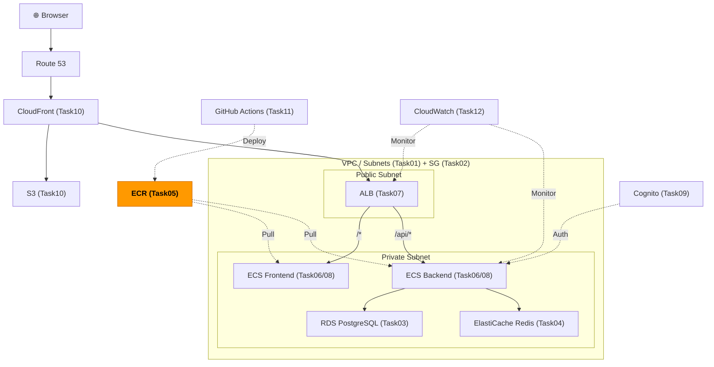
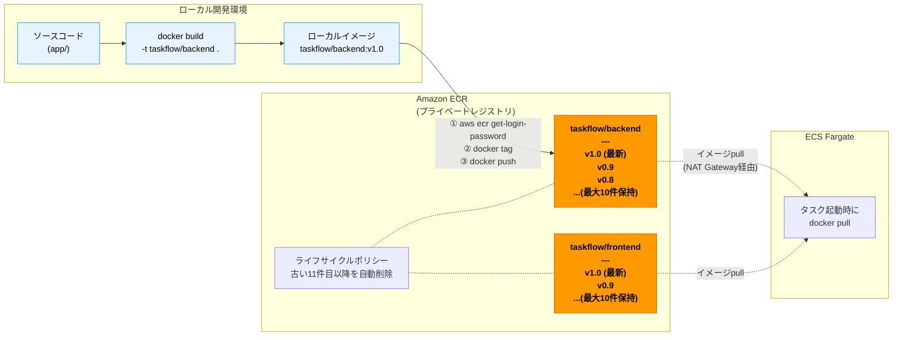

# Task 5: ECR リポジトリ作成（コンソール）

## 全体構成における位置づけ

> 図: TaskFlow全体アーキテクチャ（オレンジ色が今回構築するコンポーネント）



**今回構築する箇所:** ECR（Task05）- Dockerイメージを保管するプライベートレジストリ

---

> 図: ECRイメージライフサイクル（ビルドからデプロイまでの流れ）



---

> 参照ナレッジ: [05_containers.md](../knowledge/05_containers.md)

## このタスクのゴール

TaskFlow の Docker イメージを保管するプライベートレジストリを2つ作る。

---

## ハンズオン手順

### Step 1: バックエンド用リポジトリの作成

1. AWSコンソール → **「ECR」**（Elastic Container Registry）→ **「リポジトリを作成」**

| 項目 | 値 | 判断理由 |
|------|----|---------|
| 可視性設定 | **プライベート** | アプリのソースを含むイメージを公開する理由はない |
| リポジトリ名 | `taskflow/backend` | スラッシュ区切りの名前空間でプロジェクトごとにグループ化できる |
| タグのイミュータビリティ | **有効** | 同じタグ（例: v1.0）で別のイメージを上書きできなくなる。「本番で動いているv1.0が何か」を確実に把握するために必要 |
| イメージスキャン（プッシュ時にスキャン） | **有効** | OSパッケージの既知脆弱性を自動検出。開発段階から習慣づける |
| 暗号化設定 | AES-256（デフォルト） | AWSキー管理で十分。独自KMSキーは追加コストと管理コストが発生するため特別な理由がなければ不要 |

#### タグの設定
| キー | 値 |
|------|-----|
| Name | taskflow-backend |
| Environment | dev |
| Project | taskflow |
| ManagedBy | manual |

> **タグのイミュータビリティを有効にする場合の注意：** 同じタグで再プッシュできなくなるため、CI/CDでは `latest` ではなく git commitハッシュやバージョン番号でタグ付けする運用にする必要がある。学習中は無効にしておく方が手軽な場合もある。

2. **「リポジトリを作成」**

### Step 2: フロントエンド用リポジトリの作成

1. 再度 **「リポジトリを作成」**
2. リポジトリ名を `taskflow/frontend` に変更し、他は同様の設定で作成

#### タグの設定
| キー | 値 |
|------|-----|
| Name | taskflow-frontend |
| Environment | dev |
| Project | taskflow |
| ManagedBy | manual |

### Step 3: ライフサイクルポリシーの設定

放置すると古いイメージが溜まってストレージコストが増える。自動削除ルールを設定する。

1. `taskflow/backend` リポジトリを選択 → **「ライフサイクルポリシー」** → **「ルールを作成」**
2. 以下を設定：

| 項目 | 値 | 判断理由 |
|------|----|---------|
| ルールの優先度 | 1 | |
| ルールの説明 | `Keep last 10 images` | |
| タグのステータス | 任意 | タグ付き・未タグの両方を対象にする |
| カウントタイプ | イメージカウント（以上） | 件数で管理するのが最もシンプル |
| カウント数 | 10 | 最新10件あればロールバックに十分対応できる |

3. **「保存」** → `taskflow/frontend` にも同じポリシーを設定

### Step 4: リポジトリURIの確認・メモ

リポジトリ一覧画面に「URI」列が表示される：

```
<アカウントID>.dkr.ecr.ap-northeast-1.amazonaws.com/taskflow/backend
<アカウントID>.dkr.ecr.ap-northeast-1.amazonaws.com/taskflow/frontend
```

このURIはTask 8のタスク定義と、Task 11のCI/CD設定で使う。

### Step 5: （任意）動作確認用にイメージをプッシュ

コンソール上の **「プッシュコマンドを表示」** ボタンで、ローカルからイメージをプッシュするコマンド例が表示される。アプリが用意できていれば試してみると良い。

---

## 確認ポイント

1. `taskflow/backend` と `taskflow/frontend` の2リポジトリが存在するか
2. ライフサイクルポリシーが両方に設定されているか
3. URIをメモしたか

---

**このタスクをコンソールで完了したら:** [Task 5: ECR（IaC版）](../iac/05_ecr.md)

**次のタスク:** [Task 6: ECS クラスター構築](06_ecs_cluster.md)
