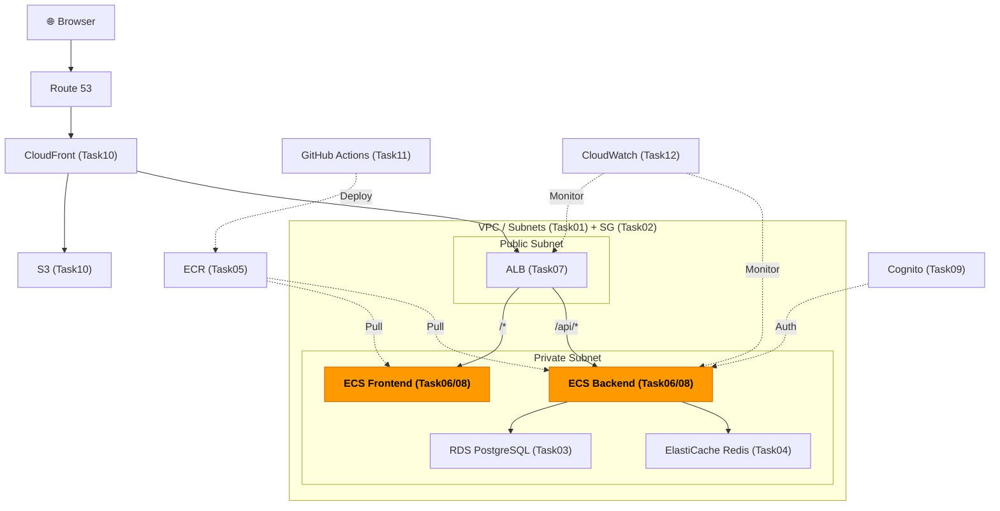
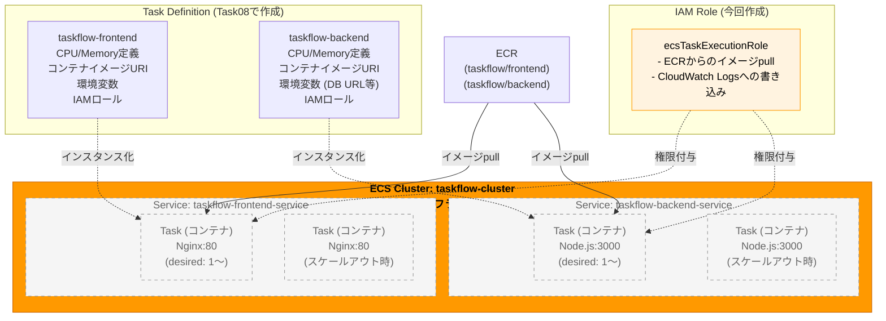
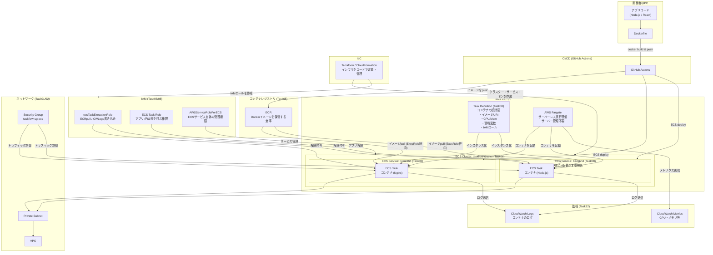

# Task 6: ECS クラスター構築（コンソール）

## 全体構成における位置づけ

> 図: TaskFlow全体アーキテクチャ（オレンジ色が今回構築するコンポーネント）

**今回構築する箇所:** ECS Cluster（Task06）- コンテナを動かす基盤（Cluster + IAMロール）

---

> 図: ECS Cluster / Service / Task の階層構造

---

> 参照ナレッジ: [06_ecs_fargate.md](../knowledge/06_ecs_fargate.md)

## このタスクのゴール

コンテナを動かす基盤（ECSクラスターとIAMロール）を作る。このタスクで作るのはコンテナの「箱」のみ。中身はTask 8で作成する。

---

## ハンズオン手順

### Step 1: ECS タスク実行ロールの作成

コンテナを起動するためにECSが必要とするIAM権限を先に作っておく。

1. AWSコンソール → **「IAM」** → 左メニュー **「ロール」** → **「ロールを作成」**

| 項目 | 値 | 判断理由 |
|------|----|---------|
| 信頼されたエンティティタイプ | AWSのサービス | ECSというAWSサービスに権限を付与する |
| サービス | Elastic Container Service | |
| ユースケース | **Elastic Container Service Task** | 「Task」を選ばないとECSタスクではなくECS全体のロールになってしまう |

2. **「次へ」** → ポリシーを検索して追加：

| ポリシー名 | 理由 |
|-----------|------|
| `AmazonECSTaskExecutionRolePolicy` | ECRからのイメージpull・CloudWatch Logsへの書き込みが含まれる。ECSタスク起動の最小セット |

> **AdministratorAccessを付けてはいけない理由：** 最小権限の原則。コンテナが侵害された場合に被害が最小になるよう、必要な権限だけを付ける。

3. **ロール名**: `ecsTaskExecutionRole`（この名前はAWSの慣習。他の名前でも動くが統一しておく）
4. **「ロールを作成」**

### Step 2: ECS クラスターの作成

1. AWSコンソール → **「ECS」** → 左メニュー **「クラスター」** → **「クラスターを作成」**

| 項目 | 値 | 判断理由 |
|------|----|---------|
| クラスター名 | `taskflow-cluster` | |
| AWS Fargate（サーバーレス） | **チェックを入れる** | サーバー管理なしでコンテナを動かせる。学習・中規模サービスに最適 |
| Amazon EC2インスタンス | チェックしない | EC2管理（OS・パッチ・スケーリング）も必要になり複雑化する。Fargateで十分 |
| 外部インスタンス | チェックしない | オンプレミスのサーバーをECSで管理する場合に使う。今回不要 |

**モニタリング：**

| 項目 | 値 | 判断理由 |
|------|----|---------|
| Container Insights を使用 | **有効** | コンテナ単位のCPU・メモリ・ネットワークメトリクスが取れるようになる。問題発生時の調査に不可欠。CloudWatchのコストが若干上がるが有効にする価値がある |

**タグ：**

| キー | 値 |
|------|-----|
| Name | taskflow-cluster |
| Environment | dev |
| Project | taskflow |
| ManagedBy | manual |

2. **「作成」**

---

## 確認ポイント

1. **ECS → クラスター** に `taskflow-cluster` が表示されるか
2. ステータスが **「ACTIVE」** か
3. インフラストラクチャに **「Fargate」** が表示されているか
4. **IAM → ロール** に `ecsTaskExecutionRole` が存在するか
5. `ecsTaskExecutionRole` に `AmazonECSTaskExecutionRolePolicy` がアタッチされているか

---

**このタスクをコンソールで完了したら:** [Task 6: ECSクラスター（IaC版）](../iac/06_ecs_cluster.md)

**次のタスク:** [Task 7: ALB 構築・パスベースルーティング](07_alb.md)

---

## 参考: ECR / ECS / Fargate / CloudFormation の関係図

> 図: ECR・ECS・Fargate・IAM・ネットワーク・監視リソースの全体関係

