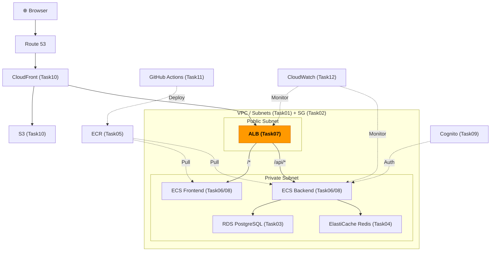
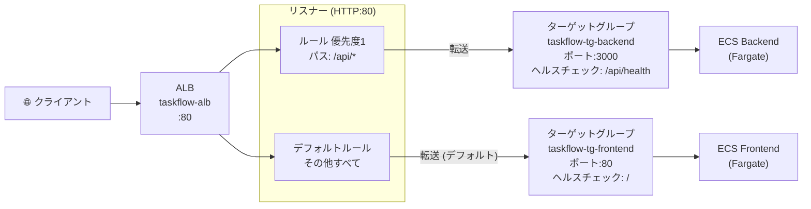

# Task 7: ALB 構築・パスベースルーティング（コンソール）

## 全体構成における位置づけ

> 図: TaskFlow全体アーキテクチャ（オレンジ色が今回構築するコンポーネント）

**今回構築する箇所:** ALB（Application Load Balancer）- Task07。パブリックサブネットに配置し、`/api/*` をECS Backendへ、それ以外をECS Frontendへルーティングする。

---

> 参照ナレッジ: [07_load_balancer.md](../knowledge/07_load_balancer.md)

## このタスクのゴール

リクエストを Backend / Frontend に振り分けるロードバランサーを作る。
- `/api/*` → ECS Backend
- `/*`（その他全て） → ECS Frontend

---

## ハンズオン手順

### Step 1: Backend用ターゲットグループの作成

1. AWSコンソール → **「EC2」** → 左メニュー **「ターゲットグループ」** → **「ターゲットグループの作成」**

| 項目 | 値 | 判断理由 |
|------|----|---------|
| ターゲットタイプ | **IP アドレス** | FargateコンテナはインスタンスではなくIPで登録する必要がある。「インスタンス」を選ぶとFargateタスクを登録できない |
| ターゲットグループ名 | `taskflow-tg-backend` | |
| プロトコル | HTTP | ALB→ECS間はVPC内通信なのでHTTPで十分。HTTPSはALBで終端 |
| ポート | 3000 | Node.jsバックエンドが3000番で起動する想定 |
| VPC | `taskflow-vpc` | |
| プロトコルバージョン | HTTP1 | HTTP/2やgRPCは今回不要 |

**ヘルスチェック設定：**

| 項目 | 値 | 判断理由 |
|------|----|---------|
| ヘルスチェックパス | `/api/health` | バックエンドが用意するヘルスチェック専用エンドポイント。`/` はHTMLを返すため重い |
| 正常のしきい値 | 2 | 2回連続成功でhealthy。起動直後の不安定な状態を弾くのに有効 |
| 非正常のしきい値 | 3 | 3回連続失敗でunhealthy。単発の遅延でトラフィックを止めないよう余裕を持たせる |
| タイムアウト | 5秒 | ヘルスチェックレスポンスの許容時間 |
| 間隔 | 30秒 | 30秒ごとにチェック。短すぎるとコンテナへの負荷が増える |
| 成功コード | 200 | アプリが200を返せば正常と判断 |

#### タグの設定
| キー | 値 |
|------|-----|
| Name | taskflow-tg-backend |
| Environment | dev |
| Project | taskflow |
| ManagedBy | manual |

2. **「次へ」** をクリック → **ターゲット登録画面**が表示される

**ターゲット登録画面の内容：**

| 項目 | 説明 | 今回の操作 |
|------|------|----------|
| ネットワーク | IPv4 / IPv6 の選択 | `IPv4`（デフォルトのまま） |
| IPアドレス | 登録するコンテナのIP | **入力しない** |
| ポート | 転送先ポート | **変更しない** |
| アベイラビリティゾーン | 対象AZの指定 | **変更しない** |
| 「保留中として以下を含める」ボタン | IPを追加リストに追加 | **クリックしない** |

> **なぜここでIPを登録しないか：** ECS Fargateはタスク（コンテナ）が起動するたびにIPが変わる。ECSサービスがターゲットグループへの登録・解除を自動で行うため、ここでは何も登録しなくてよい。空のまま進んでOK。

3. **「ターゲットグループの作成」** をクリック

### Step 2: Frontend用ターゲットグループの作成

1. 同様に **「ターゲットグループの作成」**

| 項目 | 値 | 判断理由 |
|------|----|---------|
| ターゲットタイプ | IP アドレス | |
| ターゲットグループ名 | `taskflow-tg-frontend` | |
| ポート | 80 | フロントエンドのNginxは80番で起動 |
| ヘルスチェックパス | `/` | フロントエンドはルートで200が返れば正常 |

#### タグの設定
| キー | 値 |
|------|-----|
| Name | taskflow-tg-frontend |
| Environment | dev |
| Project | taskflow |
| ManagedBy | manual |

2. **「次へ」** → ターゲット登録画面が表示される（Step 1と同様、何も登録せずそのまま進む）

3. **「ターゲットグループの作成」** をクリック

### Step 3: ALB の作成

1. 左メニュー → **「ロードバランサー」** → **「ロードバランサーの作成」** → **「Application Load Balancer」** → **「作成」**

| 項目 | 値 | 判断理由 |
|------|----|---------|
| 名前 | `taskflow-alb` | |
| スキーム | **インターネット向け** | ユーザーからのリクエストを受け付ける必要がある。「内部」はVPC内のサービス間通信用 |
| IP アドレスタイプ | IPv4 | IPv6対応が不要なら IPv4 のみで十分。デュアルスタックはコスト・設定が複雑になる |
| IPプール（Amazon-owned IP address pool） | **チェックしない**（デフォルト） | AWSが管理する固定寄りのIPアドレスブロックから割り当てるオプション。通常のALBはDNS名でアクセスするためIPが変動しても問題なく、このオプションは不要。取引先ファイアウォールのIPホワイトリスト対応や、BYOIP（自社IPをAWSに持ち込む）など特殊なケースのみ使用する |

**ネットワークマッピング：**

| 項目 | 値 | 判断理由 |
|------|----|---------|
| VPC | `taskflow-vpc` | |
| AZ・サブネット | `ap-northeast-1a` → `taskflow-public-a`、`ap-northeast-1c` → `taskflow-public-c` | ALBは必ずパブリックサブネット×2AZ以上が必要。プライベートを選ぶと外部からのアクセスができない |

> **なぜ2AZ必須か：** ALBの仕様として最低2AZが必要（可用性の担保）。1AZのみを指定しようとするとエラーになる。

**セキュリティグループ：**

| 項目 | 値 | 判断理由 |
|------|----|---------|
| セキュリティグループ | `taskflow-sg-alb`（defaultを外す） | Task 2で作成。defaultを残すとルールが混在して管理が難しくなる |

**リスナーとルーティング：**

| 項目 | 値 | 判断理由 |
|------|----|---------|
| リスナー | HTTP:80 | まずHTTPで動作確認する。本番ではHTTPS:443を追加しHTTPをリダイレクト |
| デフォルトアクション | `taskflow-tg-frontend` に転送 | ルールに合致しない全リクエストをフロントエンドへ。SPAの場合ほぼ全てのパスがフロントエンドへいく |

**タグ：**（画面下部のタグセクションに設定）

| キー | 値 |
|------|-----|
| Name | taskflow-alb |
| Environment | dev |
| Project | taskflow |
| ManagedBy | manual |

2. **「ロードバランサーの作成」**

### Step 4: パスベースルーティングの設定

> 図: ALBのリスナー・ルール・ターゲットグループ構成（パスベースルーティング）

ALBが作成されたら、`/api/*` をバックエンドに向けるルールを追加する。

1. 作成した `taskflow-alb` をクリック → **「リスナーとルール」タブ**
2. **HTTP:80** のリスナーをクリック → **「ルールを追加」** → **「ルールを追加」**
3. **名前**: `api-routing`
4. **条件を追加** → **「パス」** → 値: `/api/*`
5. **アクション** → 「転送先」→ `taskflow-tg-backend`
6. **優先度**: `1`（数値が小さいほど先に評価される。フロントエンドのデフォルトより必ず先に評価させる）
7. **「保存」**

> **優先度の設計：** `/api/*` のルールを先に評価（優先度1）し、それ以外はデフォルトのフロントエンドへ流れる。`/api/users` のような具体的なルールは `/api/*` より先に評価されるよう優先度をより小さくする。

---

## 確認ポイント

1. **ALB** のステータスが **「Active」** になっているか
2. **DNSネーム**（`taskflow-alb-xxxx.ap-northeast-1.elb.amazonaws.com`）をメモしたか
3. **リスナーのルール** で `/api/*` → backend のルールが優先度1で存在するか
4. ターゲットグループが2つ存在するか（この時点ではターゲットが0個で「unhealthy」表示は正常）

---

**このタスクをコンソールで完了したら:** [Task 7: ALB（IaC版）](../iac/07_alb.md)

**次のタスク:** [Task 8: ECS サービス・タスク定義](08_ecs_services.md)
