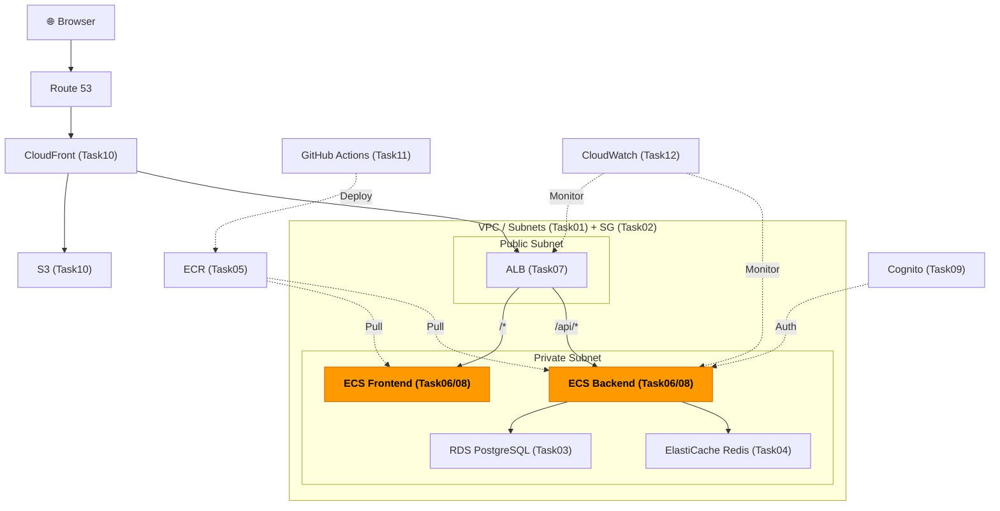
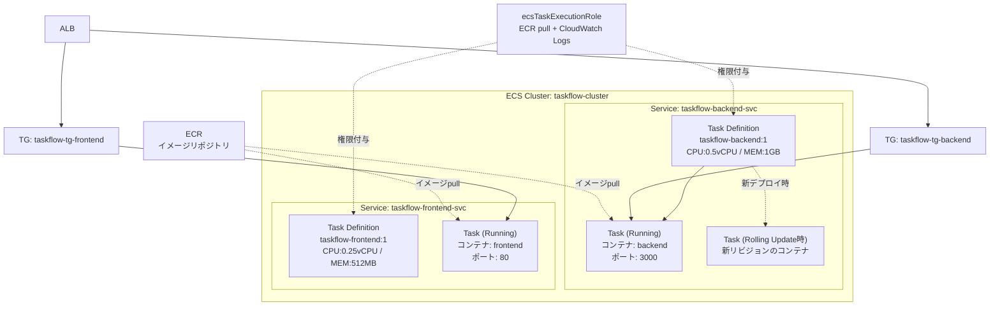

# Task 8: ECS サービス・タスク定義（コンソール）

## 全体構成における位置づけ

> 図: TaskFlow全体アーキテクチャ（オレンジ色が今回構築するコンポーネント）



**今回構築する箇所:** ECS Services + Task Definitions + IAM Roles - Task08。Backend/Frontendのコンテナをプライベートサブネットで起動し、ALBと接続する。

---

> 参照ナレッジ: [06_ecs_fargate.md](../knowledge/06_ecs_fargate.md)、[08_iam.md](../knowledge/08_iam.md)

## このタスクのゴール

TaskFlow の Backend / Frontend コンテナを実際に起動する。

---

## 事前確認（重要：このタスクを始める前に）

ECS サービスは起動後すぐに ALB のヘルスチェックが走る。ヘルスチェックが失敗するとタスクが繰り返し再起動され、原因調査に時間がかかる。事前に以下を確認しておくこと。

| 確認項目 | 理由 |
|---------|------|
| **バックエンドアプリが `/api/health` に HTTP 200 を返す** | ALB のヘルスチェックがこのパスを叩く。存在しないと全タスクが unhealthy になる |
| **Docker イメージが ECR にプッシュされている** | Task 5 で ECR リポジトリを作っただけでは不十分。`docker push` でイメージを送り込んでいること |
| **RDS のエンドポイント・Redis のエンドポイントをメモしている** | 環境変数に設定するため。Task 3・4 でメモした値 |

> **`/api/health` エンドポイントについて：** Node.js (Express) の場合は以下のようなエンドポイントを実装する。
> ```js
> app.get('/api/health', (req, res) => {
>   res.json({ status: 'ok' });
> });
> ```
> このエンドポイントがないと、ALB は「バックエンドが応答していない」と判断してタスクを停止し続ける。

---

## ハンズオン手順

### Step 1: Backend タスク定義の作成

> 図: ECS ServiceとTask Definitionの関係（デプロイ設定・ローリングアップデート）



1. AWSコンソール → **「ECS」** → 左メニュー **「タスク定義」** → **「新しいタスク定義を作成」**

**タスク定義の設定：**

| 項目 | 値 | 判断理由 |
|------|----|---------|
| タスク定義ファミリー | `taskflow-backend` | ファミリー名はリビジョン管理の単位。変更のたびに新リビジョンが作られる |
| 起動タイプ | **AWS Fargate** | |
| オペレーティングシステム | Linux/X86_64 | ARMを選ぶとコストを抑えられるが、Dockerイメージがarm64対応している必要がある |
| CPU | 0.5 vCPU（512） | 最小は0.25 vCPU。バックエンドの負荷に応じて調整。最初は小さく始めてCloudWatchを見て増やす |
| メモリ | 1 GB（1024） | CPUとメモリには有効な組み合わせがある。512MBでもよいが余裕を持たせる |
| タスクロール | なし | アプリがS3等のAWSサービスを呼ばない限り不要 |
| タスク実行ロール | `ecsTaskExecutionRole` | Task 6で作成。ECRからイメージpullとCloudWatch Logsへの書き込みに必要。これがないとタスクが起動しない |

**コンテナを追加：**

| 項目 | 値 | 判断理由 |
|------|----|---------|
| 名前 | `backend` | タスク定義内でのコンテナの識別子 |
| イメージURI | `<アカウントID>.dkr.ecr.ap-northeast-1.amazonaws.com/taskflow/backend:latest` | Task 5で作成したECRリポジトリのURI。latestは学習用。本番ではgitハッシュを使う |
| コンテナポート | 3000 / TCP | Node.jsバックエンドのポート |

**環境変数（「環境変数」セクションで追加）：**

| キー | 値 | 判断理由 |
|------|----|---------|
| `DATABASE_URL` | `postgresql://taskflow_admin:<パスワード>@<RDSエンドポイント>:5432/taskflow` | RDSのエンドポイントはTask 3でメモした値 |
| `REDIS_URL` | `redis://<Redisエンドポイント>:6379` | Task 4でメモした値 |
| `NODE_ENV` | `production` | productionモードで依存解決・最適化が変わる |

> **パスワードを環境変数に平文で入れることについて：** コンソール上は見えてしまう。学習環境では許容するが、本番では「シークレット」セクションでAWS Secrets Managerの値を参照させる。Secrets Managerに格納したパスワードがコンテナに安全に注入される。

**ログ収集：**

| 項目 | 値 | 判断理由 |
|------|----|---------|
| ログドライバー | awslogs | CloudWatch Logsにコンテナのstdout/stderrを送る。他にFirelens(fluentbit)もあるが学習用にはawslogsで十分 |
| ロググループ | `/ecs/taskflow-backend` | 自動作成される。CloudWatchでこのグループ名でログを検索できる |
| ストリームプレフィックス | `ecs` | ログストリームが `ecs/backend/<タスクID>` という形式になる |

**タグ：**（画面下部のタグセクションに設定）

| キー | 値 |
|------|-----|
| Name | taskflow-backend |
| Environment | dev |
| Project | taskflow |
| ManagedBy | manual |

2. **「作成」**

### Step 2: Frontend タスク定義の作成

同様に作成。異なる点のみ記載：

| 項目 | 値 |
|------|----|
| タスク定義ファミリー | `taskflow-frontend` |
| CPU / メモリ | 0.25 vCPU / 512 MB（フロントエンドは軽量） |
| イメージURI | `<アカウントID>.dkr.ecr.ap-northeast-1.amazonaws.com/taskflow/frontend:latest` |
| コンテナポート | 80 |
| 環境変数 | `VITE_API_URL` = `http://<ALBのDNS名>/api` |
| ロググループ | `/ecs/taskflow-frontend` |
| タグ（Name） | taskflow-frontend |
| タグ（Environment） | dev |
| タグ（Project） | taskflow |
| タグ（ManagedBy） | manual |

### Step 3: Backend ECS サービスの作成

1. **「ECS」** → **「クラスター」** → `taskflow-cluster` → **「サービス」タブ** → **「作成」**

**環境：**

| 項目 | 値 | 判断理由 |
|------|----|---------|
| コンピューティングオプション | 起動タイプ | キャパシティプロバイダーはFargate Spotの割合調整ができるが、まずはシンプルな起動タイプで |
| 起動タイプ | FARGATE | |
| プラットフォームバージョン | LATEST | 特定バージョンにロックする理由がなければLATEST |

**デプロイ設定：**

| 項目 | 値 | 判断理由 |
|------|----|---------|
| アプリケーションタイプ | サービス | 「タスク」は1回実行して終わるバッチ処理用。Webサービスは常時稼働の「サービス」 |
| タスク定義 | `taskflow-backend`（最新リビジョン） | |
| サービス名 | `taskflow-backend-svc` | |
| 必要なタスク | 1 | 学習環境では1で十分。本番では2以上（ALBが1台が死んでも継続できるよう） |

**デプロイの失敗検出：**

| 項目 | 値 | 判断理由 |
|------|----|---------|
| デプロイの失敗検出 | 有効（推奨） | ヘルスチェックが連続失敗したらデプロイを自動ロールバックする。本番では必須 |

**ネットワーキング：**

| 項目 | 値 | 判断理由 |
|------|----|---------|
| VPC | `taskflow-vpc` | |
| サブネット | `taskflow-private-a`、`taskflow-private-c` | コンテナはプライベートサブネットに配置。直接インターネットに公開しない |
| セキュリティグループ | `taskflow-sg-ecs`（defaultを外す） | Task 2で作成 |
| パブリック IP | **オフ** | プライベートサブネットにパブリックIPは不要。NATを経由してアウトバウンドする |

**ロードバランシング：**

| 項目 | 値 | 判断理由 |
|------|----|---------|
| ロードバランサーの種類 | Application Load Balancer | |
| ロードバランサー | `taskflow-alb` | Task 7で作成 |
| コンテナ | `backend 3000:3000` | タスク定義で定義したコンテナのポートと一致させる |
| リスナー | 既存を使用 → HTTP:80 | Task 7で作成済み |
| ターゲットグループ | 既存を使用 → `taskflow-tg-backend` | |

**サービスの自動スケーリング：**

| 項目 | 値 | 判断理由 |
|------|----|---------|
| サービスの自動スケーリング | 設定しない | 学習環境では不要。本番ではCPU使用率ベースのターゲット追跡を設定 |

2. **「作成」**

### Step 4: Frontend ECS サービスの作成

同様に作成。異なる点のみ：

| 項目 | 値 |
|------|----|
| タスク定義 | `taskflow-frontend` |
| サービス名 | `taskflow-frontend-svc` |
| ターゲットグループ | `taskflow-tg-frontend` |

---

## 確認ポイント

> **注意：** Task 8 の時点では Docker イメージがまだ ECR にプッシュされていないため、ECS タスクは起動に失敗します（イメージが存在しないため pull できない）。これは正常な状態です。
> イメージのプッシュは Task 11（CI/CD）で行います。
>
> そのため確認ポイントを「**今できる確認**（Task 8 完了時点）」と「**Task 11 完了後の確認**」に分けています。

---

### 今できる確認（Task 8 完了時点）

#### 確認ポイント 1: タスク定義が正しく作成されているか

**ナビゲーション：**
ECS → 左メニュー「タスク定義」

**確認する内容：**
- `taskflow-backend` と `taskflow-frontend` の両方が一覧に表示されているか
- それぞれをクリックして最新リビジョン（:1）を開き、以下の設定値が正しいか確認する

| 確認項目 | Backend の期待値 | Frontend の期待値 |
|---------|----------------|-----------------|
| 起動タイプ | FARGATE | FARGATE |
| CPU | 0.5 vCPU | 0.25 vCPU |
| メモリ | 1 GB | 512 MB |
| タスク実行ロール | `ecsTaskExecutionRole` | `ecsTaskExecutionRole` |
| コンテナポート | 3000 | 80 |
| ログドライバー | awslogs | awslogs |
| ロググループ | `/ecs/taskflow-backend` | `/ecs/taskflow-frontend` |

---

#### 確認ポイント 2: サービスが正しく作成されているか

**ナビゲーション：**
ECS → 左メニュー「クラスター」→ `taskflow-cluster` → 「サービス」タブ

**確認する内容：**
- `taskflow-backend-svc` と `taskflow-frontend-svc` の両方が一覧に表示されているか
- 「ステータス」列が **「ACTIVE」** になっているか（タスクが RUNNING でなくても ACTIVE であれば作成は成功している）
- 「必要なタスク数」列が `0` になっているか（再起動ループを止めるために 0 に設定した状態）

> **「ACTIVE」と「RUNNING」の違い：**
> - ACTIVE = サービス自体は正常に存在している（タスクが起動できない状態でも ACTIVE になる）
> - タスクの RUNNING = コンテナが実際に起動して動いている状態
> Task 8 時点ではサービスが ACTIVE であれば OK です。

---

#### 確認ポイント 3: desired count が 0 になっているか

**ナビゲーション：**
ECS → 左メニュー「クラスター」→ `taskflow-cluster` → 「サービス」タブ → `taskflow-backend-svc` をクリック

**確認する内容：**
- 「必要なタスク数」が `0` になっているか
- 「実行中のタスク数」が `0` になっているか

> 必要なタスク数が 1 のままだとタスクが起動→失敗→再起動を繰り返す（再起動ループ）。
> Task 11 でイメージをプッシュした後に必要なタスク数を 1 に戻す。
> `taskflow-frontend-svc` についても同様に確認する。

---

#### 確認ポイント 4: タスク定義の IAM ロールが正しく設定されているか

**ナビゲーション：**
ECS → 左メニュー「タスク定義」→ `taskflow-backend` → 最新リビジョンをクリック → 「JSON」タブ

**確認する内容：**
- `"executionRoleArn"` の値に `ecsTaskExecutionRole` が含まれているか
  - 例：`"arn:aws:iam::<アカウントID>:role/ecsTaskExecutionRole"`
- `"taskRoleArn"` が空（`null` または未設定）になっているか（今回はアプリが AWS サービスを直接呼ばないため不要）

> **タスク実行ロールとタスクロールの違い（重要）：**
> - **タスク実行ロール（executionRoleArn）**：ECS 基盤が使う権限。ECR からイメージを pull する、CloudWatch Logs にログを送るために必要。
> - **タスクロール（taskRoleArn）**：コンテナ内のアプリが使う権限。アプリが S3 や DynamoDB を呼ぶ場合に設定する。今回は不要。

---

### Task 11 完了後の確認

> **前提：** Task 11（GitHub Actions による CI/CD）で Docker イメージを ECR にプッシュし、ECS サービスの desired count を 1 に戻してから実施する。

#### 確認ポイント 5: タスクが RUNNING になるか

**ナビゲーション：**
ECS → 左メニュー「クラスター」→ `taskflow-cluster` → 「タスク」タブ

**確認する内容：**
- 一覧に表示されるタスクの「最後のステータス」が **「RUNNING」** になっているか
- 数分（2〜5分）待ってもRUNNINGにならない場合は、タスクIDをクリック → 「ログ」タブでエラー内容を確認する

**STOPPED になる場合のよくある原因：**
- ECR のイメージが存在しない（Task 11 のプッシュが完了しているか確認）
- `ecsTaskExecutionRole` が ECR へのアクセス権限を持っていない
- セキュリティグループが ECS から RDS/Redis への通信を許可していない
- 環境変数（`DATABASE_URL` 等）のエンドポイントが間違っている

---

#### 確認ポイント 6: ALB のターゲットグループのヘルスチェックが healthy になるか

**ナビゲーション：**
EC2 → 左メニュー「ターゲットグループ」（「ロードバランシング」セクション配下）→ `taskflow-tg-backend` → 「ターゲット」タブ

**確認する内容：**
- ECS タスクの IP アドレスが登録されているか
- 「ヘルス状態」列が **「healthy」** になっているか

> 「unhealthy」の場合はヘルスチェックの設定を確認する。
> 「ヘルスチェック」タブを開き、パスが `/api/health`、ポートが `3000` になっているか確認する。
> `taskflow-tg-frontend` についても同様に「healthy」になっているか確認する。

---

#### 確認ポイント 7: ブラウザでフロントエンドが表示されるか、`/api/health` が応答するか

**ALB の DNS 名の調べ方：**
EC2 → 左メニュー「ロードバランサー」→ `taskflow-alb` をクリック → 「詳細」タブの **「DNS 名」** フィールドをコピー

**確認する内容：**
- `http://<DNS名>/` をブラウザで開き、TaskFlow のフロントエンド画面が表示されるか
- `http://<DNS名>/api/health` をブラウザで開き、`{"status":"ok"}` という JSON が返るか

---

**このタスクをコンソールで完了したら:** [Task 8: ECSサービス（IaC版）](../iac/08_ecs_services.md)

**次のタスク:** [Task 9: Cognito 認証設定](09_cognito.md)
