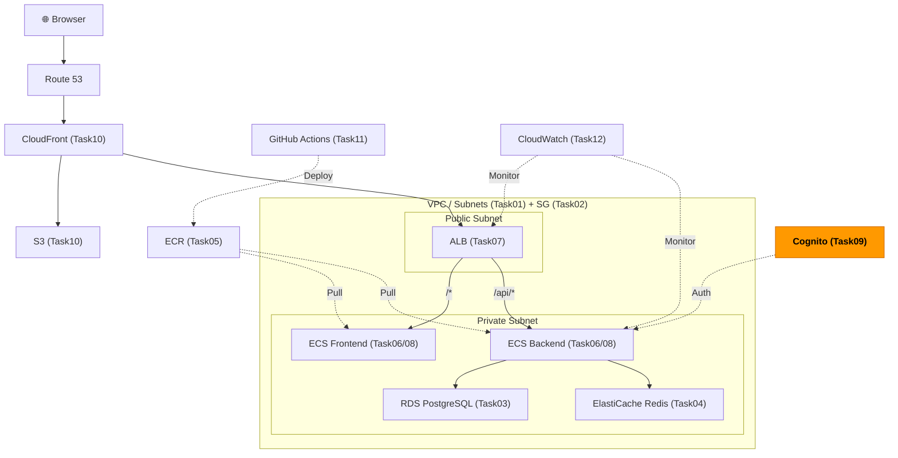
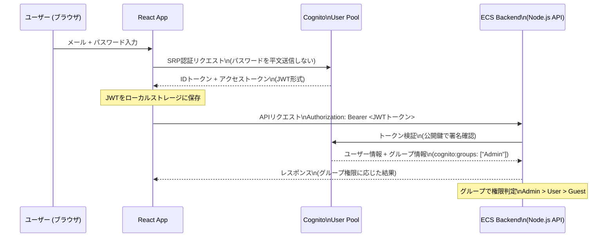

# Task 9: Cognito 認証設定（コンソール）

## 全体構成における位置づけ

> 図: TaskFlow全体アーキテクチャ（オレンジ色が今回構築するコンポーネント）

**今回構築する箇所:** Cognito User Pool + Groups（Guest/User/Admin）- Task09。ユーザー認証基盤を構築し、JWTトークンでAPIの認可を行う。

---

> 参照ナレッジ: [09_authentication.md](../knowledge/09_authentication.md)

## このタスクのゴール

TaskFlow にユーザー認証（ログイン機能）を追加する。

---

## ハンズオン手順

### Step 1: ユーザープールの作成

1. AWSコンソール → **「Cognito」** → **「ユーザープールを作成」**

**サインインオプション：**

| 項目 | 値 | 判断理由 |
|------|----|---------|
| サインイン識別子 | **Eメール** | ユーザー名よりメールの方がユーザーが覚えやすく、一意性が保証される。電話番号と両立も可能だが複雑になるため今回はメールのみ |

> **「Eメールのエイリアスによるサインインを許可する」は設定しない：** ユーザーが後からメールを変更できてしまう場合に挙動が複雑になるため。初期設計を単純に保つ。

> **🚨 変更不可の設定（重要）：** サインイン識別子（ここで設定するEメールなどの項目）は **ユーザープール作成後に変更できない**。「やっぱり電話番号でもサインインできるようにしたい」と思っても、プールを削除して作り直すしかない。間違えたらユーザープールごと作り直しになるので慎重に選択すること。

2. **「次へ」**

**パスワードポリシー：**

| 項目 | 値 | 判断理由 |
|------|----|---------|
| 最小の長さ | 8 | 短すぎると総当たり攻撃に弱い。8文字は一般的な最低ライン |
| 大文字・小文字・数字・特殊文字 | 必須のまま（デフォルト） | 適度に複雑にすることで推測しにくくなる。ただし過度な要件はUX悪化につながる |
| 一時パスワードの有効期限 | 7日 | 長すぎると未使用アカウントのリスク。7日は標準的 |

**Multi-factor authentication：**

| 項目 | 値 | 判断理由 |
|------|----|---------|
| MFA | **なし** | 学習環境では設定の複雑さを避ける。本番（特に管理者アカウント）ではTOTP（Google Authenticator等）を有効化推奨 |

3. **「次へ」**

**ユーザーアカウントの復旧：**

| 項目 | 値 | 判断理由 |
|------|----|---------|
| セルフサービスのアカウント復旧 | 有効 | ユーザーが自分でパスワードリセットできる機能。なければ全て管理者が対応する必要がある |
| 検証メッセージ配信方法 | Eメールのみ | SMS（電話番号）は別途SNSサービスの設定と費用が発生するため、今回はメールのみ |

**サインアップ設定：**

| 項目 | 値 | 判断理由 |
|------|----|---------|
| セルフサービスのサインアップ | 有効 | ユーザーが自分でアカウントを作れる。招待制にしたい場合は無効にして管理者が作成する |
| Eメールで検証 | **チェック** | 本物のメールアドレスを確認することでスパム登録を防ぐ |

4. **「次へ」**

**メッセージの配信：**

| 項目 | 値 | 判断理由 |
|------|----|---------|
| メール送信 | **Cognito でメールを送信** | 学習・開発環境向け。1日50件の制限あり。本番ではAmazon SES（送信制限なし）を設定する |

> **本番でSESを使う理由：** Cognitoの組み込みメールは配信制限があり、送信元のドメインがAWSのドメインになる。SESを設定すると自社ドメインから送れる。

5. **「次へ」**

**ユーザープールの統合：**

| 項目 | 値 | 判断理由 |
|------|----|---------|
| ユーザープール名 | `taskflow-user-pool` | |
| ホストされた認証ページを使用 | **無効**（チェックしない） | 独自のReact UIで認証画面を作るため不要 |
| アプリクライアント名 | `taskflow-web-client` | |
| クライアントシークレット | **生成しない** | ブラウザで動くSPAはシークレットを安全に保持できない。シークレットが不要なPublic Clientとして設定する |
| 認証フロー | デフォルトのまま | `ALLOW_USER_SRP_AUTH`（SRP = セキュアリモートパスワード。パスワードをそのまま送らず安全に認証できるプロトコル） |

**タグ：**（「ユーザープールの統合」ページ下部のタグセクションに設定）

| キー | 値 |
|------|-----|
| Name | taskflow-user-pool |
| Environment | dev |
| Project | taskflow |
| ManagedBy | manual |

> **ユーザーグループへのタグ設定について：** CognitoのユーザーグループはAWSがタグ付けをサポートしていないため、タグの設定は不要です。

6. **「ユーザープールを作成」**

### Step 2: ユーザーグループの作成

> 図: Cognitoの認証フロー（ログイン → JWTトークン → API認可）

1. 作成した `taskflow-user-pool` をクリック → **「グループ」タブ** → **「グループを作成」**

以下の3グループを順番に作成：

| グループ名 | 説明 | 優先順位 |
|-----------|------|---------|
| `Guest` | 閲覧のみ | 3 |
| `User` | 通常ユーザー（タスクの作成・編集） | 2 |
| `Admin` | 管理者（全操作） | 1 |

> **IAMロールは設定しない（今回）：** グループにIAMロールを紐づけるとAWSリソースへの操作権限をユーザーに付与できる（Cognito Identity Pool連携時）。今回はアプリ内での権限制御にグループ名を使うだけなのでIAMロールは不要。

> **優先順位の意味：** ユーザーが複数グループに所属している場合、`cognito:preferred_role` の決定に使われる。アプリで最初に評価するグループを優先順位1に設定する。

### Step 3: テストユーザーの作成

1. **「ユーザー」タブ** → **「ユーザーを作成」**

| 項目 | 値 | 判断理由 |
|------|----|---------|
| ユーザーを招待する方法 | **パスワードを送信しない** | テスト用なので招待メールは不要 |
| Eメールアドレス | 任意（自分のアドレス） | |
| 一時パスワード | 自分でパスワードを設定 | |
| Eメールを確認済みとしてマーク | **チェック** | メール確認フローをスキップするため |

2. 作成したユーザーをクリック → **「ユーザーをグループに追加」** → `Admin` を選択

---

## 確認ポイント

1. ユーザープールの **「ユーザープールID」** を確認・メモ（形式: `ap-northeast-1_Xxxxxxxxx`）
2. **「アプリクライアント」** タブで `taskflow-web-client` の **クライアントID** をメモ
3. **「グループ」** タブに `Guest`・`User`・`Admin` の3グループが作成されているか
4. テストユーザーのステータスが **「確認済み」** になっているか

---

**このタスクをコンソールで完了したら:** [Task 9: Cognito（IaC版）](../iac/09_cognito.md)

**次のタスク:** [Task 10: S3 + CloudFront 設定](10_s3_cloudfront.md)
