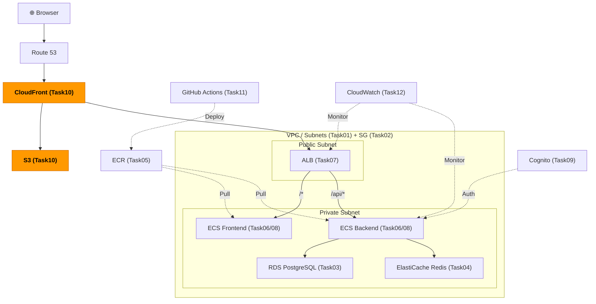
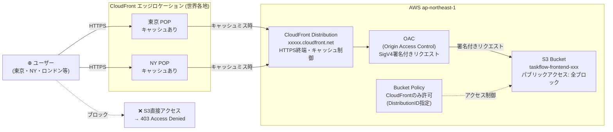

# Task 10: S3 + CloudFront 設定（コンソール）

## 全体構成における位置づけ

> 図: TaskFlow全体アーキテクチャ（オレンジ色が今回構築するコンポーネント）



**今回構築する箇所:** S3 + CloudFront - Task10。ReactビルドファイルをS3に配置し、CloudFront + OACでCDN配信する。

---

> 参照ナレッジ: [10_cdn_storage.md](../knowledge/10_cdn_storage.md)

## このタスクのゴール

React フロントエンドをCDN経由で高速配信できる構成を作る。

---

## ハンズオン手順

### Step 1: S3 バケットの作成

1. AWSコンソール → **「S3」** → **「バケットを作成」**

| 項目 | 値 | 判断理由 |
|------|----|---------|
| バケット名 | `taskflow-frontend-<アカウントID>` | バケット名はAWS全体でグローバルに一意。アカウントIDを含めると重複しにくい |
| リージョン | ap-northeast-1 | CloudFrontは全世界配信なので、バケット自体のリージョンはどこでも良いが、ALBと同リージョンで揃える |
| オブジェクト所有権 | **ACL無効（推奨）** | ACLは古い権限管理方式。バケットポリシーで管理する現在の推奨方式を使う |
| パブリックアクセスのブロック | **すべてブロック** | CloudFront + OACでのみアクセスさせる。S3を直接公開しない |
| バケットのバージョニング | 無効 | 静的ファイルは常に最新をデプロイするため旧バージョン管理は不要。有効にするとストレージコストが増える |
| デフォルトの暗号化 | SSE-S3（デフォルト） | 特別なコンプライアンス要件がなければSSE-S3で十分。SSE-KMSは独自キー管理が必要でコストも高い |

**タグ：**（「バケットを作成」画面下部のタグセクションに設定）

| キー | 値 |
|------|-----|
| Name | taskflow-frontend |
| Environment | dev |
| Project | taskflow |
| ManagedBy | manual |

2. **「バケットを作成」**

> **静的ウェブサイトホスティングを有効にしない理由：** 有効にするとS3のウェブサイトエンドポイントが公開される。CloudFront + OACを使う構成ではこのエンドポイントは不要で、OACが使えなくなるためむしろ有効にしてはいけない。

### Step 2: CloudFront ディストリビューションの作成

> 図: CloudFront + S3のOAC設定（エッジロケーション → CloudFront → OAC → S3）



1. AWSコンソール → **「CloudFront」** → **「ディストリビューションを作成」**

**オリジン：**

| 項目 | 値 | 判断理由 |
|------|----|---------|
| オリジンドメイン | S3バケットを選択（`.s3.amazonaws.com` 形式） | 静的ウェブサイトホスティングのエンドポイントではなくS3 REST APIエンドポイントを使う（OACのため） |
| オリジンアクセス | **Origin access control settings (recommended)** | OACを使ってCloudFrontだけがS3にアクセスできるよう制限する |
| コントロール設定 | **「コントロール設定を作成」** → 名前: `taskflow-oac` → 署名: SigV4 → 作成 | 新しい認証方式（OACはOAIより新しく推奨される方式） |

**デフォルトキャッシュビヘイビア：**

| 項目 | 値 | 判断理由 |
|------|----|---------|
| ビューワープロトコルポリシー | **Redirect HTTP to HTTPS** | HTTPアクセスをHTTPSにリダイレクト。ユーザーのブックマークがHTTPでも安全に誘導できる |
| 許可されたHTTPメソッド | GET, HEAD | 静的ファイルは読み取りのみ。POST等を許可する必要はない |
| キャッシュポリシー | **CachingOptimized** | JS/CSS/画像に対して最適なキャッシュ設定（TTL最大1年）。変更時はファイル名が変わるので古いキャッシュが返ることはない |
| オリジンリクエストポリシー | **設定しない（なし）** | S3への転送時に余分なヘッダーを付ける必要はない |

**ファンクションの関連付け：** 設定なし（今回はエッジ処理不要）

**設定：**

> **UI変更注意（2025年6月以降）：** CloudFrontコンソールのUIが刷新されました。以前は1画面にまとめて設定する形式でしたが、現在は複数ページのウィザード形式になっています。「ディストリビューション名」という日本語項目が見当たらない場合は、**「Distribution name」**（英語）として最初のページに表示されています。以下の項目が現在のUIに対応しています。

| 項目（現在のUI） | 値 | 判断理由 |
|------|----|---------|
| **Distribution name** | `taskflow-cloudfront` | コンソール一覧での識別名。URLには影響しない。タグの `Name` キーに自動設定される |
| **Default root object** | `index.html` | ルートURL（`/`）アクセス時に返すファイル |
| Alternate domain names (CNAMEs) | 設定しない | 独自ドメインを使う場合は設定。今回は `*.cloudfront.net` のドメインを使う |
| SSL certificate | 設定しない | 独自ドメインなしなら不要 |
| **Standard logging** | 有効（推奨） | アクセスログをS3に保存。問題調査・セキュリティ監査に使う。ログ用バケットは別途作るか後で追加 |
| **Enable IPv6** | 有効 | 追加コストなし。IPv6ユーザーにも対応できる |

> **Step 3: セキュリティ保護の設定（WAF）**
>
> ウィザードの途中で「セキュリティ保護」ページが表示されます。以下の選択肢が表示されます：
>
> | 選択肢 | 概要 |
> |--------|------|
> | セキュリティ保護を有効にしない | WAFなし（追加料金なし） |
> | セキュリティ保護機能が含まれています | WAF有効（$5/月 + リクエスト料金） |
>
> **dev環境では「セキュリティ保護を有効にしない」を選択してください。**
>
> 理由：WAFは学習環境では不要なコスト（目安：$14/月〜）がかかります。Task 10のゴールはCloudFront + OACの配信構成を理解することであり、WAFはその範囲外です。作成後でも後から追加できます。
>
> 本番環境では「Layer 7 DDoSプロテクション」を含むWAF有効オプションの採用を推奨します。

**タグ：**（作成完了後、ディストリビューション詳細画面の「タグ」タブで設定）

| キー | 値 |
|------|-----|
| Name | taskflow-cloudfront |
| Environment | dev |
| Project | taskflow |
| ManagedBy | manual |

> **タグ設定のタイミングについて：** 新UIでは作成画面中にタグを設定できる場合と、作成後に詳細画面から追加する場合があります。作成画面の下部に「タグ」セクションがあればそこで設定し、なければ作成後に追加してください。

2. **「ディストリビューションを作成」**（またはウィザード最終ページの「作成」ボタン）

3. 作成後の処理について（UIバージョンによって異なる）：

> **UI変更注意（2025年後半以降）：** 以前のUIでは作成直後にページ上部へ「S3 バケットポリシーをコピー」という通知バナーが表示されていましたが、**新しいUIではこの通知が表示されない場合があります**。表示された場合はクリックしてポリシーをコピーしてください。表示されない場合は以下の手順でポリシーを取得します。
>
> **【通知が表示されない場合の代替手順】**
> 1. 作成されたディストリビューションの詳細画面を開く
> 2. **「Origins」タブ** をクリック
> 3. S3オリジンの行を選択し **「Edit」** をクリック
> 4. 「Origin access control settings」セクションに **「Copy policy」** ボタンがあるのでクリック
> 5. そのままStep 3（バケットポリシーの設定）へ進む

### Step 3: S3 バケットポリシーの設定

1. S3 バケット → **「アクセス許可」タブ** → **「バケットポリシー」** → **「編集」**
2. Step 2でコピーしたポリシー（または下記の参考ポリシーを自分の値に書き換えたもの）を貼り付けて **「変更を保存」**

ポリシーの内容（参考）：
```json
{
  "Version": "2012-10-17",
  "Statement": [{
    "Effect": "Allow",
    "Principal": { "Service": "cloudfront.amazonaws.com" },
    "Action": "s3:GetObject",
    "Resource": "arn:aws:s3:::taskflow-frontend-<アカウントID>/*",
    "Condition": {
      "StringEquals": {
        "AWS:SourceArn": "arn:aws:cloudfront::<アカウントID>:distribution/<DistributionID>"
      }
    }
  }]
}
```

> **ConditionでDistributionIDを指定する理由：** 「CloudFrontサービス」だけを許可すると、他のAWSアカウントのCloudFrontからもS3にアクセスできてしまう。特定のディストリビューションIDを条件に指定することで自分のCloudFrontからのみに絞る。

### Step 4: SPAルーティングのエラーページ設定

1. CloudFront ディストリビューション → **「エラーページ」タブ** → **「カスタムエラーレスポンスを作成」**

| 項目 | 値 | 判断理由 |
|------|----|---------|
| HTTPエラーコード | 403 | S3はオブジェクトが存在しない場合403を返す（パブリックアクセスブロック有効時） |
| エラーキャッシュの最小 TTL | 0 | エラーをキャッシュしないようにする |
| レスポンスページのパス | `/index.html` | SPAのルーター（React Router等）に処理させる |
| HTTPレスポンスコード | 200 | ブラウザには200として返す（404ではなく） |

同様に **HTTPエラーコード: 404** も同じ設定で追加する。

> **なぜ403と404の両方を設定するか：** S3は「オブジェクトが存在しない」場合に404を返すが、パブリックアクセスブロックが有効な場合は403を返すこともある。両方設定しておくことでどちらのケースも対応できる。

### Step 5: フロントエンドのビルドとアップロード

ローカルでReactアプリをビルドしてS3にアップロードする：

```bash
# frontend ディレクトリでビルド
cd frontend
npm ci
npm run build
cd ..

# S3にアップロード（--deleteで古いファイルを削除）
aws s3 sync frontend/build/ s3://taskflow-frontend-<アカウントID>/ --delete
```

---

## 確認ポイント

1. CloudFront のステータスが **「Deployed」** になっているか（最大15分かかる）
2. **ディストリビューションドメイン名** (`xxxxx.cloudfront.net`) をブラウザで開いてサイトが表示されるか
3. S3バケットのURL（`https://taskflow-frontend-xxx.s3.ap-northeast-1.amazonaws.com/index.html`）を直接開いて **「Access Denied」** になるか（OACが正しく設定されている証拠）
4. `/tasks/any-path` のような深いURLを直接開いても404にならずアプリが表示されるか（エラーページ設定の確認）

---

**このタスクをコンソールで完了したら:** [Task 10: S3 + CloudFront（IaC版）](../iac/10_s3_cloudfront.md)

**次のタスク:** [Task 11: GitHub Actions CI/CD](11_cicd.md)
