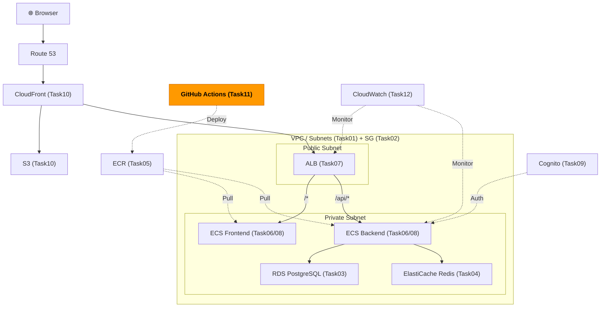
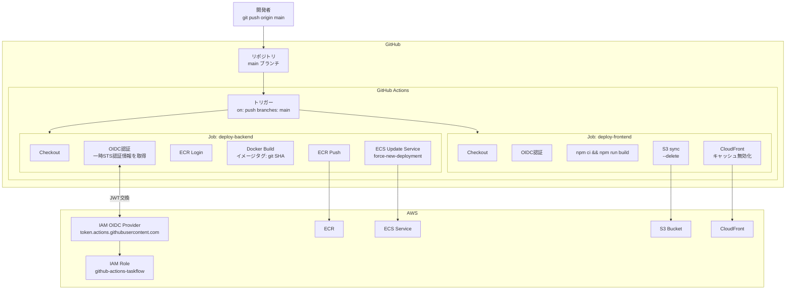

# Task 11: GitHub Actions CI/CD（コンソール準備編）

## 全体構成における位置づけ

> 図: TaskFlow全体アーキテクチャ（オレンジ色が今回構築するコンポーネント）



**今回構築する箇所:** GitHub Actions CI/CD Pipeline - Task11。OIDCによる安全なAWS認証を設定し、mainブランチへのpushで自動デプロイを実現する。

---

> 参照ナレッジ: [11_cicd.md](../knowledge/11_cicd.md)

## このタスクのゴール

GitHub ActionsがAWSを操作するための権限設定（AWS側の準備）を行い、自動デプロイパイプラインを構築する。

---

## ハンズオン手順

### Step 1: GitHub OIDC プロバイダーの登録

GitHub ActionsがAWSに認証するためのOIDCプロバイダーをIAMに登録する。

1. AWSコンソール → **「IAM」** → 左メニュー **「IDプロバイダー」** → **「プロバイダーを追加」**

| 項目 | 値 | 判断理由 |
|------|----|---------|
| プロバイダーのタイプ | **OpenID Connect** | GitHubのJWTを使った認証方式。アクセスキー不要で安全 |
| プロバイダーのURL | `https://token.actions.githubusercontent.com` | GitHubが公開しているOIDCエンドポイント。固定値 |
| サムプリントを取得 | クリックして自動取得 | GitHubのSSL証明書のフィンガープリント。AWSがGitHubを信頼するために必要 |
| 対象者 | `sts.amazonaws.com` | このOIDCトークンの受け取り側がAWS STSであることを示す。固定値 |

2. **「プロバイダーを追加」**

> **アクセスキーを使わない理由：** アクセスキー（`AWS_ACCESS_KEY_ID`/`AWS_SECRET_ACCESS_KEY`）はGitHubのSecretsに保存しても、漏洩した場合に長期間悪用される。OIDCは各ワークフロー実行ごとに一時的なSTS認証情報を発行するため、漏洩しても短時間（通常1時間）で無効になる。

### Step 2: GitHub Actions用 IAM ロールの作成

1. **「IAM」** → **「ロール」** → **「ロールを作成」**

| 項目 | 値 | 判断理由 |
|------|----|---------|
| 信頼されたエンティティタイプ | **ウェブアイデンティティ** | OIDCプロバイダーを使った認証のため |
| アイデンティティプロバイダー | `token.actions.githubusercontent.com` | Step 1で登録したプロバイダー |
| 対象者 | `sts.amazonaws.com` | |
| GitHub 組織 | `kiccho-hub` | 自分のアカウントのリポジトリからのみ使えるよう制限 |
| リポジトリ | `taskflow-aws` | このプロジェクトのリポジトリ名 |

> **リポジトリを特定する理由：** 指定しないと自分の全リポジトリからこのロールを使えてしまう。攻撃者が自分の別のリポジトリにアクセスしてもこのAWSロールは使えないようにする。

2. **「次へ」** → 以下のポリシーをアタッチ：

| ポリシー | 理由 |
|---------|------|
| `AmazonECS_FullAccess` | ECSサービスの更新・タスク定義の登録 |
| `AmazonEC2ContainerRegistryPowerUser` | ECRへのイメージpush（FullAccessではなくPowerUserで十分） |
| `AmazonS3FullAccess` | フロントエンドをS3にデプロイするため |
| `CloudFrontFullAccess` | デプロイ後のキャッシュ無効化（Invalidation）のため |

> **なぜAmazonEC2ContainerRegistryFullAccessではなくPowerUserか：** PowerUserはpush・pull・リポジトリの操作ができる。FullAccessはリポジトリの作成・削除も含む。CI/CDはリポジトリを削除する必要はないため、より限定的なPowerUserで十分。

3. **ロール名**: `github-actions-taskflow`

**タグ：**（ロール作成画面の最下部「タグ」ステップに設定）

| キー | 値 |
|------|-----|
| Name | github-actions-taskflow |
| Environment | dev |
| Project | taskflow |
| ManagedBy | manual |

4. **「ロールを作成」**
5. 作成したロールの **ARN** をメモ（`arn:aws:iam::<アカウントID>:role/github-actions-taskflow`）

### Step 3: GitHub Secretsの設定

GitHubリポジトリ → **「Settings」** → **「Secrets and variables」** → **「Actions」** → **「New repository secret」**

| Secret名 | 値 | 判断理由 |
|----------|----|---------|
| `AWS_ROLE_ARN` | Step 2でメモしたARN | ワークフローから参照するためSecretsに保存 |
| `AWS_REGION` | `ap-northeast-1` | 秘密情報ではないがSecretsで管理すると変更時に一箇所で済む |
| `ECR_REGISTRY` | `<アカウントID>.dkr.ecr.ap-northeast-1.amazonaws.com` | アカウントIDを含むため一応Secretsで管理 |
| `AWS_ACCOUNT_ID` | `<アカウントID>` | S3バケット名にアカウントIDを含むため |
| `CLOUDFRONT_DISTRIBUTION_ID` | CloudFrontディストリビューションID（例: `EXXXXXX`）| キャッシュ無効化のためワークフローから参照 |

> **`ECR_REGISTRY` をVariablesではなくSecretsにする理由：** アカウントIDを公開したくないため。Variablesはリポジトリのコントリビューターなら見えてしまう。

### Step 3.5: GitHub リポジトリの確認

ワークフローを動かす前に、GitHub リポジトリ側の設定を確認する。

**GitHub リポジトリが存在するか確認：**
- `https://github.com/kiccho-hub/taskflow-aws` にリポジトリが作成されていること
- ローカルの `aws-demo` ディレクトリが `git remote` でこのリポジトリに紐づいていること

**GitHub Actions が有効か確認：**
1. リポジトリ → **「Settings」** → **「Actions」** → **「General」**
2. **「Actions permissions」** が `Allow all actions and reusable workflows` になっているか確認
3. 無効になっている場合は有効化する

> **プライベートリポジトリの注意：** 無料プランの場合、プライベートリポジトリは GitHub Actions の月間実行時間に制限がある（2,000分/月）。学習用途では通常問題ない。

**`permissions: id-token: write` が必須：**

Step 4 で作成するワークフローファイルに `permissions: id-token: write` が含まれていることを必ず確認する。これがないと OIDC 認証が機能せず、以下のエラーになる：
```
Error: Credentials could not be loaded, please check your action inputs:
Could not load credentials from any providers
```

このフラグはリポジトリに対して「このワークフローが OIDC トークン（AWS 認証用の一時的な証明書）を発行してよい」という許可を与えるもの。アクセスキー不要の安全な認証方式だが、この設定がないと動かない。

### Step 4: GitHub Actions ワークフローファイルの作成

> 図: CI/CDパイプラインのフロー（push → test → build → ECR push → ECS deploy）



プロジェクトに `.github/workflows/deploy.yml` を作成：

> **ファイルの配置場所：** `.github/workflows/` ディレクトリはプロジェクトルート直下に作成する。ディレクトリが存在しない場合は `mkdir -p .github/workflows` で作成する。

```yaml
# =====================================
# GitHub Actions ワークフローファイル
# 保存場所: .github/workflows/deploy.yml
# 役割: mainブランチへのpushをトリガーに
#       バックエンド・フロントエンドを自動でAWSにデプロイする
# =====================================

# ワークフローの名前。GitHub ActionsのUIの「Actions」タブに表示される
name: Deploy to AWS

# -----------------------------------------------------------------------
# on: このワークフローをいつ実行するかを定義するセクション
# 「どんなイベントが起きたときに動かすか」をGitHubに伝える
# -----------------------------------------------------------------------
on:
  # pushイベント: コードがリモートリポジトリにpushされたときに反応する
  push:
    # branches: どのブランチへのpushに反応するかを配列（[...]）で指定
    # mainブランチへのpushでのみ実行する（featureブランチやPRのpushでは実行しない）
    branches: [main]

# -----------------------------------------------------------------------
# permissions: このワークフローに付与するGitHubトークンの権限
# セキュリティのため、必要最小限の権限だけを明示的に許可する
# -----------------------------------------------------------------------
permissions:
  # id-token: write — OIDC認証のためのJWTトークン発行を許可する（必須）
  # これがないとAWSへのOIDC認証が失敗する（Step 3.5で解説）
  id-token: write
  # contents: read — actions/checkout でリポジトリのコードを取得するために必要
  contents: read

# -----------------------------------------------------------------------
# jobs: 実際に実行する処理（ジョブ）を定義するセクション
# 複数のジョブを並列または直列で実行できる
# ジョブはそれぞれ独立した仮想マシン上で動く（状態は共有されない）
# -----------------------------------------------------------------------
jobs:

  # =======================================================================
  # ジョブ1: deploy-backend
  # バックエンド（Node.js）のDockerイメージをビルドしてECRにpushし、ECSを更新する
  # =======================================================================
  deploy-backend:
    # runs-on: ジョブを実行する仮想マシンのOSを指定する
    # ubuntu-latest: GitHubが提供する最新のUbuntu環境（無料枠で利用可能）
    runs-on: ubuntu-latest

    # steps: このジョブ内で順番に実行する処理の一覧（リスト）
    # 「-」（ハイフン）はYAMLのリスト要素を表す。各ステップは上から順に実行される
    steps:
      # -----------------------------------------------------------------------
      # ステップ1: ソースコードの取得（Checkout）
      # uses: 公開されているアクション（処理の部品）を使うキーワード
      # actions/checkout@v4: GitHubが公式提供するアクション。リポジトリのコードを
      #   仮想マシン上にダウンロードする。@v4はバージョン指定
      # -----------------------------------------------------------------------
      - uses: actions/checkout@v4

      # -----------------------------------------------------------------------
      # ステップ2: AWS認証情報の設定（OIDC認証）
      # name: ステップに名前をつける。GitHub ActionsのUIのログに表示される
      # -----------------------------------------------------------------------
      - name: Configure AWS credentials
        # aws-actions/configure-aws-credentials@v4: AWSが公式提供するアクション
        # OIDCを使ってGitHub ActionsからAWSに安全にログインする
        # アクセスキー不要で、一時的なSTS認証情報を自動取得する
        uses: aws-actions/configure-aws-credentials@v4
        # with: アクションに渡す設定値（引数）を定義するセクション
        with:
          # role-to-assume: 引き受けるIAMロールのARNを指定する
          # ${{ secrets.AWS_ROLE_ARN }} — GitHub Secretsに保存した値を参照する記法
          # Secretsに保存することでARN（アカウントIDを含む）をコードに直書きせずに済む
          role-to-assume: ${{ secrets.AWS_ROLE_ARN }}
          # aws-region: 操作対象のAWSリージョンを指定する
          aws-region: ${{ secrets.AWS_REGION }}

      # -----------------------------------------------------------------------
      # ステップ3: ECRへのDockerログイン
      # DockerイメージをECRにpushするには、事前にECRへのログインが必要
      # -----------------------------------------------------------------------
      - name: Login to ECR
        # id: このステップに識別子をつける。後のステップから結果を参照するために使う
        # 例: steps.login-ecr.outputs.registry でECRのURLを取得できる
        id: login-ecr
        # aws-actions/amazon-ecr-login@v2: ECRへのDockerログインを自動化するアクション
        # 直前のステップで取得したAWS認証情報を使ってログインする
        uses: aws-actions/amazon-ecr-login@v2

      # -----------------------------------------------------------------------
      # ステップ4: Dockerイメージのビルド・タグ付け・ECRへのpush
      # -----------------------------------------------------------------------
      - name: Build, tag, and push backend image
        # env: このステップ内で使う環境変数を定義するセクション
        # シェルコマンド（run:）の中で $変数名 として参照できる
        env:
          # ECR_REGISTRY: ECRのエンドポイントURL（例: 123456789.dkr.ecr.ap-northeast-1.amazonaws.com）
          # Secretsから参照することでアカウントIDをコードに直書きしない
          ECR_REGISTRY: ${{ secrets.ECR_REGISTRY }}
          # IMAGE_TAG: Dockerイメージのタグにgitのコミットハッシュ（SHA）を使う
          # ${{ github.sha }} — GitHub Actionsが自動で提供するコンテキスト変数
          # 「latest」タグではなくSHAを使う理由: どのコミットのコードかを追跡できる
          # またロールバック時に特定バージョンのイメージを正確に指定できる
          IMAGE_TAG: ${{ github.sha }}
        # run: シェルコマンドを直接実行するキーワード
        # 「|」（パイプ）はYAMLの複数行文字列を表す。次の行からインデントされた内容が続く
        run: |
          # docker build: Dockerfileからイメージをビルドする
          # -t: タグ（イメージ名:バージョン）を指定するオプション
          # ./backend: Dockerfileが置かれているディレクトリ（ビルドコンテキスト）
          docker build -t $ECR_REGISTRY/taskflow/backend:$IMAGE_TAG ./backend
          # docker push: ビルドしたイメージをECRにアップロードする
          docker push $ECR_REGISTRY/taskflow/backend:$IMAGE_TAG

      # -----------------------------------------------------------------------
      # ステップ5: ECSサービスの更新（新しいイメージでコンテナを再起動）
      # -----------------------------------------------------------------------
      - name: Update ECS service
        # run: AWS CLIコマンドを実行してECSサービスを更新する
        # 「\」（バックスラッシュ）はシェルの行継続文字。長いコマンドを複数行に分けて書ける
        run: |
          aws ecs update-service \
            # --cluster: 対象のECSクラスター名を指定する
            --cluster taskflow-cluster \
            # --service: 更新する対象のECSサービス名を指定する
            --service taskflow-backend-svc \
            # --force-new-deployment: 新しいタスク定義が登録されていなくても
            # 強制的に新しいデプロイメントを開始するオプション
            # これにより、ECSが最新のECRイメージを取得して新しいコンテナを起動する
            --force-new-deployment

  # =======================================================================
  # ジョブ2: deploy-frontend
  # フロントエンド（React）をビルドしてS3にアップロードし、CloudFrontのキャッシュをクリアする
  # deploy-backendとは独立して並列実行される（needsの指定がないため）
  # =======================================================================
  deploy-frontend:
    # バックエンドジョブと同じくUbuntu環境で実行する
    runs-on: ubuntu-latest

    steps:
      # -----------------------------------------------------------------------
      # ステップ1: ソースコードの取得（バックエンドと同じ）
      # ジョブは別々の仮想マシンで動くため、フロントエンドジョブでも個別にcheckoutが必要
      # -----------------------------------------------------------------------
      - uses: actions/checkout@v4

      # -----------------------------------------------------------------------
      # ステップ2: AWS認証情報の設定（バックエンドと同じ設定）
      # フロントエンドジョブでもS3・CloudFront操作のためにAWS認証が必要
      # -----------------------------------------------------------------------
      - name: Configure AWS credentials
        uses: aws-actions/configure-aws-credentials@v4
        with:
          role-to-assume: ${{ secrets.AWS_ROLE_ARN }}
          aws-region: ${{ secrets.AWS_REGION }}

      # -----------------------------------------------------------------------
      # ステップ3: Node.js環境のセットアップ
      # フロントエンド（React）のビルドにはNode.jsが必要
      # -----------------------------------------------------------------------
      - name: Setup Node.js
        # actions/setup-node@v4: 指定したバージョンのNode.jsをインストールするアクション
        uses: actions/setup-node@v4
        with:
          # node-version: 使用するNode.jsのバージョンを指定する
          # シングルクォートで囲む理由: YAMLで数値と区別するため（20は数値、'20'は文字列）
          node-version: '20'
          # cache: npmのキャッシュを有効にする設定
          # node_modulesをキャッシュすることで2回目以降のnpm installが高速になる
          cache: 'npm'
          # cache-dependency-path: キャッシュのキーとなるファイルを指定する
          # package-lock.jsonが変わったときだけキャッシュを再生成する
          cache-dependency-path: frontend/package.json

      # -----------------------------------------------------------------------
      # ステップ4: フロントエンドのビルド
      # ReactアプリをHTML/CSS/JSの静的ファイルに変換する
      # -----------------------------------------------------------------------
      - name: Build frontend
        # working-directory: コマンドを実行するディレクトリを指定する
        # frontend/ サブディレクトリ内でコマンドを実行する（cd frontend と同等）
        working-directory: frontend
        run: |
          # npm ci: package-lock.jsonを厳密に参照してパッケージをインストールする
          # npm install との違い: ciはpackage-lock.jsonを書き換えない。
          # CI環境では常に同じバージョンのパッケージが入ることが保証される
          npm ci
          # npm run build: package.jsonのscriptsに定義されたbuildコマンドを実行する
          # Reactの場合: src/ のコードをfrontend/build/ に最適化してビルドする
          npm run build

      # -----------------------------------------------------------------------
      # ステップ5: ビルド成果物をS3にアップロード
      # frontend/build/ の静的ファイルをS3バケットに同期する
      # -----------------------------------------------------------------------
      - name: Deploy to S3
        run: |
          # aws s3 sync: ローカルディレクトリとS3バケットを同期するコマンド
          # 差分ファイルのみアップロードするため効率的
          # frontend/build/: Reactビルドの出力先ディレクトリ
          # s3://...: 同期先のS3バケットURL。${{ secrets.AWS_ACCOUNT_ID }} でアカウントIDを埋め込む
          # --delete: S3側にあってローカルに存在しないファイルをS3から削除する
          #   これにより古いファイルがS3に残り続けることを防ぐ
          aws s3 sync frontend/build/ s3://taskflow-frontend-${{ secrets.AWS_ACCOUNT_ID }}/ --delete

      # -----------------------------------------------------------------------
      # ステップ6: CloudFrontのキャッシュ無効化（Invalidation）
      # S3を更新しただけではCloudFrontがキャッシュした古いファイルが配信され続ける
      # Invalidationを発行することでCloudFrontのキャッシュを強制クリアする
      # -----------------------------------------------------------------------
      - name: Invalidate CloudFront cache
        run: |
          # aws cloudfront create-invalidation: キャッシュ無効化リクエストを作成するコマンド
          aws cloudfront create-invalidation \
            # --distribution-id: キャッシュをクリアするCloudFrontディストリビューションのIDを指定
            --distribution-id ${{ secrets.CLOUDFRONT_DISTRIBUTION_ID }} \
            # --paths: 無効化するパスを指定する
            # "/*" は全てのファイル（パス）を対象にすることを意味する
            # 特定ページだけ更新した場合は "/index.html" のように絞り込むことも可能
            --paths "/*"
```

---

## 確認ポイント

1. **IAM → IDプロバイダー** に `token.actions.githubusercontent.com` が追加されているか
2. **IAM → ロール** に `github-actions-taskflow` が存在し、信頼ポリシーにリポジトリが指定されているか
3. **GitHub → Settings → Secrets** に3つのSecretが設定されているか
4. mainブランチにpushしてActionsが動くか（Actionsタブで確認）

---

**このタスクをコンソールで完了したら:** [Task 11: CI/CD（IaC版）](../iac/11_cicd.md)

**次のタスク:** [Task 12: CloudWatch 監視設定](12_monitoring.md)
