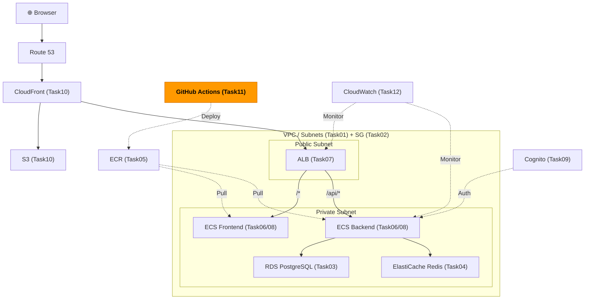
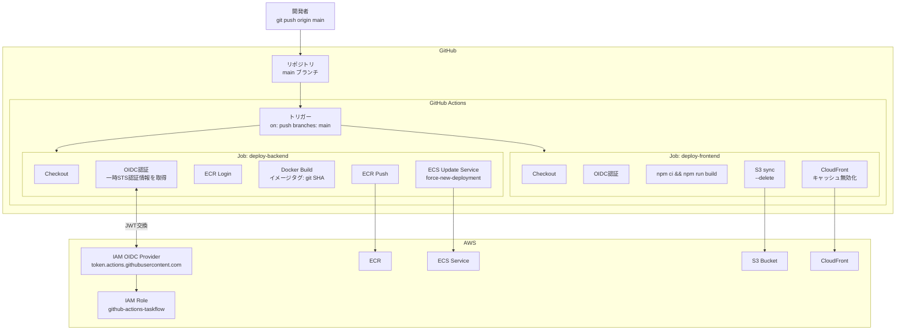

# Task 11: GitHub Actions CI/CD（コンソール準備編）

## 全体構成における位置づけ

> 図: TaskFlow全体アーキテクチャ（オレンジ色が今回構築するコンポーネント）



**今回構築する箇所:** GitHub Actions CI/CD Pipeline - Task11。OIDCによる安全なAWS認証を設定し、mainブランチへのpushで自動デプロイを実現する。

---

> 参照ナレッジ: [11_cicd.md](../knowledge/11_cicd.md)

## このタスクのゴール

GitHub ActionsがAWSを操作するための権限設定（AWS側の準備）を行い、自動デプロイパイプラインを構築する。

---

## ハンズオン手順

### Step 1: GitHub OIDC プロバイダーの登録

GitHub ActionsがAWSに認証するためのOIDCプロバイダーをIAMに登録する。

1. AWSコンソール → **「IAM」** → 左メニュー **「IDプロバイダー」** → **「プロバイダーを追加」**

| 項目 | 値 | 判断理由 |
|------|----|---------|
| プロバイダーのタイプ | **OpenID Connect** | GitHubのJWTを使った認証方式。アクセスキー不要で安全 |
| プロバイダーのURL | `https://token.actions.githubusercontent.com` | GitHubが公開しているOIDCエンドポイント。固定値 |
| サムプリントを取得 | クリックして自動取得 | GitHubのSSL証明書のフィンガープリント。AWSがGitHubを信頼するために必要 |
| 対象者 | `sts.amazonaws.com` | このOIDCトークンの受け取り側がAWS STSであることを示す。固定値 |

2. **「プロバイダーを追加」**

> **アクセスキーを使わない理由：** アクセスキー（`AWS_ACCESS_KEY_ID`/`AWS_SECRET_ACCESS_KEY`）はGitHubのSecretsに保存しても、漏洩した場合に長期間悪用される。OIDCは各ワークフロー実行ごとに一時的なSTS認証情報を発行するため、漏洩しても短時間（通常1時間）で無効になる。

### Step 2: GitHub Actions用 IAM ロールの作成

1. **「IAM」** → **「ロール」** → **「ロールを作成」**

| 項目 | 値 | 判断理由 |
|------|----|---------|
| 信頼されたエンティティタイプ | **ウェブアイデンティティ** | OIDCプロバイダーを使った認証のため |
| アイデンティティプロバイダー | `token.actions.githubusercontent.com` | Step 1で登録したプロバイダー |
| 対象者 | `sts.amazonaws.com` | |
| GitHub 組織 | 自分のGitHubユーザー名（例: `yourname`） | 自分のアカウントのリポジトリからのみ使えるよう制限 |
| リポジトリ | `aws-demo` | このプロジェクトのリポジトリ名 |

> **リポジトリを特定する理由：** 指定しないと自分の全リポジトリからこのロールを使えてしまう。攻撃者が自分の別のリポジトリにアクセスしてもこのAWSロールは使えないようにする。

2. **「次へ」** → 以下のポリシーをアタッチ：

| ポリシー | 理由 |
|---------|------|
| `AmazonECS_FullAccess` | ECSサービスの更新・タスク定義の登録 |
| `AmazonEC2ContainerRegistryPowerUser` | ECRへのイメージpush（FullAccessではなくPowerUserで十分） |
| `AmazonS3FullAccess` | フロントエンドをS3にデプロイするため |
| `CloudFrontFullAccess` | デプロイ後のキャッシュ無効化（Invalidation）のため |

> **なぜAmazonEC2ContainerRegistryFullAccessではなくPowerUserか：** PowerUserはpush・pull・リポジトリの操作ができる。FullAccessはリポジトリの作成・削除も含む。CI/CDはリポジトリを削除する必要はないため、より限定的なPowerUserで十分。

3. **ロール名**: `github-actions-taskflow`
4. **「ロールを作成」**
5. 作成したロールの **ARN** をメモ（`arn:aws:iam::<アカウントID>:role/github-actions-taskflow`）

### Step 3: GitHub Secretsの設定

GitHubリポジトリ → **「Settings」** → **「Secrets and variables」** → **「Actions」** → **「New repository secret」**

| Secret名 | 値 | 判断理由 |
|----------|----|---------|
| `AWS_ROLE_ARN` | Step 2でメモしたARN | ワークフローから参照するためSecretsに保存 |
| `AWS_REGION` | `ap-northeast-1` | 秘密情報ではないがSecretsで管理すると変更時に一箇所で済む |
| `ECR_REGISTRY` | `<アカウントID>.dkr.ecr.ap-northeast-1.amazonaws.com` | アカウントIDを含むため一応Secretsで管理 |

> **`ECR_REGISTRY` をVariablesではなくSecretsにする理由：** アカウントIDを公開したくないため。Variablesはリポジトリのコントリビューターなら見えてしまう。

### Step 3.5: GitHub リポジトリの確認

ワークフローを動かす前に、GitHub リポジトリ側の設定を確認する。

**GitHub リポジトリが存在するか確認：**
- `https://github.com/<ユーザー名>/aws-demo` にリポジトリが作成されていること
- ローカルの `aws-demo` ディレクトリが `git remote` でこのリポジトリに紐づいていること

**GitHub Actions が有効か確認：**
1. リポジトリ → **「Settings」** → **「Actions」** → **「General」**
2. **「Actions permissions」** が `Allow all actions and reusable workflows` になっているか確認
3. 無効になっている場合は有効化する

> **プライベートリポジトリの注意：** 無料プランの場合、プライベートリポジトリは GitHub Actions の月間実行時間に制限がある（2,000分/月）。学習用途では通常問題ない。

**`permissions: id-token: write` が必須：**

Step 4 で作成するワークフローファイルに `permissions: id-token: write` が含まれていることを必ず確認する。これがないと OIDC 認証が機能せず、以下のエラーになる：
```
Error: Credentials could not be loaded, please check your action inputs:
Could not load credentials from any providers
```

このフラグはリポジトリに対して「このワークフローが OIDC トークン（AWS 認証用の一時的な証明書）を発行してよい」という許可を与えるもの。アクセスキー不要の安全な認証方式だが、この設定がないと動かない。

### Step 4: GitHub Actions ワークフローファイルの作成

> 図: CI/CDパイプラインのフロー（push → test → build → ECR push → ECS deploy）



プロジェクトに `.github/workflows/deploy.yml` を作成：

> **ファイルの配置場所：** `.github/workflows/` ディレクトリはプロジェクトルート直下に作成する。ディレクトリが存在しない場合は `mkdir -p .github/workflows` で作成する。

```yaml
name: Deploy to AWS

on:
  push:
    branches: [main]   # mainへのpushでのみ実行（PRのpushでは実行しない）

permissions:
  id-token: write    # OIDC認証のためのJWT発行を許可（必須）
  contents: read     # リポジトリのコードをcheckoutするため

jobs:
  deploy-backend:
    runs-on: ubuntu-latest
    steps:
      - uses: actions/checkout@v4

      - name: Configure AWS credentials
        uses: aws-actions/configure-aws-credentials@v4
        with:
          role-to-assume: ${{ secrets.AWS_ROLE_ARN }}
          aws-region: ${{ secrets.AWS_REGION }}

      - name: Login to ECR
        id: login-ecr
        uses: aws-actions/amazon-ecr-login@v2

      - name: Build, tag, and push backend image
        env:
          ECR_REGISTRY: ${{ secrets.ECR_REGISTRY }}
          IMAGE_TAG: ${{ github.sha }}    # gitのcommitハッシュをタグとして使う（latestより安全）
        run: |
          docker build -t $ECR_REGISTRY/taskflow/backend:$IMAGE_TAG ./backend
          docker push $ECR_REGISTRY/taskflow/backend:$IMAGE_TAG

      - name: Update ECS service
        run: |
          aws ecs update-service \
            --cluster taskflow-cluster \
            --service taskflow-backend-svc \
            --force-new-deployment

  deploy-frontend:
    runs-on: ubuntu-latest
    steps:
      - uses: actions/checkout@v4

      - name: Configure AWS credentials
        uses: aws-actions/configure-aws-credentials@v4
        with:
          role-to-assume: ${{ secrets.AWS_ROLE_ARN }}
          aws-region: ${{ secrets.AWS_REGION }}

      - name: Build frontend
        run: npm ci && npm run build    # npm ciはpackage-lock.jsonを厳密に使う（installより再現性が高い）

      - name: Deploy to S3
        run: |
          aws s3 sync build/ s3://taskflow-frontend-<アカウントID>/ --delete

      - name: Invalidate CloudFront cache
        run: |
          aws cloudfront create-invalidation \
            --distribution-id <DistributionID> \
            --paths "/*"    # 全ファイルのキャッシュをクリア
```

---

## 確認ポイント

1. **IAM → IDプロバイダー** に `token.actions.githubusercontent.com` が追加されているか
2. **IAM → ロール** に `github-actions-taskflow` が存在し、信頼ポリシーにリポジトリが指定されているか
3. **GitHub → Settings → Secrets** に3つのSecretが設定されているか
4. mainブランチにpushしてActionsが動くか（Actionsタブで確認）

---

**このタスクをコンソールで完了したら:** [Task 11: CI/CD（IaC版）](../iac/11_cicd.md)

**次のタスク:** [Task 12: CloudWatch 監視設定](12_monitoring.md)
