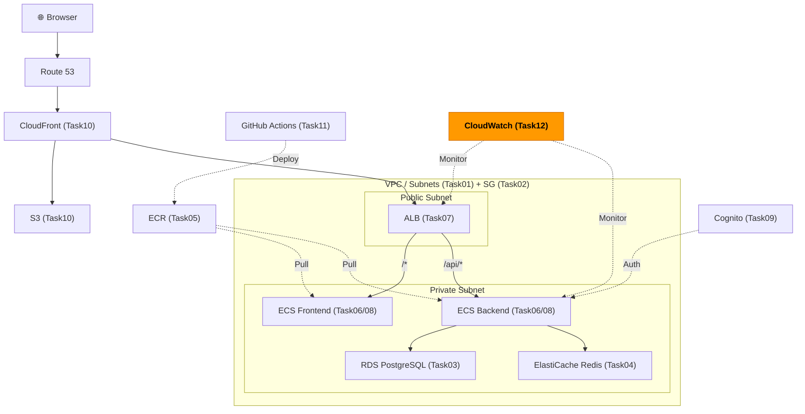
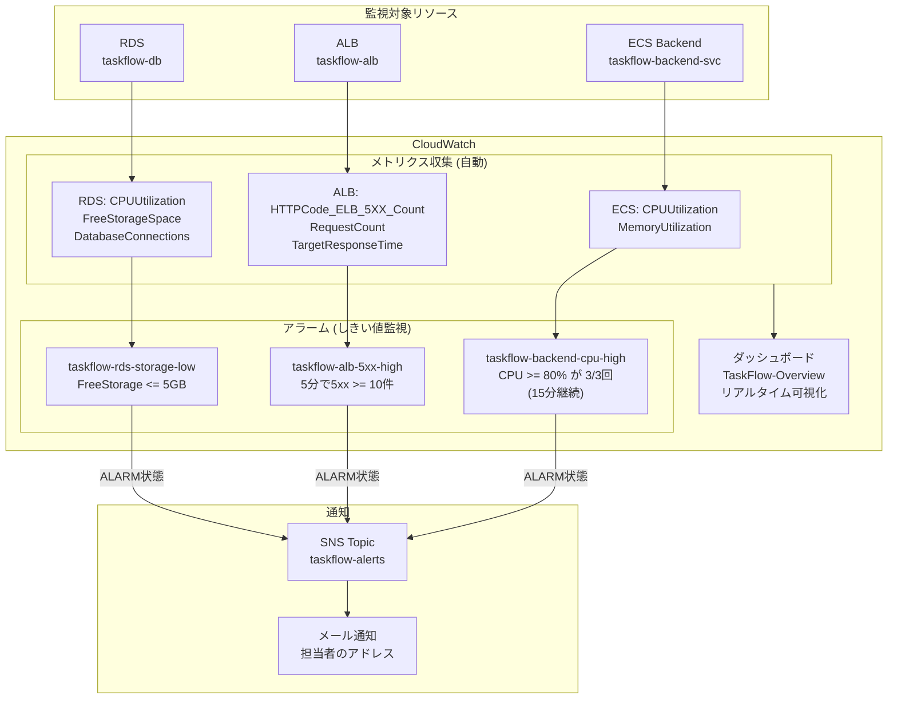

# Task 12: CloudWatch 監視設定（コンソール）

## 全体構成における位置づけ

> 図: TaskFlow全体アーキテクチャ（オレンジ色が今回構築するコンポーネント）

**今回構築する箇所:** CloudWatch Dashboards + Alarms - Task12。メトリクス収集・アラーム設定・SNS通知で問題を早期発見できる監視基盤を構築する。

---

> 参照ナレッジ: [12_observability.md](../knowledge/12_observability.md)

## このタスクのゴール

TaskFlow の監視・アラートを設定し、問題を早期発見できるようにする。

---

## ハンズオン手順

### Step 1: SNS トピックの作成（通知先）

1. AWSコンソール → **「SNS」** → 左メニュー **「トピック」** → **「トピックの作成」**

| 項目 | 値 | 判断理由 |
|------|----|---------|
| タイプ | **スタンダード** | FIFOは順序保証が必要なメッセージキュー用。通知配信にはスタンダードで十分 |
| 名前 | `taskflow-alerts` | |
| 暗号化 | なし | 通知内容は機密情報ではないため不要 |
| アクセスポリシー | デフォルト | CloudWatchからの発行を許可する設定が含まれる |

2. **「トピックの作成」**

3. 作成したトピック → **「サブスクリプションの作成」**：

| 項目 | 値 | 判断理由 |
|------|----|---------|
| プロトコル | **Email** | メールで通知を受け取る。Slack通知はLambdaを経由する必要があるためまずはメールで |
| エンドポイント | 自分のメールアドレス | |

4. 確認メールが届くので **「Confirm subscription」** リンクをクリック（これをしないと通知が来ない）

> **Slack連携について：** `プロトコル: HTTPS` でSlack Incoming WebhookのURLを指定できる場合もあるが、AWS Chatbotを使う方が設定がシンプル。本番環境ではAWS Chatbotを検討する。

### Step 2: アラームの作成

> 図: CloudWatch監視の全体構成（メトリクス収集 → アラーム → SNS通知）

#### ECS Backend CPU使用率アラーム

1. AWSコンソール → **「CloudWatch」** → 左メニュー **「アラーム」** → **「アラームを作成」**
2. **「メトリクスの選択」** → 「ECS」→「ClusterName, ServiceName」→ `taskflow-backend-svc` の **CPUUtilization** を選択 → **「メトリクスの選択」**

| 項目 | 値 | 判断理由 |
|------|----|---------|
| 統計 | **平均** | 瞬間値（最大）だと短期スパイクで誤検知が増える。平均で継続的な高負荷を検知する |
| 期間 | 5分 | 5分間の平均値を1データポイントとして使う。短すぎると一時的な処理によって誤検知が増える |
| しきい値タイプ | 静的 | 時間帯によって変動するトラフィックには異常検知（異常バンド）も使えるが、まずは静的から |
| 条件 | 以上（>=） 80 | 80%超えで警戒。90%超えるとスロットリングやパフォーマンス劣化が起きる可能性 |
| アラームを実行するデータポイント | **3/3** | 5分間×3回連続（15分間）高負荷が続いた場合にアラーム。一時的なスパイクで騒がない |

3. **「次へ」** → **通知**：

| 項目 | 値 | 判断理由 |
|------|----|---------|
| アラーム状態のトリガー | **アラーム状態** | 問題発生時に通知 |
| SNSトピック | `taskflow-alerts` | Step 1で作成 |

> **「OK状態」の通知も追加するか：** 復旧時に「問題が解消した」通知があると状況把握に便利。必要に応じて追加する。

4. **アラーム名**: `taskflow-backend-cpu-high` → **「アラームを作成」**

#### ALB 5xxエラーアラーム

同様の手順で：
- **メトリクス**: ApplicationELB → `taskflow-alb` → **`HTTPCode_ELB_5XX_Count`**
- **統計**: 合計
- **期間**: 5分
- **条件**: >= 10（5分で10件以上の5xxエラー）
- **アラーム名**: `taskflow-alb-5xx-high`

> **`Target_5XX` vs `ELB_5XX` の違い：**
> - `HTTPCode_Target_5XX_Count`: バックエンドアプリ（ECS）が5xxを返した件数
> - `HTTPCode_ELB_5XX_Count`: ALB自体が5xxを返した件数（ターゲットが全滅して到達できない等）
> 両方監視するのが理想。まずはALBレベルのものを設定する。

#### RDS ストレージ残量アラーム（重要）

- **メトリクス**: RDS → `taskflow-db` → **`FreeStorageSpace`**
- **統計**: 最小
- **条件**: <= 5,000,000,000（5GB未満）
- **アラーム名**: `taskflow-rds-storage-low`

> **なぜFreeStorageSpaceを監視するか：** ストレージが0になるとDBが書き込み不可になりアプリが停止する。CPUより優先度が高い。単位はバイト（5GB = 5,000,000,000バイト）。

### Step 3: ダッシュボードの作成

1. 左メニュー → **「ダッシュボード」** → **「ダッシュボードの作成」**
2. **名前**: `TaskFlow-Overview` → **「ダッシュボードの作成」**
3. **「ウィジェットを追加」** で以下を追加：

**ウィジェット 1: ECS サービス状態（折れ線グラフ）**
- メトリクス: ECS → `taskflow-backend-svc` の CPUUtilization + MemoryUtilization
- 追加で: `taskflow-frontend-svc` の CPUUtilization + MemoryUtilization
- タイトル: `ECS Services - CPU & Memory`

> **なぜCPUとメモリを同じグラフに入れるか：** 両方が80%に近づくとスケールアウトのサインになる。まとめて見ることで相関関係を把握しやすい。

**ウィジェット 2: ALB リクエスト状況（折れ線グラフ）**
- メトリクス: `RequestCount`、`HTTPCode_Target_5XX_Count`、`TargetResponseTime`
- タイトル: `ALB - Traffic Overview`

**ウィジェット 3: RDS（折れ線グラフ）**
- メトリクス: `CPUUtilization`、`DatabaseConnections`、`FreeStorageSpace`
- タイトル: `RDS - Database Status`

4. ウィジェット配置を調整 → **「保存」**

---

## 確認ポイント

1. **SNS** のサブスクリプションが **「確認済み（Confirmed）」** になっているか（メール内のリンクをクリックしたか）
2. **アラーム** 一覧で作成したアラームが **「データ不足」** か **「OK」** 状態で表示されるか（最初はデータがないためDATABASE_INSUFFICIENTは正常）
3. **テスト送信**: アラーム → 「アクション」→「アラーム状態に設定」でメールが届くか確認 → 確認後「OK状態に設定」で戻す
4. **ダッシュボード** `TaskFlow-Overview` でグラフが表示されるか

---

**このタスクをコンソールで完了したら:** [Task 12: 監視（IaC版）](../iac/12_monitoring.md)

**全コンソールタスク完了！** 次のステップ: [IaC フェーズ: Task 1から始める](../iac/01_vpc.md) でTerraformを使って同じ構成をコードとして管理する
