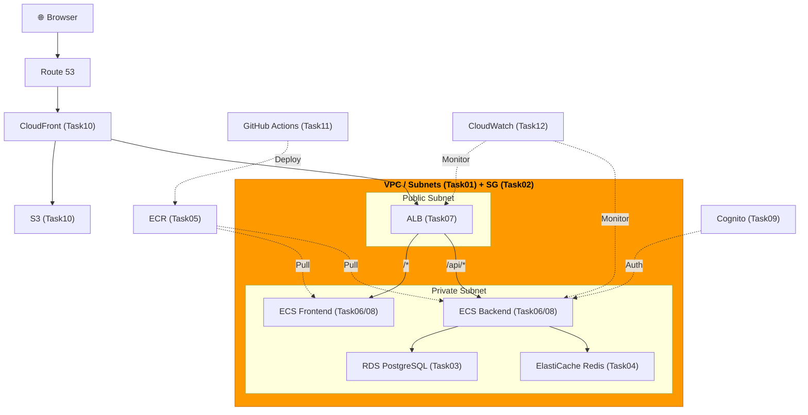
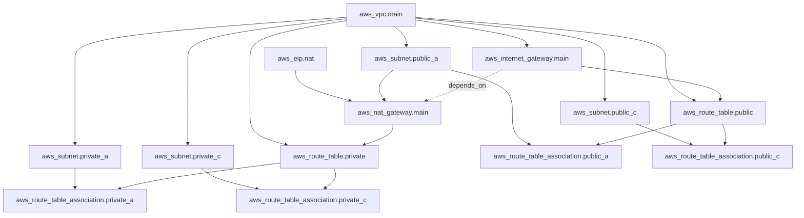

# Task 1: VPC・サブネット・ゲートウェイ構築（IaC）

## 全体構成における位置づけ

> 図: TaskFlow全体アーキテクチャ（オレンジ色が今回構築するコンポーネント）



**今回構築する箇所:** VPC・サブネット・IGW・NAT Gateway・ルートテーブル（Task01）。すべてのAWSリソースが配置されるネットワーク基盤。

---

> 図: Terraformリソース依存グラフ（Task01）



---

> 前提: [コンソール版 Task 1](../console/01_vpc.md) を完了済みであること
> 参照ナレッジ: [01_networking.md](../knowledge/01_networking.md)

## このタスクのゴール

コンソールで手動作成したVPCネットワーク基盤をTerraformコードで再現する。

---

## Terraform の基本的な仕組み

### Terraform とは何をするツールか

「インフラの設計図（コード）」を書くと、Terraformが自動でAWSにリソースを作成・更新・削除してくれるツール。

手動でコンソールを操作する代わりに「こういうリソースが欲しい」とコードで宣言する。これを **Infrastructure as Code（IaC）** と呼ぶ。

```
コード（.tf ファイル）
    ↓ terraform apply
AWS上のリソース（VPC、サブネット、など）
```

### 4つの基本コマンド

```bash
terraform init    # 初期化。プロバイダープラグインをダウンロードする（初回・変更時に1回だけ実行）
terraform plan    # 「何が変わるか」を確認するだけ。実際には何もしない。必ずapply前に実行する
terraform apply   # 実際にAWSにリソースを作成・更新・削除する
terraform destroy # コードで管理している全リソースを削除する（学習後のコスト削減に使う）
```

### tfstate（状態ファイル）とは

Terraform は `terraform.tfstate` というJSONファイルで「現在AWSに何が作られているか」を記録している。

```
terraform.tfstate ← Terraformが管理するリソースの現在状態
    ↕ 差分を計算
.tf ファイル ← こうあってほしい状態（宣言）
    ↓ 差分をapply
AWS上のリソース（実際の状態）
```

- **ローカルに生成される**（`terraform.tfstate`）
- **絶対にGitにコミットしない**（パスワードなどが含まれることがある）
- チームで使う場合はS3 + DynamoDBでリモート管理する

---

## HCL（Terraform の言語）の文法基礎

Terraform のコードは **HCL（HashiCorp Configuration Language）** という言語で書く。拡張子は `.tf`。

### ブロックの基本構造

HCL はすべて「ブロック」で構成される。

```hcl
ブロックタイプ "ラベル1" "ラベル2" {
  引数名 = 値
  引数名 = 値

  ネストされたブロック {
    引数名 = 値
  }
}
```

具体例：
```hcl
resource "aws_vpc" "main" {   # ← resource ブロック。"aws_vpc" がリソースタイプ、"main" が自分でつける名前
  cidr_block = "10.0.0.0/16"  # ← 引数名 = 値（文字列はダブルクォートで囲む）
}
```

### 値の型

| 型 | 書き方 | 例 |
|----|--------|-----|
| 文字列 | `"..."` | `"10.0.0.0/16"` |
| 数値 | 数字そのまま | `5432` |
| 真偽値 | `true` / `false` | `true` |
| リスト | `[...]` | `["0.0.0.0/0"]` |
| マップ | `{key = value}` | `{ Name = "taskflow-vpc" }` |

### リソース間の参照（最重要！）

別のリソースの属性を参照するには `リソースタイプ.名前.属性名` と書く。

```hcl
resource "aws_vpc" "main" {
  cidr_block = "10.0.0.0/16"
}

resource "aws_subnet" "public_a" {
  vpc_id = aws_vpc.main.id   # ← aws_vpc リソースの "main" という名前のもののidを参照
  #       ^^^^^^^^^^^^^^^^
  #       タイプ  名前  属性
}
```

これにより：
1. Terraformは「サブネットを作る前にVPCを先に作らなければならない」と自動で判断する
2. VPCのIDをハードコードする必要がない（Terraformが実行時に解決する）

### `tags` の書き方

AWSリソースにタグを付けるための引数。値はマップ型。

```hcl
tags = { Name = "taskflow-vpc" }            # 1行で書く場合
tags = {                                     # 複数タグの場合
  Name        = "taskflow-vpc"
  Environment = "dev"
  Project     = "taskflow"
  ManagedBy   = "terraform"
}
```

### 共通タグを `locals` でまとめる（推奨）

同じタグを全リソースに書くのは冗長になりがちです。`locals` ブロックで共通タグをまとめ、`merge()` 関数でリソース固有のタグと組み合わせる方法を推奨します。

```hcl
locals {
  common_tags = {
    Environment = "dev"
    Project     = "taskflow"
    ManagedBy   = "terraform"
  }
}

# 使用例: 共通タグ + リソース固有のNameタグをマージ
resource "aws_vpc" "main" {
  cidr_block = "10.0.0.0/16"

  tags = merge(local.common_tags, {
    Name = "taskflow-vpc"
  })
}
```

`merge()` 関数は複数のマップを結合します。後から渡したキーが優先されるため、`Name` のような上書きも安全に行えます。

---

## プロジェクト構成

```bash
mkdir -p infra/environments/dev
cd infra/environments/dev
```

ファイルは複数の `.tf` ファイルに分けて書いて良い。Terraform は同じディレクトリ内の全 `.tf` ファイルを1つとして扱う。

```
infra/environments/dev/
├── main.tf       # Terraformの設定とprovider
├── vpc.tf        # VPC関連のリソース
├── variables.tf  # 変数の定義
└── outputs.tf    # 出力値の定義
```

---

## ハンズオン手順

### `main.tf` — Terraform設定とProvider

```hcl
# terraform ブロック: Terraformツール自体の設定
terraform {
  required_version = ">= 1.5"   # このコードを動かすのに必要なTerraformのバージョン
  required_providers {           # 使うプロバイダー（AWSのAPIと話すプラグイン）を宣言
    aws = {
      source  = "hashicorp/aws"
      version = "~> 5.0"         # バージョン制約。~> 5.0 = 5.x系の最新（6.0には上がらない）
    }
  }
}

# provider ブロック: AWSのどのリージョンを使うかなどの接続設定
provider "aws" {
  region = "ap-northeast-1"   # 東京リージョン
}

# locals ブロック: 全リソースで共通して使うタグをまとめて定義する
locals {
  common_tags = {
    Environment = "dev"
    Project     = "taskflow"
    ManagedBy   = "terraform"
  }
}
```

**`~>` バージョン制約の意味：**
- `~> 5.0` : 5.0以上、6.0未満（マイナーバージョンは上がる）
- `~> 5.31` : 5.31以上、5.32未満（パッチバージョンのみ上がる）
- `>= 1.5` : 1.5以上なら何でも良い

### `vpc.tf` — ネットワークリソース

#### VPC

```hcl
resource "aws_vpc" "main" {
  # ↑ resource ブロック
  # ↑ "aws_vpc" = リソースタイプ（Terraformのドキュメントで調べる）
  # ↑ "main"    = このファイル内での識別名（自由につけられる）

  cidr_block           = "10.0.0.0/16"
  enable_dns_support   = true    # true/false は引用符なし（文字列の "true" とは別物）
  enable_dns_hostnames = true

  tags = merge(local.common_tags, {
    Name = "taskflow-vpc"
  })
}
```

#### サブネット

```hcl
resource "aws_subnet" "public_a" {
  vpc_id            = aws_vpc.main.id   # 上で定義したVPCのIDを参照
  cidr_block        = "10.0.1.0/24"
  availability_zone = "ap-northeast-1a"

  map_public_ip_on_launch = true
  # ↑ パブリックサブネットだけ true にする
  # プライベートサブネットはこの行ごと書かない（デフォルト false）

  tags = merge(local.common_tags, {
    Name = "taskflow-public-a"
  })
}

resource "aws_subnet" "public_c" {
  vpc_id            = aws_vpc.main.id
  cidr_block        = "10.0.2.0/24"
  availability_zone = "ap-northeast-1c"

  map_public_ip_on_launch = true

  tags = merge(local.common_tags, {
    Name = "taskflow-public-c"
  })
}

resource "aws_subnet" "private_a" {
  vpc_id            = aws_vpc.main.id
  cidr_block        = "10.0.10.0/24"
  availability_zone = "ap-northeast-1a"
  # map_public_ip_on_launch は省略 = デフォルト値（false）が使われる

  tags = merge(local.common_tags, {
    Name = "taskflow-private-a"
  })
}

resource "aws_subnet" "private_c" {
  vpc_id            = aws_vpc.main.id
  cidr_block        = "10.0.11.0/24"
  availability_zone = "ap-northeast-1c"

  tags = merge(local.common_tags, {
    Name = "taskflow-private-c"
  })
}
```

> **同じリソースタイプを複数定義するには？**
> `resource "aws_subnet" "public_a"` と `resource "aws_subnet" "public_c"` のように、**2番目のラベル（名前）を変える**。タイプが同じでも名前が違えば別のリソースとして扱われる。

#### インターネットゲートウェイ

```hcl
resource "aws_internet_gateway" "main" {
  vpc_id = aws_vpc.main.id   # このVPCにアタッチする（コンソールでの「アタッチ」操作がこの1行）

  tags = merge(local.common_tags, {
    Name = "taskflow-igw"
  })
}
```

#### NAT Gateway

```hcl
# NAT Gatewayには固定IPが必要。先にElastic IPを作る
resource "aws_eip" "nat" {
  domain = "vpc"   # "vpc" という文字列を渡す（以前は vpc = true という書き方だったが変更された）

  tags = merge(local.common_tags, {
    Name = "taskflow-nat-eip"
  })
}

resource "aws_nat_gateway" "main" {
  allocation_id = aws_eip.nat.id          # 上で作ったEIPのID
  subnet_id     = aws_subnet.public_a.id  # どのサブネットに置くか

  # depends_on: 明示的な依存関係の指定
  # TerraformはIDの参照から依存関係を自動推測するが、
  # 間接的な依存（NATが動くにはIGWが必要だが、コードに直接の参照がない）は
  # depends_on で明示的に書く
  depends_on = [aws_internet_gateway.main]
  #              ↑ リソースタイプ.名前 の形式でリストに入れる

  tags = merge(local.common_tags, {
    Name = "taskflow-nat"
  })
}
```

#### ルートテーブル

```hcl
resource "aws_route_table" "public" {
  vpc_id = aws_vpc.main.id

  # route はネストされたブロック（{ } で囲む）
  # 同じリソースブロック内に複数の route ブロックを書ける
  route {
    cidr_block = "0.0.0.0/0"
    gateway_id = aws_internet_gateway.main.id
  }

  tags = merge(local.common_tags, {
    Name = "taskflow-public-rt"
  })
}

# サブネットとルートテーブルの紐づけは別リソース（aws_route_table_association）
#
# なぜ aws_route_table の中に書かずに別リソースなのか？
#   → AWSのAPIの設計がそうなっているから。ルートテーブル自体と「どのサブネットに紐づけるか」は
#     別の概念として分離されている。コンソールでも「ルートを編集」と「サブネットの関連付け」が
#     別タブになっていた通り、Terraformも同じ構造で表現している。
#
# この設計の利点：
#   - 1つのルートテーブルを複数のサブネットに紐づける場合、association だけ増やせばよい
#   - ルートの変更と紐づけの変更が独立して管理できる
resource "aws_route_table_association" "public_a" {
  subnet_id      = aws_subnet.public_a.id
  route_table_id = aws_route_table.public.id
}

resource "aws_route_table_association" "public_c" {
  subnet_id      = aws_subnet.public_c.id
  route_table_id = aws_route_table.public.id
}

resource "aws_route_table" "private" {
  vpc_id = aws_vpc.main.id

  route {
    cidr_block     = "0.0.0.0/0"
    nat_gateway_id = aws_nat_gateway.main.id   # NATに向ける（パブリックはIGW、プライベートはNAT）
  }

  tags = merge(local.common_tags, {
    Name = "taskflow-private-rt"
  })
}

resource "aws_route_table_association" "private_a" {
  subnet_id      = aws_subnet.private_a.id
  route_table_id = aws_route_table.private.id
}

resource "aws_route_table_association" "private_c" {
  subnet_id      = aws_subnet.private_c.id
  route_table_id = aws_route_table.private.id
}
```

### `outputs.tf` — 出力値の定義

```hcl
# output ブロック: terraform apply 後に表示される値。他のモジュールから参照することもできる
output "vpc_id" {
  value = aws_vpc.main.id   # 出力したい値を参照式で書く
}

output "public_subnet_ids" {
  # リストで複数の値をまとめて出力できる
  value = [aws_subnet.public_a.id, aws_subnet.public_c.id]
}

output "private_subnet_ids" {
  value = [aws_subnet.private_a.id, aws_subnet.private_c.id]
}
```

**outputを定義する理由：**
- `terraform apply` 後に `terraform output` コマンドで値を確認できる
- 他のTerraformモジュールからこのモジュールの出力値を参照できる
- スクリプトから `terraform output -raw vpc_id` のように値を取得できる

---

## 実行

```bash
# 初回のみ実行（プロバイダープラグインのダウンロード）
terraform init

# 変更内容を確認（実際には何もしない）
terraform plan
# + は追加、- は削除、~ は変更を意味する

# 実際に作成（"yes" と入力して確定）
terraform apply
```

`terraform plan` の出力例：
```
+ resource "aws_vpc" "main" {   # ← + = 新規作成
    + cidr_block = "10.0.0.0/16"
    + id         = (known after apply)   # ← apply後に決まる値はこう表示される
  }
```

---

## よくあるエラー

| エラー | 原因 | 対処 |
|--------|------|------|
| `Error: CIDR block conflicts` | 既存のサブネットとCIDRが重複 | コンソールで残っているサブネットを削除してからapply |
| `InvalidAllocationID.NotFound` | EIPが見つからない | terraform planでEIPの作成が先になっているか確認 |
| `The argument "vpc" is deprecated` | 古い書き方（`vpc = true`）を使っている | `domain = "vpc"` に変更 |

---

**次のタスク:** [Task 2: セキュリティグループ（IaC版）](02_security_groups.md)
