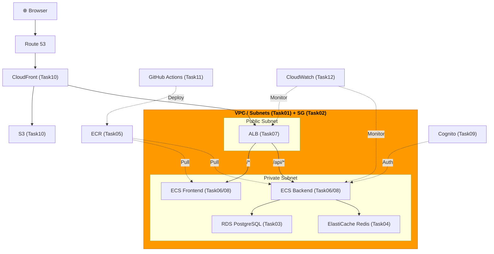
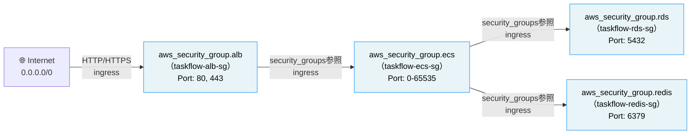

# Task 2: セキュリティグループ設定（IaC）

## 全体構成における位置づけ

> 図: TaskFlow全体アーキテクチャ（オレンジ色が今回構築するコンポーネント）



**今回構築する箇所:** Security Groups - ALB/ECS/RDS/Redis（Task02）。各リソース間の通信を制御するファイアウォールルール。

---

> 図: セキュリティグループ間の参照関係（source_security_group_idによる連鎖）



---

> 前提: [コンソール版 Task 2](../console/02_security_groups.md) を完了済みであること
> 参照ナレッジ: [02_security_groups.md](../knowledge/02_security_groups.md)

## このタスクのゴール

4つのセキュリティグループをTerraformコードで管理する。

---

## 新しいHCL文法：ネストされたブロックとリスト

### ネストされたブロック（ingress / egress）

Task 1では `route {}` というネストされたブロックが登場した。セキュリティグループの通信ルールも同じ仕組みで書く。

```hcl
resource "aws_security_group" "alb" {
  name   = "taskflow-alb-sg"
  vpc_id = aws_vpc.main.id

  ingress {           # ← ネストされたブロック。リソースの中にブロックを書く
    from_port = 80
    to_port   = 80
    protocol  = "tcp"
    cidr_blocks = ["0.0.0.0/0"]
  }
  #   ↑ ingress ブロックはいくつでも書ける（ルールを追加するたびに1ブロック）

  egress { ... }
}
```

同じ `resource` ブロックの中に複数の `ingress {}` を並べることで、複数の通信ルールを定義できる。

### リスト型の値

Task 1の `depends_on = [aws_internet_gateway.main]` でリストが登場した。CIDRブロックの指定も同じリスト型を使う。

```hcl
cidr_blocks = ["0.0.0.0/0"]               # 1要素のリスト
cidr_blocks = ["10.0.0.0/8", "192.168.0.0/16"]  # 複数要素のリスト（カンマ区切り）
```

### `protocol = "-1"` の意味

```hcl
protocol = "-1"    # 数字だが文字列（ダブルクォートあり）。-1 = 全プロトコル（TCP/UDP/ICMPすべて）
protocol = "tcp"   # TCP のみ
protocol = "udp"   # UDP のみ
```

egressで全アウトバウンドを許可する場合は `"-1"` を使う。

### `security_groups` でSGを参照する

`cidr_blocks` ではIPアドレス範囲を指定するが、`security_groups` では「別のSGを持つリソースからの通信」を許可できる。

```hcl
ingress {
  security_groups = [aws_security_group.alb.id]
  #                  ↑ aws_security_group リソースの "alb" という名前のもののID
  # cidr_blocks の代わりに security_groups を使う
}
```

---

## Terraform固有のポイント：SGの循環参照問題

SGのルールで別のSGをソースに指定する場合、SG本体を先に作ってからルールを追加する必要がある場合がある。

例えばALB→ECSの参照を `aws_security_group` リソースのブロック内に書くと、AとBが互いに参照し合うような循環参照が起きることがある。`aws_vpc_security_group_ingress_rule` や `aws_security_group_rule` を使ってルールをSGと分離するか、依存関係を整理する。

---

## ハンズオン手順

> **タグについて：** Task 1 の `main.tf` で定義した `local.common_tags` を `merge()` で組み合わせてタグを付けます。`local.common_tags` には `Environment`・`Project`・`ManagedBy` が含まれています。

### ALB 用 SG

```hcl
resource "aws_security_group" "alb" {
  name        = "taskflow-alb-sg"
  description = "Allow HTTP/HTTPS from internet"
  vpc_id      = aws_vpc.main.id    # Task 1 で作成した VPC を参照

  ingress {
    description = "HTTP from internet"
    from_port   = 80
    to_port     = 80
    protocol    = "tcp"
    cidr_blocks = ["0.0.0.0/0"]   # インターネット全体からのアクセスを許可
  }

  ingress {
    description = "HTTPS from internet"
    from_port   = 443
    to_port     = 443
    protocol    = "tcp"
    cidr_blocks = ["0.0.0.0/0"]
  }

  egress {
    from_port   = 0
    to_port     = 0
    protocol    = "-1"             # 全プロトコル = アウトバウンド全許可
    cidr_blocks = ["0.0.0.0/0"]
  }

  tags = merge(local.common_tags, {
    Name = "taskflow-alb-sg"
  })
}
```

### ECS 用 SG

```hcl
resource "aws_security_group" "ecs" {
  name        = "taskflow-ecs-sg"
  description = "Allow traffic from ALB only"
  vpc_id      = aws_vpc.main.id

  ingress {
    description     = "All traffic from ALB"
    from_port       = 0
    to_port         = 65535
    protocol        = "tcp"
    security_groups = [aws_security_group.alb.id]
    # ↑ cidr_blocks ではなく security_groups で指定。
    #   「ALB SGを持つリソース（= ALBそのもの）からの通信」を許可
    #   IPアドレスではなくSGで制御するのがAWS流のベストプラクティス
  }

  egress {
    from_port   = 0
    to_port     = 0
    protocol    = "-1"
    cidr_blocks = ["0.0.0.0/0"]
  }

  tags = merge(local.common_tags, {
    Name = "taskflow-ecs-sg"
  })
}
```

### RDS 用 SG

```hcl
resource "aws_security_group" "rds" {
  name        = "taskflow-rds-sg"
  description = "Allow PostgreSQL from ECS only"
  vpc_id      = aws_vpc.main.id

  ingress {
    description     = "PostgreSQL from ECS"
    from_port       = 5432     # PostgreSQL のポート番号
    to_port         = 5432
    protocol        = "tcp"
    security_groups = [aws_security_group.ecs.id]    # ECS SGからのみ
  }

  egress {
    from_port   = 0
    to_port     = 0
    protocol    = "-1"
    cidr_blocks = ["0.0.0.0/0"]
  }

  tags = merge(local.common_tags, {
    Name = "taskflow-rds-sg"
  })
}
```

### Redis 用 SG

```hcl
resource "aws_security_group" "redis" {
  name        = "taskflow-redis-sg"
  description = "Allow Redis from ECS only"
  vpc_id      = aws_vpc.main.id

  ingress {
    description     = "Redis from ECS"
    from_port       = 6379     # Redis のポート番号
    to_port         = 6379
    protocol        = "tcp"
    security_groups = [aws_security_group.ecs.id]    # ECS SGからのみ
  }

  egress {
    from_port   = 0
    to_port     = 0
    protocol    = "-1"
    cidr_blocks = ["0.0.0.0/0"]
  }

  tags = merge(local.common_tags, {
    Name = "taskflow-redis-sg"
  })
}
```

---

## 実行

```bash
terraform plan
terraform apply
```

---

## よくあるエラー

| エラー | 原因 | 対処 |
|--------|------|------|
| `Error: cycle detected` | SG同士の循環参照 | SG本体を先に作り、ルールを `aws_security_group_rule` で後から追加 |
| `InvalidGroup.Duplicate` | 同じ名前のSGが既存 | コンソールで既存SGを削除するか名前を変更 |

---

**次のタスク:** [Task 3: RDS PostgreSQL構築（IaC版）](03_rds.md)
