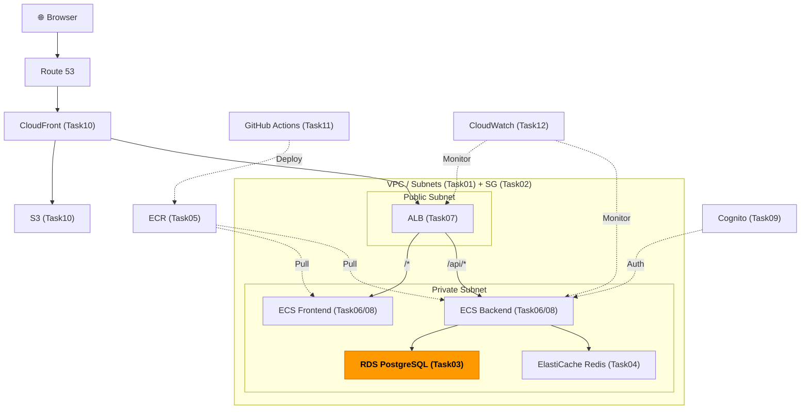
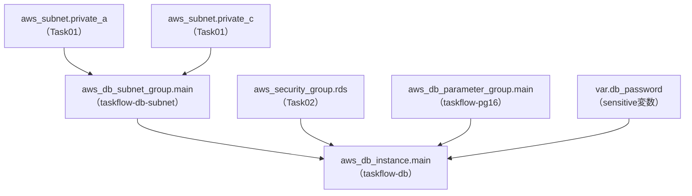

# Task 3: RDS PostgreSQL 構築（IaC）

## 全体構成における位置づけ

> 図: TaskFlow全体アーキテクチャ（オレンジ色が今回構築するコンポーネント）



**今回構築する箇所:** RDS PostgreSQL（Task03）。バックエンドECSからのみアクセス可能なプライベートサブネット内のデータベース。

---

> 図: Terraformリソース依存グラフ（Task03）



---

> 前提: [コンソール版 Task 3](../console/03_rds.md) を完了済みであること
> 参照ナレッジ: [03_rds.md](../knowledge/03_rds.md)

## このタスクのゴール

RDS PostgreSQLインスタンスをTerraformで管理する。特にパスワードの安全な管理方法を習得する。

---

## 新しいHCL文法：変数（variable）ブロック

### `variable` ブロックとは

「コードに直接書きたくない値（パスワードなど）」や「環境ごとに変えたい値」を変数として定義する仕組み。

```hcl
variable "変数名" {
  description = "説明文（terraform plan 時に表示される）"
  type        = string    # 型（string / number / bool / list / map）
  default     = "値"      # デフォルト値（省略すると apply 時に入力を求められる）
  sensitive   = true      # ログや出力に値を表示しない
}
```

### 変数の参照：`var.変数名`

定義した変数は `var.変数名` で参照する。

```hcl
variable "db_password" {
  type = string
}

resource "aws_db_instance" "main" {
  password = var.db_password    # ← var. で始まる参照式
  #          ^^^^^^^^^^^
  #          変数名
}
```

### 変数への値の渡し方

| 方法 | 書き方 | 使いどころ |
|------|--------|-----------|
| `terraform.tfvars` ファイル | `db_password = "xxx"` をファイルに書く | 個人学習（必ずgitignore） |
| 環境変数 | `export TF_VAR_db_password=xxx` | CI/CD環境 |
| コマンドライン | `terraform apply -var="db_password=xxx"` | 一時的な上書き |
| 入力待ち | 何も指定しない | apply実行時にターミナルで入力 |

### `sensitive = true`

```hcl
variable "db_password" {
  sensitive = true    # terraform plan/apply の出力にこの変数の値を表示しない
}
```

`sensitive = true` を付けると出力結果が `(sensitive value)` と表示され、ログにパスワードが残らなくなる。パスワード・シークレットキー等には必ず設定する。

---

## パスワードの管理方針

DBパスワードはコードにハードコードしてはならない。

| 方法 | やり方 | 向いている場面 |
|------|--------|--------------|
| `terraform.tfvars`（gitignore） | 変数ファイルに書いて `.gitignore` で除外 | 個人学習 |
| 環境変数 `TF_VAR_db_password` | `export TF_VAR_db_password=xxx` | CI/CD |
| AWS Secrets Manager + `data` source | Secretsからランダム生成・参照 | 本番 |

`terraform.tfvars` は必ず `.gitignore` に追加すること。

---

## ハンズオン手順

### variables.tf

```hcl
# File: infra/environments/dev/variables.tf
variable "db_password" {
  description = "RDS master password"
  type        = string
  sensitive   = true    # planやapplyの出力にパスワードが表示されなくなる
  # default は設定しない → apply時に毎回入力を求められる（安全）
}
```

### terraform.tfvars（.gitignoreに追加すること）

```hcl
db_password = "YourSecurePassword123!"
```

`.gitignore` に追加：
```
*.tfvars
*.tfstate
*.tfstate.backup
.terraform/
```

### DBサブネットグループ

```hcl
# File: infra/environments/dev/rds.tf
resource "aws_db_subnet_group" "main" {
  name = "taskflow-db-subnet"

  subnet_ids = [               # ← リスト型。サブネットIDを複数指定
    aws_subnet.private_a.id,   # ← Task 1 で作成したプライベートサブネットA
    aws_subnet.private_c.id,   # ← プライベートサブネットC（末尾カンマOK）
  ]

  tags = merge(local.common_tags, {
    Name = "taskflow-db-subnet"
  })
}
```

> **リストの末尾カンマについて：** `aws_subnet.private_c.id,` の末尾のカンマはあってもなくてもよい。複数行リストでは付けておくと、後で要素を追加した際の diff が 1行だけになるため推奨。

### パラメータグループ

```hcl
# File: infra/environments/dev/rds.tf
resource "aws_db_parameter_group" "main" {
  name   = "taskflow-pg16"
  family = "postgres16"    # エンジンバージョンと一致させる（postgres16 → 16.x）

  parameter {
    name  = "client_encoding"
    value = "UTF8"
  }
  # parameter ブロックも複数書くことができる（settingと同じ仕組み）

  tags = merge(local.common_tags, {
    Name = "taskflow-pg16"
  })
}
```

### RDSインスタンス

```hcl
# File: infra/environments/dev/rds.tf
resource "aws_db_instance" "main" {
  identifier = "taskflow-db"    # AWSコンソールやARNで使われる識別子

  engine         = "postgres"
  engine_version = "16.4"

  instance_class        = "db.t4g.micro"    # ARM、無料枠対象
  allocated_storage     = 20                # 初期ストレージ（GB）
  max_allocated_storage = 100               # オートスケーリング上限（0で無効）
  storage_type          = "gp3"

  db_name  = "taskflow"          # 作成するデータベース名
  username = "taskflow_admin"
  password = var.db_password     # ← 変数を参照。値はtfvarsや環境変数から来る

  db_subnet_group_name   = aws_db_subnet_group.main.name
  vpc_security_group_ids = [aws_security_group.rds.id]    # リスト型（複数SGを指定可能）
  publicly_accessible    = false                           # プライベートサブネット内に配置

  multi_az                = false           # 開発環境: false、本番: true
  backup_retention_period = 7               # バックアップを7日間保持
  backup_window           = "03:00-04:00"   # UTC（日本時間12:00-13:00）
  maintenance_window      = "sun:04:00-sun:05:00"

  deletion_protection = false               # 開発環境: false（destroyできる）、本番: true
  skip_final_snapshot = true                # 開発環境: true（削除時にスナップショット不要）

  parameter_group_name = aws_db_parameter_group.main.name

  tags = merge(local.common_tags, {
    Name = "taskflow-rds-postgres"
  })
}
```

### outputs.tf

```hcl
# File: infra/environments/dev/outputs.tf
output "db_endpoint" {
  value     = aws_db_instance.main.address    # ホスト名（例: taskflow-db.xxxx.ap-northeast-1.rds.amazonaws.com）
  sensitive = false    # エンドポイントはホスト名なので秘密情報ではない（表示OK）
}
```

---

## 実行

```bash
terraform plan
terraform apply    # RDS作成に10〜15分かかる
```

---

## よくあるエラー

| エラー | 原因 | 対処 |
|--------|------|------|
| `DBSubnetGroupDoesNotCoverEnoughAZs` | サブネットグループのAZが1つだけ | 2AZ以上のサブネットを含める |
| `InvalidParameterValue: password` | パスワードが要件を満たさない | 8文字以上、`/` `"` `@` `\` を避ける |
| `var.db_password` が求められる | tfvarsが読み込まれていない | ファイル名が `terraform.tfvars` になっているか確認 |

---

**次のタスク:** [Task 4: ElastiCache Redis構築（IaC版）](04_elasticache.md)
