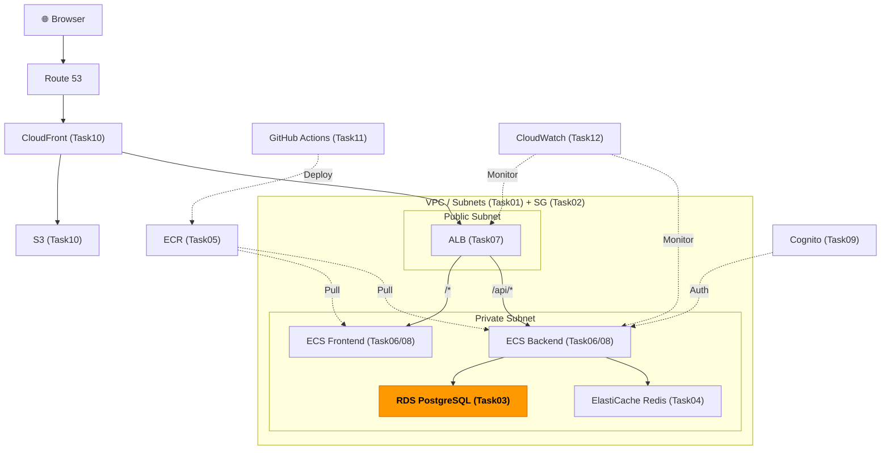
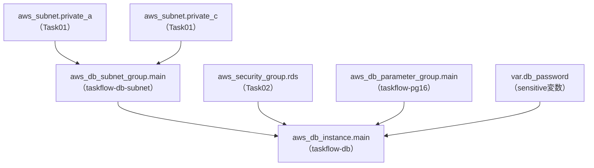

# Task 3: RDS PostgreSQL 構築（IaC）

## 全体構成における位置づけ

> 図: TaskFlow全体アーキテクチャ（オレンジ色が今回構築するコンポーネント）



**今回構築する箇所:** RDS PostgreSQL（Task03）。バックエンドECSからのみアクセス可能なプライベートサブネット内のデータベース。

---

> 図: Terraformリソース依存グラフ（Task03）



---

> 前提: [コンソール版 Task 3](../console/03_rds.md) を完了済みであること
> 参照ナレッジ: [03_rds.md](../knowledge/03_rds.md)

## このタスクのゴール

RDS PostgreSQLインスタンスをTerraformで管理する。特にパスワードの安全な管理方法を習得する。

---

## 新しいHCL文法：変数（variable）ブロック

### `variable` ブロックとは

「コードに直接書きたくない値（パスワードなど）」や「環境ごとに変えたい値」を変数として定義する仕組み。

```hcl
variable "変数名" {
  description = "説明文（terraform plan 時に表示される）"
  type        = string    # 型（string / number / bool / list / map）
  default     = "値"      # デフォルト値（省略すると apply 時に入力を求められる）
  sensitive   = true      # ログや出力に値を表示しない
}
```

### 変数の参照：`var.変数名`

定義した変数は `var.変数名` で参照する。

```hcl
variable "db_password" {
  type = string
}

resource "aws_db_instance" "main" {
  password = var.db_password    # ← var. で始まる参照式
  #          ^^^^^^^^^^^
  #          変数名
}
```

### 変数への値の渡し方

| 方法 | 書き方 | 使いどころ |
|------|--------|-----------|
| `terraform.tfvars` ファイル | `db_password = "xxx"` をファイルに書く | 個人学習（必ずgitignore） |
| 環境変数 | `export TF_VAR_db_password=xxx` | CI/CD環境 |
| コマンドライン | `terraform apply -var="db_password=xxx"` | 一時的な上書き |
| 入力待ち | 何も指定しない | apply実行時にターミナルで入力 |

### `sensitive = true`

```hcl
variable "db_password" {
  sensitive = true    # terraform plan/apply の出力にこの変数の値を表示しない
}
```

`sensitive = true` を付けると出力結果が `(sensitive value)` と表示され、ログにパスワードが残らなくなる。パスワード・シークレットキー等には必ず設定する。

---

## パスワードの管理方針

DBパスワードはコードにハードコードしてはならない。

| 方法 | やり方 | 向いている場面 |
|------|--------|--------------|
| `terraform.tfvars`（gitignore） | 変数ファイルに書いて `.gitignore` で除外 | 個人学習 |
| 環境変数 `TF_VAR_db_password` | `export TF_VAR_db_password=xxx` | CI/CD |
| AWS Secrets Manager + `data` source | Secretsからランダム生成・参照 | 本番 |

`terraform.tfvars` は必ず `.gitignore` に追加すること。

---

## ハンズオン手順

### variables.tf

```hcl
# File: infra/environments/dev/variables.tf
variable "db_password" {
  description = "RDS master password"
  type        = string
  sensitive   = true    # planやapplyの出力にパスワードが表示されなくなる
  # default は設定しない → apply時に毎回入力を求められる（安全）
}
```

### terraform.tfvars（.gitignoreに追加すること）

```hcl
db_password = "YourSecurePassword123!"
```

`.gitignore` に追加：
```
*.tfvars
*.tfstate
*.tfstate.backup
.terraform/
```

### DBサブネットグループ

```hcl
# File: infra/environments/dev/rds.tf
resource "aws_db_subnet_group" "main" {
  name = "taskflow-db-subnet"

  subnet_ids = [               # ← リスト型。サブネットIDを複数指定
    aws_subnet.private_a.id,   # ← Task 1 で作成したプライベートサブネットA
    aws_subnet.private_c.id,   # ← プライベートサブネットC（末尾カンマOK）
  ]

  tags = merge(local.common_tags, {
    Name = "taskflow-db-subnet"
  })
}
```

> **リストの末尾カンマについて：** `aws_subnet.private_c.id,` の末尾のカンマはあってもなくてもよい。複数行リストでは付けておくと、後で要素を追加した際の diff が 1行だけになるため推奨。

### パラメータグループ

```hcl
# File: infra/environments/dev/rds.tf
resource "aws_db_parameter_group" "main" {
  name   = "taskflow-pg16"
  family = "postgres16"    # エンジンバージョンと一致させる（postgres16 → 16.x）

  parameter {
    name  = "client_encoding"
    value = "UTF8"
  }
  # parameter ブロックも複数書くことができる（settingと同じ仕組み）

  tags = merge(local.common_tags, {
    Name = "taskflow-pg16"
  })
}
```

### RDSインスタンス

```hcl
# File: infra/environments/dev/rds.tf
resource "aws_db_instance" "main" {
  identifier = "taskflow-db"    # AWSコンソールやARNで使われる識別子

  engine         = "postgres"
  engine_version = "16.4"

  instance_class        = "db.t4g.micro"    # ARM、無料枠対象
  allocated_storage     = 20                # 初期ストレージ（GB）
  max_allocated_storage = 100               # オートスケーリング上限（0で無効）
  storage_type          = "gp3"

  db_name  = "taskflow"          # 作成するデータベース名
  username = "taskflow_admin"
  password = var.db_password     # ← 変数を参照。値はtfvarsや環境変数から来る

  db_subnet_group_name   = aws_db_subnet_group.main.name
  vpc_security_group_ids = [aws_security_group.rds.id]    # リスト型（複数SGを指定可能）
  publicly_accessible    = false                           # プライベートサブネット内に配置

  multi_az                = false           # 開発環境: false、本番: true
  backup_retention_period = 7               # バックアップを7日間保持
  backup_window           = "03:00-04:00"   # UTC（日本時間12:00-13:00）
  maintenance_window      = "sun:04:00-sun:05:00"

  deletion_protection = false               # 開発環境: false（destroyできる）、本番: true
  skip_final_snapshot = true                # 開発環境: true（削除時にスナップショット不要）

  parameter_group_name = aws_db_parameter_group.main.name

  tags = merge(local.common_tags, {
    Name = "taskflow-rds-postgres"
  })
}
```

### outputs.tf

```hcl
# File: infra/environments/dev/outputs.tf
output "db_endpoint" {
  value     = aws_db_instance.main.address    # ホスト名（例: taskflow-db.xxxx.ap-northeast-1.rds.amazonaws.com）
  sensitive = false    # エンドポイントはホスト名なので秘密情報ではない（表示OK）
}
```

---

## 実行

```bash
terraform plan
terraform apply    # RDS作成に10〜15分かかる
```

---

## よくあるエラー

| エラー | 原因 | 対処 |
|--------|------|------|
| `DBSubnetGroupDoesNotCoverEnoughAZs` | サブネットグループのAZが1つだけ | 2AZ以上のサブネットを含める |
| `InvalidParameterValue: password` | パスワードが要件を満たさない | 8文字以上、`/` `"` `@` `\` を避ける |
| `var.db_password` が求められる | tfvarsが読み込まれていない | ファイル名が `terraform.tfvars` になっているか確認 |

---

## 本番環境でのシークレット管理

開発環境（dev）では `terraform.tfvars` でパスワードを管理していますが、本番環境では **AWS Secrets Manager** を使い、パスワードを一元管理します。このセクションでは、本番設計のベストプラクティスを学びます。

### 開発環境 vs 本番環境の違い

| 項目 | 開発環境（dev） | 本番環境（prod） |
|------|----------------|-----------------|
| パスワード生成 | 手動入力、固定値 | ランダム自動生成（Secrets Manager） |
| パスワード保存先 | `terraform.tfvars`（gitignore） | AWS Secrets Manager |
| 更新方法 | 手動（tfvars書き換え） | `terraform apply` で自動更新 |
| ローテーション | なし | 定期ローテーション（手動 or 自動） |
| 監査ログ | なし | CloudTrail で記録 |
| アクセス制御 | Terraformを実行できる人 | IAM ロールで制限 |

---

### Secrets Manager の役割

**AWS Secrets Manager** は、パスワード・APIキー・DB認証情報などを暗号化して一元管理するサービスです。

**メリット：**
- パスワードをコード・ファイルに書かない
- 暗号化された状態で保存（KMS）
- アクセス権限を IAM で制御
- CloudTrail で全アクセスを監査
- 定期的な自動ローテーション機能
- RDS マスターユーザーパスワードの自動ローテーション対応

---

### 本番環境での実装例

#### variables.tf（本番用）

```hcl
# File: infra/environments/prod/variables.tf

variable "enable_secrets_manager" {
  description = "Use AWS Secrets Manager for RDS password (true for prod)"
  type        = bool
  default     = false    # dev は false、prod は tfvars で true に上書き
}

variable "db_password" {
  description = "RDS master password (only used when enable_secrets_manager=false)"
  type        = string
  sensitive   = true
  default     = ""    # 本番では使わない（Secrets Manager が担当）
}
```

#### rds.tf（本番用、Secrets Manager 統合）

```hcl
# File: infra/environments/prod/rds.tf

# 1. Secrets Manager で RDS パスワードを生成・管理
resource "aws_secretsmanager_secret" "rds_password" {
  count                   = var.enable_secrets_manager ? 1 : 0
  name                    = "taskflow/prod/rds/master-password"
  description             = "RDS master user password for TaskFlow (prod)"
  recovery_window_in_days = 7    # 削除前7日の復旧期間

  tags = merge(local.common_tags, {
    Name = "taskflow-rds-master-password"
  })
}

# 2. ランダムなパスワードを自動生成
resource "random_password" "db" {
  count            = var.enable_secrets_manager ? 1 : 0
  length           = 32
  special          = true
  override_special = "!&#$^<>-"    # RDS が許可する特殊文字
  # 避ける文字: / " @ \
}

# 3. 生成したパスワードを Secrets Manager に格納
resource "aws_secretsmanager_secret_version" "rds_password" {
  count             = var.enable_secrets_manager ? 1 : 0
  secret_id         = aws_secretsmanager_secret.rds_password[0].id
  secret_string     = random_password.db[0].result
}

# 4. RDS インスタンス（パスワードは Secrets Manager から参照）
resource "aws_db_instance" "main" {
  identifier = "taskflow-db"

  engine         = "postgres"
  engine_version = "16.4"

  instance_class        = "db.t4g.micro"
  allocated_storage     = 20
  max_allocated_storage = 100
  storage_type          = "gp3"

  db_name  = "taskflow"
  username = "taskflow_admin"
  
  # 本番: Secrets Manager から、開発: tfvars から
  password = var.enable_secrets_manager ? random_password.db[0].result : var.db_password

  db_subnet_group_name   = aws_db_subnet_group.main.name
  vpc_security_group_ids = [aws_security_group.rds.id]
  publicly_accessible    = false

  # 本番は Multi-AZ を有効化
  multi_az                = var.enable_secrets_manager ? true : false
  backup_retention_period = 7
  backup_window           = "03:00-04:00"
  maintenance_window      = "sun:04:00-sun:05:00"

  # 本番は削除保護を有効化
  deletion_protection = var.enable_secrets_manager ? true : false
  skip_final_snapshot = var.enable_secrets_manager ? false : true    # 本番はスナップショット必須

  parameter_group_name = aws_db_parameter_group.main.name

  tags = merge(local.common_tags, {
    Name = "taskflow-rds-postgres"
  })
}
```

#### prod.tfvars（本番設定）

```hcl
# File: infra/environments/prod/prod.tfvars

enable_secrets_manager = true    # 本番は Secrets Manager を使用
db_password            = ""      # 使わない（Secrets Manager が生成）
```

#### outputs.tf（本番用）

```hcl
# File: infra/environments/prod/outputs.tf

output "db_endpoint" {
  value = aws_db_instance.main.address
}

output "db_secret_arn" {
  value       = var.enable_secrets_manager ? aws_secretsmanager_secret.rds_password[0].arn : null
  description = "ARN of Secrets Manager secret containing RDS password"
}

output "db_secret_name" {
  value       = var.enable_secrets_manager ? aws_secretsmanager_secret.rds_password[0].name : null
  description = "Name of Secrets Manager secret for accessing RDS password"
}
```

---

### アプリケーションから Secrets Manager のパスワードを取得する方法

#### Node.js (AWS SDK v3)

```javascript
// backend/src/db.js
import { SecretsManagerClient, GetSecretValueCommand } from "@aws-sdk/client-secrets-manager";
import { createPool } from "pg";

const secretsClient = new SecretsManagerClient({ region: process.env.AWS_REGION });

async function getDBPassword() {
  if (process.env.NODE_ENV === 'production') {
    // 本番: Secrets Manager から取得
    const command = new GetSecretValueCommand({
      SecretId: 'taskflow/prod/rds/master-password'
    });
    const response = await secretsClient.send(command);
    return response.SecretString;
  } else {
    // 開発: 環境変数から取得
    return process.env.DB_PASSWORD;
  }
}

const pool = createPool({
  host: process.env.DB_ENDPOINT,
  port: 5432,
  database: 'taskflow',
  user: 'taskflow_admin',
  password: await getDBPassword(),
  max: 20,
});

export default pool;
```

#### Lambda 関数用 IAM ロール

```hcl
# ECS タスクロール（Secrets Manager へのアクセスを許可）
resource "aws_iam_role_policy" "ecs_secrets_manager" {
  count  = var.enable_secrets_manager ? 1 : 0
  name   = "taskflow-ecs-secrets-manager"
  role   = aws_iam_role.ecs_task_role.id

  policy = jsonencode({
    Version = "2012-10-17"
    Statement = [
      {
        Effect = "Allow"
        Action = [
          "secretsmanager:GetSecretValue"
        ]
        Resource = [
          aws_secretsmanager_secret.rds_password[0].arn
        ]
      }
    ]
  })
}
```

---

### パスワードローテーション（自動）

RDS には **自動ローテーション** 機能があり、Secrets Manager 内のパスワードを定期的に更新できます。

```hcl
# 30日ごとにパスワードをローテーション
resource "aws_secretsmanager_secret_rotation" "rds" {
  count               = var.enable_secrets_manager ? 1 : 0
  secret_id           = aws_secretsmanager_secret.rds_password[0].id
  rotation_enabled    = true
  rotation_days       = 30

  rotation_rules {
    automatically_after_days = 30
  }
}
```

---

### セキュリティベストプラクティス

| 項目 | 推奨 | 理由 |
|------|------|------|
| KMS 暗号化 | 有効化 | Secrets Manager の保存時暗号化 |
| 自動ローテーション | 30日ごと | パスワード漏洩時のリスク軽減 |
| IAM アクセス制御 | 厳密に | ECS タスクロールのみ許可 |
| CloudTrail ログ | 有効化 | 誰がいつパスワードを取得したか監査 |
| 削除保護 | 有効化 | 誤削除防止 |
| バージョン管理 | 複数バージョン保持 | ローテーション中の互換性確保 |

---

### 開発環境でもテストしたい場合

開発環境で Secrets Manager をテストしたければ、`prod.tfvars` のように設定を上書きできます：

```bash
cd infra/environments/dev

# 開発だが Secrets Manager を有効化してテスト
terraform apply -var="enable_secrets_manager=true"

# 後で戻す
terraform apply -var="enable_secrets_manager=false"
```

---

### まとめ

| シーン | 何を使う | メリット |
|--------|----------|----------|
| ローカル開発 | 環境変数 + tfvars | シンプル、即座 |
| CI/CD テスト | GitHub Actions Secrets | リポジトリで管理、ログなし |
| 本番環境 | AWS Secrets Manager | 暗号化、監査、ローテーション、IAM統合 |

Task 3 では開発環境で Terraform variables を使い、**Task 12 の本番化フェーズで Secrets Manager に移行する流れ** を想定しています。今後、prod 環境を構築するときは、このセクションを参考に、安全でスケーラブルなシークレット管理を実装してください。

---

**次のタスク:** [Task 4: ElastiCache Redis構築（IaC版）](04_elasticache.md)
