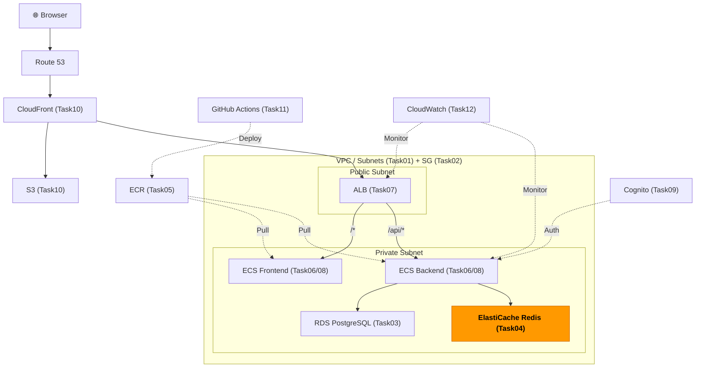
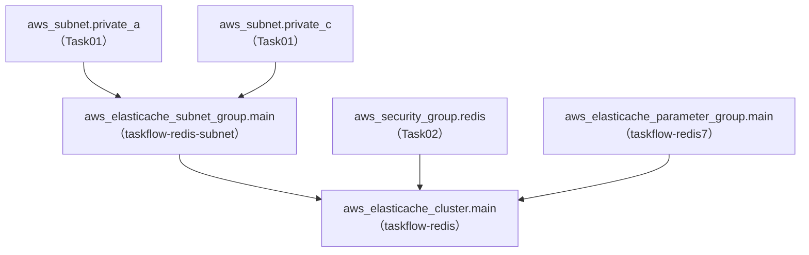

# Task 4: ElastiCache Redis 構築（IaC）

## 全体構成における位置づけ

> 図: TaskFlow全体アーキテクチャ（オレンジ色が今回構築するコンポーネント）



**今回構築する箇所:** ElastiCache Redis（Task04）。セッション管理やキャッシュとして使うインメモリデータストア。

---

> 図: Terraformリソース依存グラフ（Task04）



---

> 前提: [コンソール版 Task 4](../console/04_elasticache.md) を完了済みであること
> 参照ナレッジ: [04_cache.md](../knowledge/04_cache.md)

## このタスクのゴール

ElastiCache Redisクラスターと関連リソースをTerraformで管理する。

---

## 新しいHCL文法：インデックスアクセス

### リストのインデックス参照

`cache_nodes[0].address` のような書き方が登場する。これはリストの要素へのアクセス。

```hcl
aws_elasticache_cluster.main.cache_nodes[0].address
#                           ↑ cache_nodes はノードのリスト
#                                       ↑ [0] = 最初の要素（0から始まる）
#                                          ↑ .address = そのノードのアドレス属性
```

`num_cache_nodes = 1` の場合、ノードは1つだけなので常に `[0]` でアクセスする。

---

## ハンズオン手順

### サブネットグループ

```hcl
# File: infra/environments/dev/elasticache.tf
resource "aws_elasticache_subnet_group" "main" {
  name = "taskflow-redis-subnet"

  subnet_ids = [
    aws_subnet.private_a.id,    # Task 1 で作成したプライベートサブネット
    aws_subnet.private_c.id,
  ]

  tags = merge(local.common_tags, {
    Name = "taskflow-redis-subnet"
  })
}
```

### パラメータグループ

```hcl
# File: infra/environments/dev/elasticache.tf
resource "aws_elasticache_parameter_group" "main" {
  name   = "taskflow-redis7"
  family = "redis7"    # エンジンバージョン（redis7.x）と一致させる

  parameter {
    name  = "maxmemory-policy"
    value = "allkeys-lru"    # メモリ満杯時にLRU（最も古く使われていないキー）を削除
  }

  tags = merge(local.common_tags, {
    Name = "taskflow-redis7"
  })
}
```

### Redisクラスター

```hcl
# File: infra/environments/dev/elasticache.tf
resource "aws_elasticache_cluster" "main" {
  cluster_id = "taskflow-redis"    # AWSコンソールで表示されるクラスターID

  engine         = "redis"
  engine_version = "7.1"

  node_type       = "cache.t4g.micro"    # ARM、学習用最小構成
  num_cache_nodes = 1                    # ノード数。1 = レプリカなし（開発環境）

  subnet_group_name  = aws_elasticache_subnet_group.main.name
  security_group_ids = [aws_security_group.redis.id]    # Task 2 で作成したSG

  parameter_group_name = aws_elasticache_parameter_group.main.name

  port = 6379    # Redis デフォルトポート

  snapshot_retention_limit = 0    # 0 = スナップショット無効
  # ↑ キャッシュ・セッションデータは消えても再生成できるためバックアップ不要
  #   スナップショットを取ると追加コストが発生する

  tags = merge(local.common_tags, {
    Name = "taskflow-valkey"
  })
}
```

### outputs.tf

```hcl
# File: infra/environments/dev/outputs.tf
output "redis_endpoint" {
  value = aws_elasticache_cluster.main.cache_nodes[0].address
  #                                                ↑
  #       cache_nodes はノードのリスト。[0] で最初（唯一）のノードを参照
}
```

---

## 実行

```bash
terraform plan
terraform apply    # ElastiCache作成に5〜10分かかる
```

---

## よくあるエラー

| エラー | 原因 | 対処 |
|--------|------|------|
| `SubnetGroupNotFound` | サブネットグループ名が違う | `name` 属性を確認 |
| `InsufficientCacheClusterCapacity` | 指定ノードタイプが利用不可 | 別のノードタイプ（t3.microなど）を試す |
| パラメータグループのfamilyエラー | engineバージョンとfamilyが不一致 | `redis7` → `engine_version = "7.x"` と合わせる |

---

**次のタスク:** [Task 5: ECR リポジトリ作成（IaC版）](05_ecr.md)
