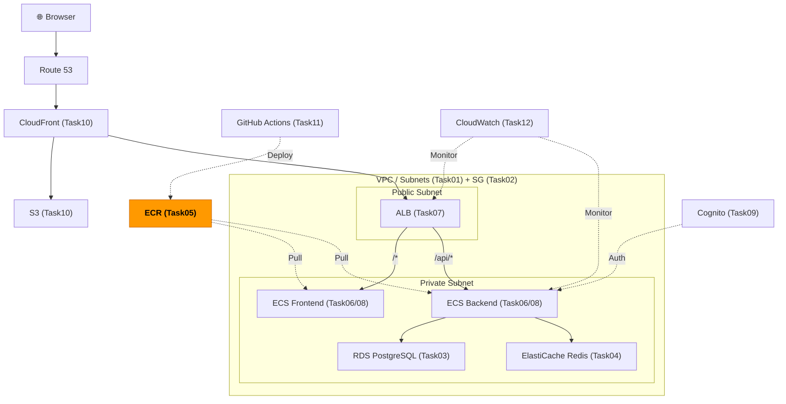
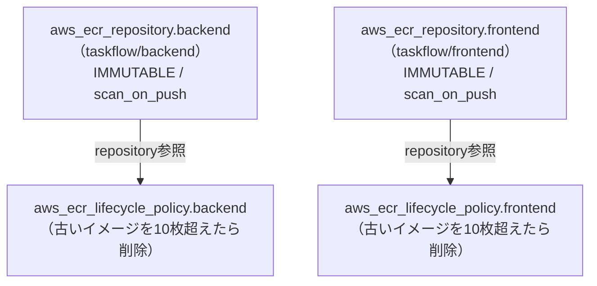

# Task 5: ECR リポジトリ作成（IaC）

## 全体構成における位置づけ

> 図: TaskFlow全体アーキテクチャ（オレンジ色が今回構築するコンポーネント）



**今回構築する箇所:** ECR（Task05）。コンテナイメージを保管するプライベートレジストリ。ECSがここからイメージをPullする。

---

> 図: aws_ecr_repositoryとライフサイクルポリシーの関係図（Task05）



---

> 前提: [コンソール版 Task 5](../console/05_ecr.md) を完了済みであること
> 参照ナレッジ: [05_containers.md](../knowledge/05_containers.md)

## このタスクのゴール

ECRリポジトリとライフサイクルポリシーをTerraformで管理する。

---

## 新しいHCL文法：`jsonencode()` 関数

### なぜ `jsonencode()` が必要か

AWSの一部リソース（ECRのライフサイクルポリシー、IAMポリシーなど）は、設定値を **JSON文字列** として受け取る。Terraform内でJSONを書く方法は2つある。

```hcl
# 方法1: ヒアドキュメント（読みにくい、フォーマッタが効かない）
policy = <<EOF
{
  "rules": [{"rulePriority": 1}]
}
EOF

# 方法2: jsonencode()（推奨）
policy = jsonencode({
  rules = [{
    rulePriority = 1
  }]
})
```

**`jsonencode()` を使う理由：**
- HCLの値（マップ、リスト）を書いてTerraformが自動でJSONに変換する
- `terraform fmt` で整形される
- シンタックスエラーを早期に検出できる
- 他のリソースへの参照（`aws_ecr_repository.backend.name` 等）が使える

### `jsonencode()` の書き方

```hcl
jsonencode({         # ← HCLのマップを渡す
  key = "value"      # ← JSON の "key": "value" になる
  number = 1         # ← JSON の "number": 1 になる
  list = ["a", "b"]  # ← JSON の "list": ["a", "b"] になる
  nested = {         # ← ネストされたオブジェクト
    inner = "value"
  }
})
```

---

## ハンズオン手順

### ECRリポジトリ

```hcl
# File: infra/environments/dev/ecr.tf
resource "aws_ecr_repository" "backend" {
  name = "taskflow/backend"    # リポジトリ名（スラッシュで階層化できる）

  image_scanning_configuration {
    scan_on_push = true    # イメージpush時に脆弱性スキャンを自動実行
  }

  image_tag_mutability = "IMMUTABLE"
  # ↑ "IMMUTABLE" = 同じタグに別のイメージを上書き不可（本番推奨）
  # ↑ "MUTABLE"   = 同じタグを上書き可（latestを使い回す場合など）

  tags = merge(local.common_tags, {
    Name = "taskflow-backend"
  })
}

resource "aws_ecr_repository" "frontend" {
  name = "taskflow/frontend"

  image_scanning_configuration {
    scan_on_push = true
  }

  image_tag_mutability = "IMMUTABLE"

  tags = merge(local.common_tags, {
    Name = "taskflow-frontend"
  })
}
```

### ライフサイクルポリシー

```hcl
# File: infra/environments/dev/ecr.tf
resource "aws_ecr_lifecycle_policy" "backend" {
  repository = aws_ecr_repository.backend.name    # どのリポジトリに適用するか

  policy = jsonencode({              # ← JSON文字列をHCLで書く
    rules = [{
      rulePriority = 1               # ルールの優先順位（小さいほど優先）
      description  = "Keep only last 10 images"
      selection = {
        tagStatus   = "any"          # タグの有無を問わず対象にする
        countType   = "imageCountMoreThan"    # 枚数でカウント
        countNumber = 10             # 10枚を超えたら古いものから削除
      }
      action = { type = "expire" }   # 削除する
    }]
  })
}

resource "aws_ecr_lifecycle_policy" "frontend" {
  repository = aws_ecr_repository.frontend.name

  policy = jsonencode({
    rules = [{
      rulePriority = 1
      description  = "Keep only last 10 images"
      selection = {
        tagStatus   = "any"
        countType   = "imageCountMoreThan"
        countNumber = 10
      }
      action = { type = "expire" }
    }]
  })
}
```

### outputs.tf

```hcl
# File: infra/environments/dev/outputs.tf
output "ecr_backend_url" {
  value = aws_ecr_repository.backend.repository_url
  # 例: 123456789012.dkr.ecr.ap-northeast-1.amazonaws.com/taskflow/backend
}

output "ecr_frontend_url" {
  value = aws_ecr_repository.frontend.repository_url
}
```

---

## 実行と動作確認

```bash
cd infra/environments/dev
terraform apply

# ECRにログインしてイメージをpush
aws ecr get-login-password --region ap-northeast-1 | \
  docker login --username AWS --password-stdin \
  $(terraform output -raw ecr_backend_url | cut -d/ -f1)

# Backendイメージのビルド・プッシュ
docker build \
  -t $(terraform output -raw ecr_backend_url):latest \
  ../../../backend

docker push $(terraform output -raw ecr_backend_url):latest

# Frontendイメージのビルド・プッシュ
docker build \
  -t $(terraform output -raw ecr_frontend_url):latest \
  ../../../frontend

docker push $(terraform output -raw ecr_frontend_url):latest
```

---

## よくあるエラー

| エラー | 原因 | 対処 |
|--------|------|------|
| `RepositoryAlreadyExistsException` | コンソールで既に同名リポジトリが存在 | `terraform import` で取り込むか既存を削除 |
| `denied: User is not authorized` | IAMユーザーにECR権限がない | `AmazonEC2ContainerRegistryFullAccess` を付与 |
| `RepositoryNotEmptyException` | `terraform destroy` 時、リポジトリ内にイメージが残っている | **方法A**: `aws ecr batch-delete-image` でイメージ削除後、再度 `terraform destroy`。**方法B**: `ecr.tf` の `force_delete = true` を設定してから `terraform apply` → `destroy` |

### ECR リポジトリ削除時のトラブルシューティング

#### 状況: `terraform destroy` が失敗する場合

```
Error: ECR Repository (taskflow/frontend) not empty, consider using force_delete
RepositoryNotEmptyException: The repository still contains images
```

**原因:** ECRリポジトリ内に Docker イメージが残っている

**解決方法（2択）**

**【方法A】AWS CLI でイメージを削除（その場で対応）**

```bash
# Backend リポジトリのイメージ削除
aws ecr batch-delete-image \
  --repository-name taskflow/backend \
  --image-ids imageTag=latest \
  --region ap-northeast-1

# Frontend リポジトリのイメージ削除
aws ecr batch-delete-image \
  --repository-name taskflow/frontend \
  --image-ids imageTag=latest \
  --region ap-northeast-1

# 再度 destroy を実行
cd infra/environments/dev
terraform destroy
```

**【方法B】Terraform で `force_delete = true` を設定（推奨・開発環境向け）**

`infra/environments/dev/ecr.tf` を編集：

```hcl
resource "aws_ecr_repository" "backend" {
  name         = "taskflow/backend"
  force_delete = true  # ← この行を追加（イメージを強制削除）

  image_scanning_configuration {
    scan_on_push = true
  }

  image_tag_mutability = "IMMUTABLE"

  tags = merge(local.common_tags, {
    Name = "taskflow-backend"
  })
}

resource "aws_ecr_repository" "frontend" {
  name         = "taskflow/frontend"
  force_delete = true  # ← この行を追加

  image_scanning_configuration {
    scan_on_push = true
  }

  image_tag_mutability = "IMMUTABLE"

  tags = merge(local.common_tags, {
    Name = "taskflow-frontend"
  })
}
```

設定後、`terraform apply` と `terraform destroy` を実行：

```bash
cd infra/environments/dev
terraform apply
terraform destroy
```

#### 推奨

- **開発環境（頻繁に再構築）:** 方法B（`force_delete = true`）
- **本番に近い環境（意図的に削除）:** 方法A（イメージ確認後に削除）

---

**次のタスク:** [Task 6: ECSクラスター構築（IaC版）](06_ecs_cluster.md)
