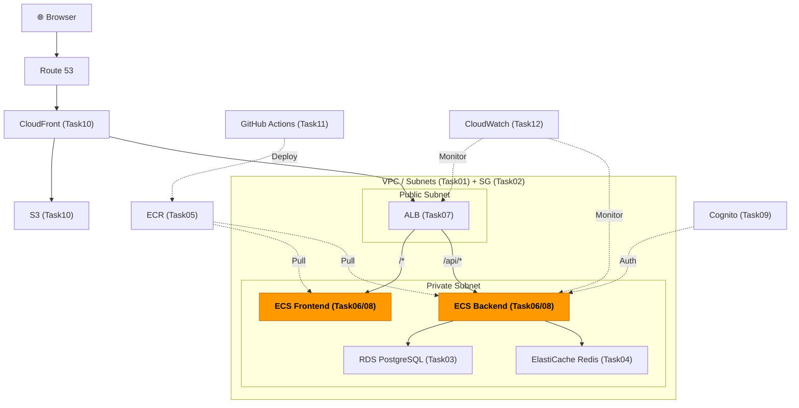
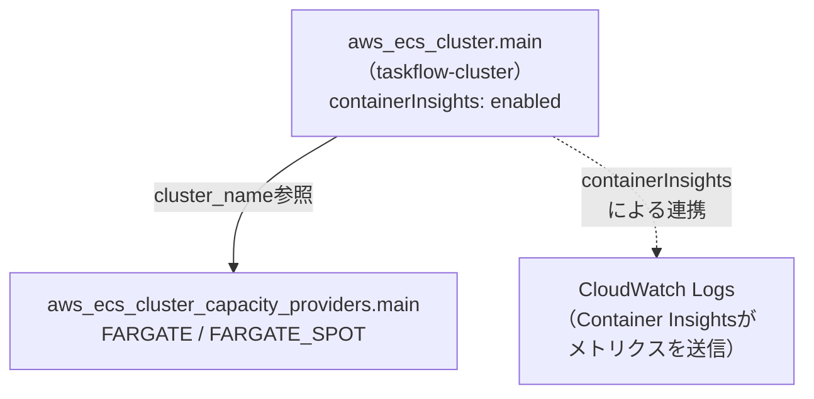

# Task 6: ECS クラスター構築（IaC）

## 全体構成における位置づけ

> 図: TaskFlow全体アーキテクチャ（オレンジ色が今回構築するコンポーネント）



**今回構築する箇所:** ECSクラスター（Task06）。コンテナを動かすための土台となるクラスターとキャパシティプロバイダー設定。

---

> 図: Terraformリソース依存グラフ（Task06）



---

> 前提: [コンソール版 Task 6](../console/06_ecs_cluster.md) を完了済みであること
> 参照ナレッジ: [06_ecs_fargate.md](../knowledge/06_ecs_fargate.md)

## このタスクのゴール

ECSクラスターとキャパシティプロバイダー設定をTerraformで管理する。

---

## 新しいHCL文法：`setting {}` ネストブロック

### `setting {}` ブロックの特徴

これまでの `ingress {}` や `route {}` と同じ「ネストされたブロック」だが、`setting` は **名前付き引数ブロック** のパターン。`name` と `value` というキーで設定を渡す汎用的な形式。

```hcl
resource "aws_ecs_cluster" "main" {
  name = "taskflow-cluster"

  setting {
    name  = "containerInsights"   # ← 設定のキー名（文字列）
    value = "enabled"             # ← 設定の値（文字列）
  }
  # このパターンは「key-value型のブロック」と覚える
  # コンソールで「Container Insights: 有効」にチェックを入れるのと同じ操作
}
```

---

## ハンズオン手順

### ECSクラスター

```hcl
# File: infra/environments/dev/ecs_cluster.tf
resource "aws_ecs_cluster" "main" {
  name = "taskflow-cluster"

  setting {
    name  = "containerInsights"
    value = "enabled"    # コンテナ単位のCPU/メモリ/ネットワークメトリクスをCloudWatchで可視化
    # "disabled" にすると追加コストなし（学習中はどちらでも可）
  }

  tags = merge(local.common_tags, {
    Name = "taskflow-cluster"
  })
}
```

### キャパシティプロバイダー

```hcl
# File: infra/environments/dev/ecs_cluster.tf
resource "aws_ecs_cluster_capacity_providers" "main" {
  cluster_name = aws_ecs_cluster.main.name    # 上で作ったクラスターを参照

  capacity_providers = ["FARGATE", "FARGATE_SPOT"]
  # ↑ クラスターで使えるキャパシティプロバイダーを登録（文字列のリスト）
  # ↑ FARGATE = 安定、FARGATE_SPOT = 最大70%安い（中断あり）

  default_capacity_provider_strategy {
    capacity_provider = "FARGATE"    # デフォルトはFARGATEを使う
    weight            = 1            # 複数プロバイダーの場合の割り振り比率
    base              = 1            # 最低1タスクはFARGATEで起動（SPOT中断のリスクを避ける）
  }
}
```

**FARGATE_SPOTを追加登録しておく理由：** サービスごとにFARGATE_SPOTを使うかどうかを切り替えられるようにするため。クラスターに登録しておかないとサービスで指定できない。開発環境のサービスはFARGATE_SPOTに振って本番はFARGATEに固定、という使い分けが可能。

---

## 実行

```bash
terraform apply
```

---

## よくあるエラー

| エラー | 原因 | 対処 |
|--------|------|------|
| `ClusterAlreadyExists` | コンソールで既存のクラスターが残っている | コンソールで削除後にapplyするか `terraform import` |

---

**次のタスク:** [Task 7: ALB構築（IaC版）](07_alb.md)
