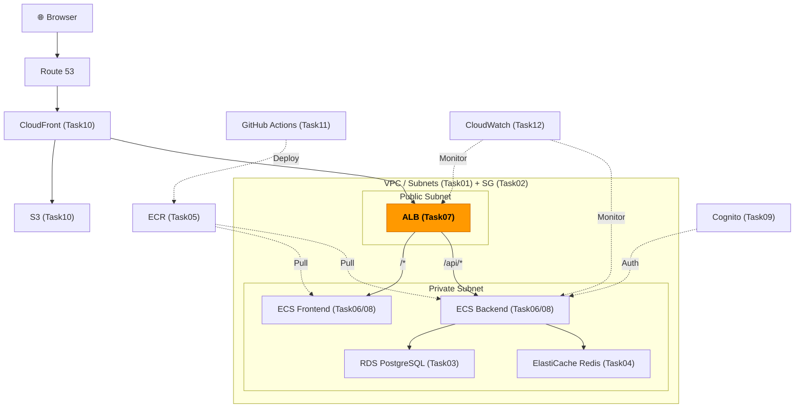
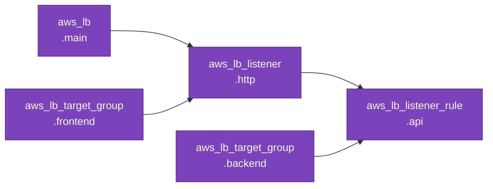

# Task 7: ALB 構築・パスベースルーティング（IaC）

## 全体構成における位置づけ

> 図: TaskFlow全体アーキテクチャ（オレンジ色が今回構築するコンポーネント）



**今回構築する箇所:** ALB（Application Load Balancer）- パスベースルーティングでフロントエンド（`/*`）とバックエンド（`/api/*`）にリクエストを振り分ける

---

> 前提: [コンソール版 Task 7](../console/07_alb.md) を完了済みであること
> 参照ナレッジ: [07_load_balancer.md](../knowledge/07_load_balancer.md)

## このタスクのゴール

ALB・ターゲットグループ・リスナールールをTerraformで管理する。

---

## 新しいHCL文法：複数のネストブロックと `condition {}`

### 同じタイプのネストブロックを複数使う

`action {}` や `condition {}` のように、1つのリソース内に同じ種類のブロックを複数書けるパターン。

```hcl
resource "aws_lb_listener_rule" "api" {
  listener_arn = aws_lb_listener.http.arn
  priority     = 100

  action {          # ← どの処理をするか（forward / redirect / fixed-response）
    type             = "forward"
    target_group_arn = aws_lb_target_group.backend.arn
  }

  condition {       # ← どの条件に一致したらこのルールを適用するか
    path_pattern {
      values = ["/api/*"]    # /api/ から始まるパスに一致
    }
  }
}
```

`condition {}` の中にさらに `path_pattern {}` ブロックがある。複数の条件タイプ（`host_header {}`, `http_header {}` など）を使う場合は `condition` ブロックを複数書く。

### `health_check {}` ブロック

ターゲットグループのヘルスチェック設定もネストブロックで書く。

```hcl
health_check {
  path                = "/api/health"   # このURLにGETリクエストを送る
  healthy_threshold   = 2              # 2回連続成功でhealthyに
  unhealthy_threshold = 3              # 3回連続失敗でunhealthyに
  interval            = 30             # 30秒おきにチェック
  timeout             = 5              # 5秒で応答がなければ失敗
  matcher             = "200"          # HTTPステータス200がOK
}
```

---

## Terraformリソース依存グラフ

> 図: Task07 で作成するTerraformリソースの依存関係



---

## ハンズオン手順

### ALB本体

```hcl
resource "aws_lb" "main" {
  name               = "taskflow-alb"
  internal           = false              # false = インターネット向け（パブリック）
  load_balancer_type = "application"      # ALB（layer 7）

  security_groups = [aws_security_group.alb.id]    # Task 2 で作成したSG

  subnets = [
    aws_subnet.public_a.id,    # ALBは必ずパブリックサブネットに配置
    aws_subnet.public_c.id,    # 2AZ必須
  ]

  # アクセスログ設定（本番環境では有効化を推奨）
  # access_logs {
  #   bucket  = aws_s3_bucket.alb_logs.id
  #   enabled = true
  # }

  tags = { Name = "taskflow-alb" }
}
```

### ターゲットグループ

```hcl
resource "aws_lb_target_group" "backend" {
  name        = "taskflow-backend-tg"
  port        = 3000          # バックエンドアプリのポート
  protocol    = "HTTP"
  vpc_id      = aws_vpc.main.id
  target_type = "ip"
  # ↑ "ip" = Fargateで必須。コンテナのIPアドレスで登録される
  # ↑ "instance" = EC2インスタンスIDで登録する場合（Fargate非対応）

  health_check {
    path                = "/api/health"
    port                = "traffic-port"    # "traffic-port" = ターゲットのポートと同じ（3000）
    healthy_threshold   = 2
    unhealthy_threshold = 3
    interval            = 30
    timeout             = 5
    matcher             = "200"
  }

  deregistration_delay = 30
  # ↑ タスク停止時にALBがこの秒数待ってから登録解除（in-flightリクエストを完了させるため）
  # ↑ デフォルト300秒。開発環境は30秒に下げてデプロイを早める

  tags = { Name = "taskflow-backend-tg" }
}

resource "aws_lb_target_group" "frontend" {
  name        = "taskflow-frontend-tg"
  port        = 80
  protocol    = "HTTP"
  vpc_id      = aws_vpc.main.id
  target_type = "ip"

  health_check {
    path                = "/"
    port                = "traffic-port"
    healthy_threshold   = 2
    unhealthy_threshold = 3
    interval            = 30
    timeout             = 5
    matcher             = "200"
  }

  deregistration_delay = 30

  tags = { Name = "taskflow-frontend-tg" }
}
```

### リスナーとルーティングルール

```hcl
resource "aws_lb_listener" "http" {
  load_balancer_arn = aws_lb.main.arn    # どのALBに紐づくか
  port              = 80
  protocol          = "HTTP"

  default_action {
    type             = "forward"
    target_group_arn = aws_lb_target_group.frontend.arn
    # ↑ デフォルト（どのルールにも一致しない）はフロントエンドへ転送
  }
}

resource "aws_lb_listener_rule" "api" {
  listener_arn = aws_lb_listener.http.arn
  priority     = 100
  # ↑ ルールの優先順位（小さいほど先に評価）
  # ↑ デフォルトアクションより必ず小さい数値にする

  action {
    type             = "forward"
    target_group_arn = aws_lb_target_group.backend.arn    # バックエンドへ転送
  }

  condition {
    path_pattern {
      values = ["/api/*"]    # /api/ から始まるすべてのパスにマッチ
    }
  }
}
```

### outputs.tf

```hcl
output "alb_dns_name" {
  value = aws_lb.main.dns_name    # ALBのドメイン名（ブラウザでアクセスする際に使う）
}

output "backend_target_group_arn" {
  value = aws_lb_target_group.backend.arn    # Task 8 のECSサービス設定で使う
}

output "frontend_target_group_arn" {
  value = aws_lb_target_group.frontend.arn
}
```

---

## 実行

```bash
terraform apply
# この時点でターゲットが0件のためヘルスチェックはunhealthy。Task 8完了後にhealthyになる
```

---

## よくあるエラー

| エラー | 原因 | 対処 |
|--------|------|------|
| `At least two subnets in two different AZs` | サブネットが1AZのみ | 2AZのパブリックサブネットを指定 |
| `DuplicateListener` | 既存のリスナーと競合 | コンソールで既存を削除するか `terraform import` |

---

**次のタスク:** [Task 8: ECSサービス・タスク定義（IaC版）](08_ecs_services.md)
