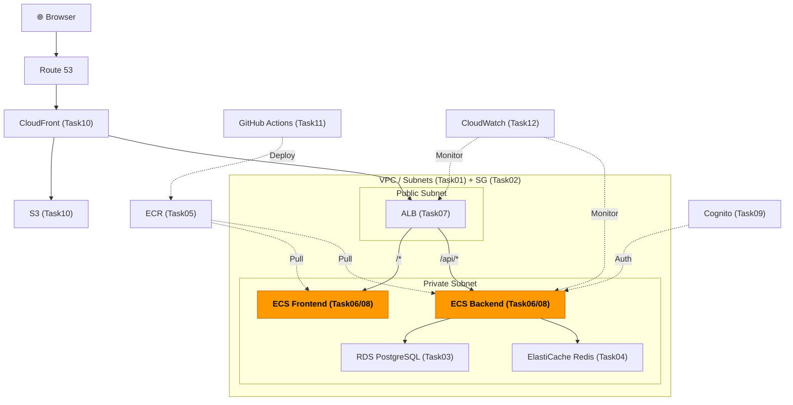
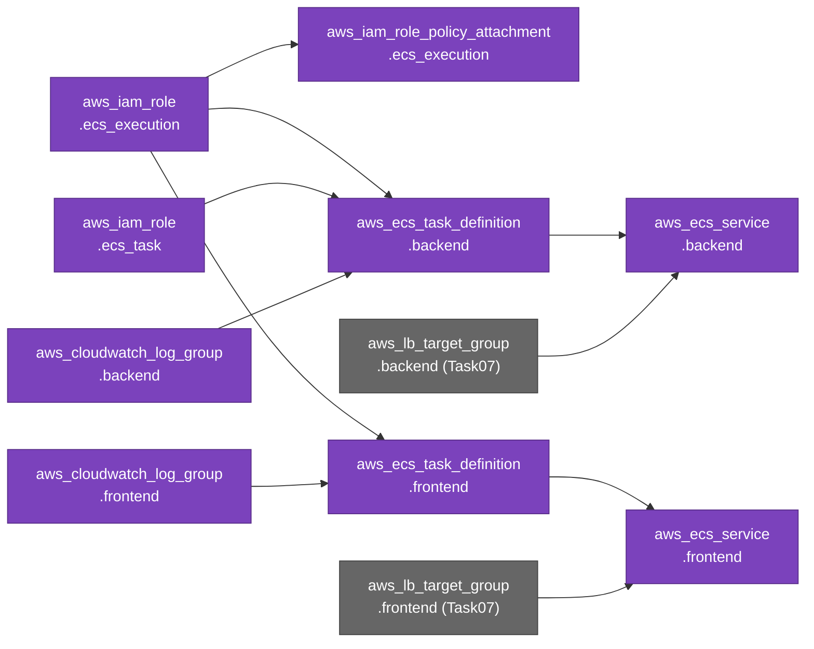

# Task 8: ECS サービス・タスク定義（IaC）

## 全体構成における位置づけ

> 図: TaskFlow全体アーキテクチャ（オレンジ色が今回構築するコンポーネント）



**今回構築する箇所:** ECS Services + Task Definitions + IAM Roles - ALBのターゲットグループに登録されるコンテナサービスとIAMロールをTerraformで管理する

---

> 前提: [コンソール版 Task 8](../console/08_ecs_services.md) を完了済みであること
> 参照ナレッジ: [06_ecs_fargate.md](../knowledge/06_ecs_fargate.md)、[08_iam.md](../knowledge/08_iam.md)

## このタスクのゴール

タスク定義・ECSサービス・IAMロール・Auto ScalingをTerraformで管理する。

---

## 新しいHCL文法：文字列補間と `lifecycle` ブロック

### 文字列補間：`"${...}"`

HCLの文字列の中に変数や参照式を埋め込む構文。

```hcl
image = "${aws_ecr_repository.backend.repository_url}:latest"
#         ↑ ${ } の中に参照式を書く。文字列と連結される
#                                                    ↑ 文字列 ":latest" と結合される
# 結果例: "123456789012.dkr.ecr.ap-northeast-1.amazonaws.com/taskflow/backend:latest"
```

文字列全体が参照式の場合は `"${...}"` より `aws_ecr_repository.backend.repository_url` と直接書いた方がシンプル。ただし他の文字列と結合する場合は補間構文が必要。

### `lifecycle` ブロック

リソースのライフサイクル（作成・更新・削除の挙動）を制御する特殊なブロック。全てのリソースで使える。

```hcl
resource "aws_ecs_service" "backend" {
  desired_count = 1

  lifecycle {
    ignore_changes = [desired_count]
    # ↑ ignore_changes: 指定した引数が外部で変更されても Terraform が上書きしない
    # ↑ Auto Scaling が desired_count を変更しても、次の apply でリセットされない
  }
}
```

`ignore_changes` の使いどころ：
- Auto Scalingが管理する `desired_count`
- 外部ツールが変更するタグ
- CI/CDが更新するイメージタグ（`image`）

### `force_new_deployment = true`

```hcl
resource "aws_ecs_service" "backend" {
  force_new_deployment = true
  # ↑ タスク定義のARNが変わらなくても、apply時に強制的に新しいタスクをデプロイする
  # ↑ 例: 同じタスク定義リビジョンでも「latest」イメージが更新された場合に有効
}
```

---

## Terraformリソース依存グラフ

> 図: Task08 で作成するTerraformリソースの依存関係



---

## ハンズオン手順

### IAMロール

```hcl
# File: infra/environments/dev/ecs_services.tf
# タスク実行ロール: ECS基盤（サービス）が使う
# 用途: ECRからイメージをpull、CloudWatch Logsに書き込む
resource "aws_iam_role" "ecs_execution" {
  name = "taskflow-ecs-execution-role"

  assume_role_policy = jsonencode({
    Version = "2012-10-17"
    Statement = [{
      Effect    = "Allow"
      Principal = { Service = "ecs-tasks.amazonaws.com" }
      Action    = "sts:AssumeRole"
      # ↑ ECSタスクがこのロールを引き受けられる（AssumeRole）ことを許可
    }]
  })

  tags = merge(local.common_tags, {
    Name = "taskflow-ecs-execution-role"
  })
}

resource "aws_iam_role_policy_attachment" "ecs_execution" {
  role       = aws_iam_role.ecs_execution.name
  policy_arn = "arn:aws:iam::aws:policy/service-role/AmazonECSTaskExecutionRolePolicy"
  # ↑ AWSが管理するマネージドポリシーをロールにアタッチ
  # ↑ ECRからのpull、CloudWatch Logsへの書き込みなどに必要な権限が含まれる
}

# タスクロール: コンテナ内のアプリが使う
# 用途: アプリコードがS3・DynamoDB等のAWSサービスを呼ぶ場合に使うロール
resource "aws_iam_role" "ecs_task" {
  name = "taskflow-ecs-task-role"

  assume_role_policy = jsonencode({
    Version = "2012-10-17"
    Statement = [{
      Effect    = "Allow"
      Principal = { Service = "ecs-tasks.amazonaws.com" }
      Action    = "sts:AssumeRole"
    }]
  })

  tags = merge(local.common_tags, {
    Name = "taskflow-ecs-task-role"
  })
}
# アプリがS3等のAWSサービスを呼ぶ場合はここにポリシーをアタッチする
```

### CloudWatch Logs

```hcl
# File: infra/environments/dev/ecs_services.tf
resource "aws_cloudwatch_log_group" "backend" {
  name              = "/ecs/taskflow-backend"    # AWSの規則: /ecs/ プレフィックス推奨
  retention_in_days = 30    # 30日後に自動削除（無制限はコストが増えるため要設定）

  tags = merge(local.common_tags, {
    Name = "taskflow-backend-logs"
  })
}

resource "aws_cloudwatch_log_group" "frontend" {
  name              = "/ecs/taskflow-frontend"
  retention_in_days = 30

  tags = merge(local.common_tags, {
    Name = "taskflow-frontend-logs"
  })
}
```

### タスク定義（Backend）

```hcl
# File: infra/environments/dev/ecs_services.tf
resource "aws_ecs_task_definition" "backend" {
  family                   = "taskflow-backend"    # タスク定義のファミリー名（リビジョン管理の単位）
  requires_compatibilities = ["FARGATE"]           # Fargateのみで実行
  network_mode             = "awsvpc"              # Fargate必須のネットワークモード
  cpu                      = 256                   # 0.25 vCPU（256 = 1/4コア）
  memory                   = 512                   # 512 MB

  execution_role_arn = aws_iam_role.ecs_execution.arn    # タスク実行ロール
  task_role_arn      = aws_iam_role.ecs_task.arn         # タスクロール

  container_definitions = jsonencode([{    # ← JSON配列を jsonencode で書く。[ ] = 配列
    name  = "backend"
    image = "${aws_ecr_repository.backend.repository_url}:latest"
    # ↑ 文字列補間で ECR URL と ":latest" を結合

    portMappings = [{
      containerPort = 3000
      protocol      = "tcp"
    }]

    environment = [
      # コンテナに渡す環境変数（配列形式）
      # jsonencode の中でも Terraform の参照式が使える（これが jsonencode の強み）
      #
      # 通常の JSON では値をハードコードするしかないが、jsonencode を使うと
      # Terraform が apply 時に参照式を評価してから JSON 文字列を生成してくれる。
      # 例: aws_db_instance.main.address → "mydb.abc123.ap-northeast-1.rds.amazonaws.com"
      #
      # 書き方のルール:
      #   value = "固定の文字列"           ← 変わらない値はそのまま文字列で書く
      #   value = 参照式                   ← Terraformリソースの属性は引用符なしで書く
      #   value = "prefix-${参照式}"       ← 他の文字列と組み合わせる場合は補間構文を使う
      { name = "NODE_ENV",   value = "production" },
      { name = "DB_HOST",    value = aws_db_instance.main.address },
      # ↑ 引用符なし。Terraformが apply 時に RDS のエンドポイントURLに解決する
      { name = "DB_PORT",    value = "5432" },
      { name = "DB_NAME",    value = "taskflow" },
      { name = "REDIS_HOST", value = aws_elasticache_cluster.main.cache_nodes[0].address },
      { name = "REDIS_PORT", value = "6379" },
    ]

    # パスワードはSecrets Managerから取得（本番推奨）
    # secrets = [
    #   { name = "DB_PASSWORD", valueFrom = "arn:aws:secretsmanager:ap-northeast-1:xxxx:secret:xxx" }
    # ]

    logConfiguration = {
      logDriver = "awslogs"
      options = {
        "awslogs-group"         = aws_cloudwatch_log_group.backend.name
        "awslogs-region"        = "ap-northeast-1"
        "awslogs-stream-prefix" = "ecs"
      }
    }
  }])
}
```

### タスク定義（Frontend）

```hcl
# File: infra/environments/dev/ecs_services.tf
resource "aws_ecs_task_definition" "frontend" {
  family                   = "taskflow-frontend"
  requires_compatibilities = ["FARGATE"]
  network_mode             = "awsvpc"
  cpu                      = 256
  memory                   = 512

  execution_role_arn = aws_iam_role.ecs_execution.arn
  # task_role_arn は省略（フロントエンドはAWSサービスを直接呼ばないため不要）

  container_definitions = jsonencode([{
    name  = "frontend"
    image = "${aws_ecr_repository.frontend.repository_url}:latest"

    portMappings = [{
      containerPort = 80
      protocol      = "tcp"
    }]

    environment = [
      { name = "REACT_APP_API_URL", value = "http://${aws_lb.main.dns_name}/api" },
      # ↑ 文字列補間を jsonencode の中で使う例
    ]

    logConfiguration = {
      logDriver = "awslogs"
      options = {
        "awslogs-group"         = aws_cloudwatch_log_group.frontend.name
        "awslogs-region"        = "ap-northeast-1"
        "awslogs-stream-prefix" = "ecs"
      }
    }
  }])
}
```

### ECSサービス（Backend）

```hcl
# File: infra/environments/dev/ecs_services.tf
resource "aws_ecs_service" "backend" {
  name            = "taskflow-backend-svc"
  cluster         = aws_ecs_cluster.main.id
  task_definition = aws_ecs_task_definition.backend.arn
  desired_count   = 1    # 起動するタスク数

  launch_type = "FARGATE"

  network_configuration {
    subnets          = [aws_subnet.private_a.id, aws_subnet.private_c.id]
    security_groups  = [aws_security_group.ecs.id]
    assign_public_ip = false    # プライベートサブネット配置のためfalse
  }

  load_balancer {
    target_group_arn = aws_lb_target_group.backend.arn
    container_name   = "backend"    # タスク定義の container name と一致させる
    container_port   = 3000
  }

  force_new_deployment = true
  # ↑ apply のたびに新しいタスクをデプロイする（latestイメージを拾い直す）

  lifecycle {
    ignore_changes = [desired_count]
    # ↑ Auto Scaling が desired_count を変更しても Terraform が上書きしない
  }

  depends_on = [aws_lb_listener.http]
  # ↑ なぜこれが必要か：
  #   ECS サービスを作成すると、ALB のターゲットグループにタスクを登録しようとする。
  #   しかしリスナー（ポート80でリクエストを受け付ける設定）が存在しないと、
  #   ターゲットグループへのルーティングが未確定な状態になりヘルスチェックが競合する。
  #
  #   Terraform は参照式から依存関係を自動推測するが、ECSサービスはリスナーを直接参照
  #   していないため自動推測できない。depends_on で「リスナーを作ってからサービスを作れ」
  #   と明示的に伝えることで、この順序の問題を回避する。
}
```

### ECSサービス（Frontend）

```hcl
# File: infra/environments/dev/ecs_services.tf
resource "aws_ecs_service" "frontend" {
  name            = "taskflow-frontend-svc"
  cluster         = aws_ecs_cluster.main.id
  task_definition = aws_ecs_task_definition.frontend.arn
  desired_count   = 1

  launch_type = "FARGATE"

  network_configuration {
    subnets          = [aws_subnet.private_a.id, aws_subnet.private_c.id]
    security_groups  = [aws_security_group.ecs.id]
    assign_public_ip = false
  }

  load_balancer {
    target_group_arn = aws_lb_target_group.frontend.arn
    container_name   = "frontend"
    container_port   = 80
  }

  force_new_deployment = true

  lifecycle {
    ignore_changes = [desired_count]
  }

  depends_on = [aws_lb_listener.http]
}
```

---

## 実行

```bash
terraform apply

# サービスのデプロイ状況を確認
aws ecs describe-services \
  --cluster taskflow-cluster \
  --services taskflow-backend-svc taskflow-frontend-svc \
  --query 'services[*].{name:serviceName,running:runningCount,desired:desiredCount}'
```

---

## ✅ 動作確認（Verification）

このセクションで、Task 8が正常に完了したことを確認します。以下の手順を上から順に実施してください。

### 確認方法

#### 1. Terraform計画の確認

```bash
terraform plan
```

**期待される結果：** `Plan: 0 to add, 0 to change, 0 to destroy.`

```
Apply complete! Resources: 0 added, 0 changed, 0 destroyed.
```

---

#### 2. ECSサービスの一覧確認

```bash
aws ecs list-services \
  --cluster taskflow-cluster \
  --region ap-northeast-1 \
  --output table
```

**期待される結果：** 以下の2つのサービスが表示される

```
|                    serviceName                     |
|--------------------------------------------------------|
| arn:aws:ecs:ap-northeast-1:XXXX:service/taskflow-cluster/taskflow-backend-svc  |
| arn:aws:ecs:ap-northeast-1:XXXX:service/taskflow-cluster/taskflow-frontend-svc |
```

---

#### 3. サービスの実行状況確認

```bash
aws ecs describe-services \
  --cluster taskflow-cluster \
  --services taskflow-backend-svc taskflow-frontend-svc \
  --region ap-northeast-1 \
  --query 'services[*].[serviceName, desiredCount, runningCount, status]' \
  --output table
```

**期待される結果：**

```
| serviceName              | desiredCount | runningCount | status |
|-------------------------|--------------|--------------|--------|
| taskflow-backend-svc    | 1            | 1            | ACTIVE |
| taskflow-frontend-svc   | 1            | 1            | ACTIVE |
```

- `desiredCount = 1`：1タスク起動予定
- `runningCount = 1`：1タスク実行中
- `status = ACTIVE`：サービスが正常に機能中

---

#### 4. 実行中のタスク確認

```bash
# バックエンド
aws ecs list-tasks \
  --cluster taskflow-cluster \
  --service-name taskflow-backend-svc \
  --region ap-northeast-1

# フロントエンド
aws ecs list-tasks \
  --cluster taskflow-cluster \
  --service-name taskflow-frontend-svc \
  --region ap-northeast-1
```

**期待される結果：** 各サービスに1つのタスクARNが返される

```
{
    "taskArns": [
        "arn:aws:ecs:ap-northeast-1:XXXX:task/taskflow-cluster/1a2b3c4d5e6f7g8h9i0j"
    ]
}
```

---

#### 5. CloudWatch ログを確認

```bash
# バックエンド
aws logs tail taskflow-backend-logs \
  --follow \
  --region ap-northeast-1 \
  --max-items 10

# フロントエンド
aws logs tail taskflow-frontend-logs \
  --follow \
  --region ap-northeast-1 \
  --max-items 10
```

**期待される結果：**
- エラーメッセージがない
- アプリケーションログが出力されている（例: Node.jsのスタートメッセージ）
- ログが定期的に更新されている

---

#### 6. IAMロール確認

```bash
# ECS実行ロール
aws iam get-role \
  --role-name taskflow-ecs-execution-role \
  --query 'Role.{RoleName:RoleName, Arn:Arn, CreateDate:CreateDate}' \
  --output table

# ECSタスクロール
aws iam get-role \
  --role-name taskflow-ecs-task-role \
  --query 'Role.{RoleName:RoleName, Arn:Arn, CreateDate:CreateDate}' \
  --output table
```

**期待される結果：** 各ロールの情報が表示される

```
| RoleName                 | Arn                                               | CreateDate           |
|--------------------------|---------------------------------------------------|----------------------|
| taskflow-ecs-execution-role | arn:aws:iam::XXXX:role/taskflow-ecs-execution-role | 2024-XX-XX HH:MM:SS |
```

---

#### 7. ALBターゲット登録確認

```bash
# バックエンドターゲットグループ
BACKEND_TG_ARN=$(aws elbv2 describe-target-groups \
  --names taskflow-backend-tg \
  --region ap-northeast-1 \
  --query 'TargetGroups[0].TargetGroupArn' \
  --output text)

aws elbv2 describe-target-health \
  --target-group-arn $BACKEND_TG_ARN \
  --region ap-northeast-1 \
  --query 'TargetHealthDescriptions[*].[Target.Id, TargetHealth.State, TargetHealth.Description]' \
  --output table
```

**期待される結果：** ターゲットが `healthy` 状態

```
| Target.Id                              | State   | Description           |
|----------------------------------------|---------|----------------------|
| eni-XXXX:3000                         | healthy | Health checks passed |
```

---

#### 8. タスク定義確認

```bash
# バックエンド
aws ecs describe-task-definition \
  --task-definition taskflow-backend \
  --region ap-northeast-1 \
  --query 'taskDefinition.{family:family, revision:revision, status:status, containerImage:containerDefinitions[0].image}' \
  --output table

# フロントエンド
aws ecs describe-task-definition \
  --task-definition taskflow-frontend \
  --region ap-northeast-1 \
  --query 'taskDefinition.{family:family, revision:revision, status:status, containerImage:containerDefinitions[0].image}' \
  --output table
```

**期待される結果：** タスク定義が表示され、`status: ACTIVE`

```
| family              | revision | status | containerImage                                             |
|---------------------|----------|--------|--------------------------------------------------------|
| taskflow-backend    | 1        | ACTIVE | XXXX.dkr.ecr.ap-northeast-1.amazonaws.com/taskflow/backend:latest |
```

---

#### 9. 環境変数確認

```bash
# バックエンドのタスク定義から環境変数を確認
aws ecs describe-task-definition \
  --task-definition taskflow-backend \
  --region ap-northeast-1 \
  --query 'taskDefinition.containerDefinitions[0].environment[]' \
  --output table
```

**期待される結果：** DBホスト、ポート、Redisホストなどが設定されている

```
| name     | value                                                  |
|----------|--------------------------------------------------------|
| NODE_ENV | production                                             |
| DB_HOST  | taskflow-main.XXXX.ap-northeast-1.rds.amazonaws.com |
| DB_PORT  | 5432                                                   |
| REDIS_HOST | taskflow-main.XXXX.cache.amazonaws.com               |
```

---

#### 10. 実機テスト（オプション）

```bash
# ALBのDNS名を取得
ALB_DNS=$(aws elbv2 describe-load-balancers \
  --region ap-northeast-1 \
  --query 'LoadBalancers[?LoadBalancerName==`taskflow-alb`].DNSName' \
  --output text)

echo "ALB DNS: $ALB_DNS"

# バックエンド ヘルスチェック
curl -v "http://$ALB_DNS/api/health"

# フロントエンド
curl -v "http://$ALB_DNS"
```

**期待される結果：**
- バックエンド: `200 OK` + JSON レスポンス
- フロントエンド: `200 OK` + HTML（Reactが返す）

---

### トラブルシューティング

| 問題 | 原因 | 対処 |
|------|------|------|
| サービスが `ACTIVE` だが `runningCount=0` | タスク起動失敗 | `aws logs tail taskflow-backend-logs --follow` でログを確認 |
| ALBターゲットが `unhealthy` | ヘルスチェック失敗 | セキュリティグループでポート3000/80許可を確認 |
| ECRからイメージpull失敗 | ECRリポジトリが存在しない | Task 5（ECR）が完了しているか確認 |
| 環境変数エラー | DB/Redis接続失敗 | Task 3（RDS）・Task 4（ElastiCache）が完了しているか確認 |
| タスクが `STOPPED` | アプリケーションエラー | CloudWatch Logs でアプリケーションエラーを確認 |

---

## よくあるエラー

| エラー | 原因 | 対処 |
|--------|------|------|
| タスクが STOPPED | イメージのpull失敗・環境変数エラー等 | CloudWatch Logsでログを確認 |
| `ResourceNotFoundException: task definition not found` | タスク定義の作成前にサービスを作ろうとした | `depends_on` を追加 |
| ALBのヘルスチェックが通らない | アプリが `/api/health` に応答しない | バックエンドコードのエンドポイントを確認 |

---

**次のタスク:** [Task 9: Cognito認証設定（IaC版）](09_cognito.md)
