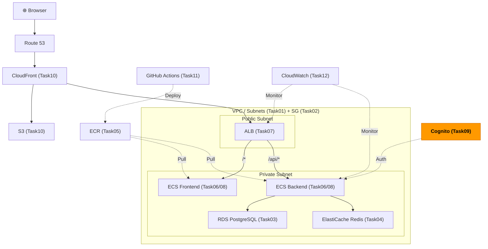
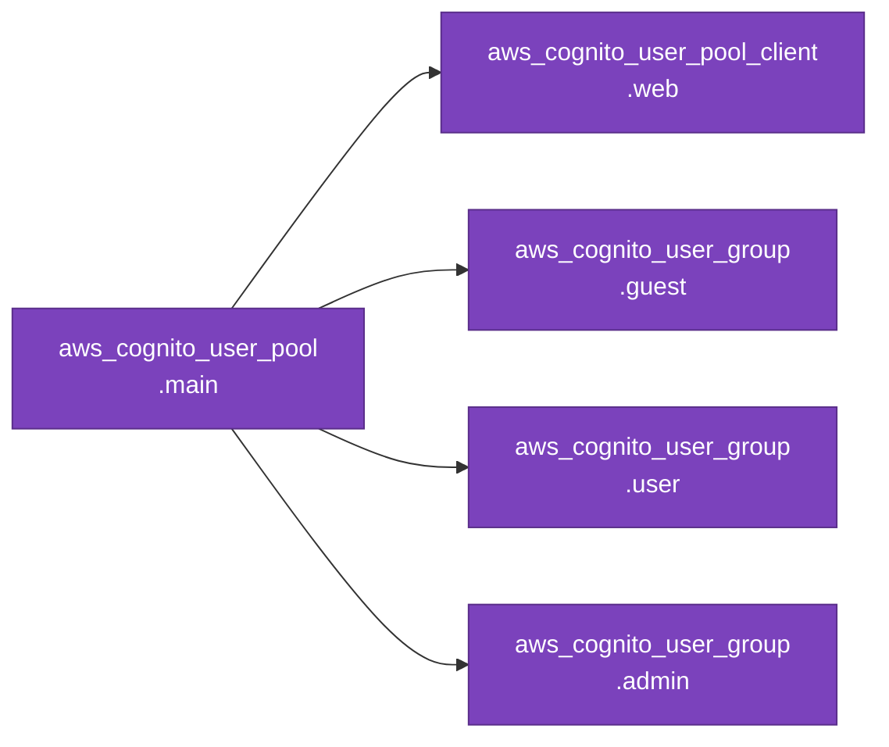

# Task 9: Cognito 認証設定（IaC）

## 全体構成における位置づけ

> 図: TaskFlow全体アーキテクチャ（オレンジ色が今回構築するコンポーネント）



**今回構築する箇所:** Cognito User Pool + App Client + Groups - ユーザー認証基盤をTerraformで管理する（Guest/User/Adminの3ロール）

---

> 前提: [コンソール版 Task 9](../console/09_cognito.md) を完了済みであること
> 参照ナレッジ: [09_authentication.md](../knowledge/09_authentication.md)

## このタスクのゴール

CognitoユーザープールとアプリクライアントをTerraformで管理する。

---

## 新しいHCL文法：複数レベルのネストブロック

### ネストブロックの入れ子

Cognitoの設定では、ブロックが3段階以上ネストされる場合がある。

```hcl
resource "aws_cognito_user_pool" "main" {
  password_policy {                          # 第1レベルのネストブロック
    minimum_length = 8
  }

  account_recovery_setting {                 # 第1レベルのネストブロック
    recovery_mechanism {                     # 第2レベルのネストブロック
      name     = "verified_email_only"
      priority = 1
    }
  }
}
```

構造は深くなるが、書き方の原則は同じ：`ブロック名 { 引数 }` を入れ子にするだけ。

---

## Terraform固有のポイント：Cognitoリソースの変更制限

一部のCognito設定（`username_attributes` など）は **作成後に変更できない**。変更が必要な場合はユーザープールを削除して再作成する必要がある。

これは `terraform apply` を実行しても：
```
Error: cannot change username attributes after creation
```
のようなエラーが出て変更できない。本番環境では作成前に設定を慎重に確認すること。

---

## Terraformリソース依存グラフ

> 図: Task09 で作成するTerraformリソースの依存関係



---

## ハンズオン手順

### ユーザープール

```hcl
resource "aws_cognito_user_pool" "main" {
  name = "taskflow-users"

  username_attributes = ["email"]
  # ↑ ログインIDとして使う属性。["email"] = メールアドレスでログイン
  # ↑ 作成後変更不可。["email"] か ["phone_number"] か慎重に選ぶ

  password_policy {
    minimum_length                   = 8
    require_lowercase                = true
    require_uppercase                = true
    require_numbers                  = true
    require_symbols                  = true
    temporary_password_validity_days = 7    # 管理者発行の仮パスワードの有効期限
  }

  mfa_configuration = "OFF"    # "OFF" / "ON" / "OPTIONAL"（開発環境はOFF）

  auto_verified_attributes = ["email"]
  # ↑ 登録時にメールアドレスを自動で確認（確認コードをメール送信）

  account_recovery_setting {
    recovery_mechanism {
      name     = "verified_email_only"    # メール確認済みのアドレスで復旧
      priority = 1                        # 複数の復旧手段がある場合の優先度
    }
  }

  email_configuration {
    email_sending_account = "COGNITO_DEFAULT"
    # ↑ "COGNITO_DEFAULT" = CognitoのSES共有アドレスから送信（無料・送信数制限あり）
    # ↑ 本番は "DEVELOPER" にして独自ドメインのSESを使う
  }

  tags = { Name = "taskflow-user-pool" }
}
```

### アプリクライアント

```hcl
resource "aws_cognito_user_pool_client" "web" {
  name         = "taskflow-web-client"
  user_pool_id = aws_cognito_user_pool.main.id    # 上で作ったユーザープールに紐づける

  generate_secret = false
  # ↑ false = クライアントシークレットを生成しない
  # ↑ SPAはブラウザにシークレットを保存できないため false が必須

  explicit_auth_flows = [
    "ALLOW_USER_SRP_AUTH",
    # ↑ SRP = Secure Remote Password。パスワードを平文で送らない認証方式（推奨）
    "ALLOW_REFRESH_TOKEN_AUTH",
    # ↑ リフレッシュトークンで新しいアクセストークンを取得できるようにする
  ]

  access_token_validity  = 60     # アクセストークンの有効期限
  id_token_validity      = 60     # IDトークンの有効期限
  refresh_token_validity = 30     # リフレッシュトークンの有効期限（単位は下で指定）

  token_validity_units {
    access_token  = "minutes"    # 60分
    id_token      = "minutes"    # 60分
    refresh_token = "days"       # 30日
  }
}
```

### ユーザーグループ

```hcl
resource "aws_cognito_user_group" "guest" {
  user_pool_id = aws_cognito_user_pool.main.id
  name         = "Guest"
  description  = "Read-only access"
  precedence   = 3    # 優先度（小さいほど優先。ユーザーが複数グループに属する場合に使用）
}

resource "aws_cognito_user_group" "user" {
  user_pool_id = aws_cognito_user_pool.main.id
  name         = "User"
  description  = "Standard user access"
  precedence   = 2
}

resource "aws_cognito_user_group" "admin" {
  user_pool_id = aws_cognito_user_pool.main.id
  name         = "Admin"
  description  = "Full administrative access"
  precedence   = 1    # 最高優先度
}
```

### outputs.tf

```hcl
output "cognito_user_pool_id" {
  value = aws_cognito_user_pool.main.id
  # フロントエンドのAmplify/SDK設定で使う
}

output "cognito_client_id" {
  value = aws_cognito_user_pool_client.web.id
  # フロントエンドのAmplify/SDK設定で使う
}
```

---

## 実行

```bash
terraform apply
```

---

## よくあるエラー

| エラー | 原因 | 対処 |
|--------|------|------|
| `username_attributes cannot be changed` | 作成済みプールのusername設定を変更しようとした | プールを削除して再作成 |
| `explicit_auth_flows が不足` | フロントエンドが使う認証フローが許可されていない | `ALLOW_USER_SRP_AUTH` を追加 |

---

**次のタスク:** [Task 10: S3 + CloudFront（IaC版）](10_s3_cloudfront.md)
