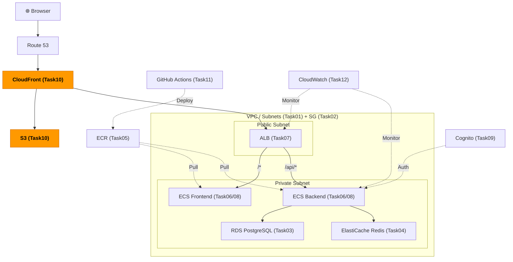
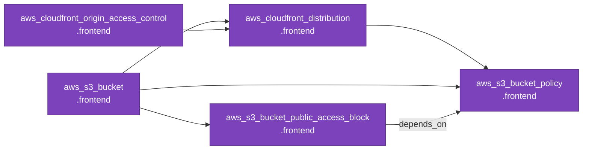

# Task 10: S3 + CloudFront 設定（IaC）

## 全体構成における位置づけ

> 図: TaskFlow全体アーキテクチャ（オレンジ色が今回構築するコンポーネント）



**今回構築する箇所:** S3 + CloudFront + OAC - 静的フロントエンドファイルをS3に格納し、CloudFront経由で世界中に高速配信する

---

> 前提: [コンソール版 Task 10](../console/10_s3_cloudfront.md) を完了済みであること
> 参照ナレッジ: [10_cdn_storage.md](../knowledge/10_cdn_storage.md)

## このタスクのゴール

S3バケットとCloudFrontディストリビューションをTerraformで管理する。OACの設定が複雑なため、依存関係の順序に注意する。

---

## 新しいHCL文法：`data` ソース

### `data` ブロックとは

`resource` は「リソースを**作る**」ブロックだが、`data` は「**既存の**情報を**読み取る**」ブロック。Terraformが管理していない既存のAWSリソースや情報を参照する場合に使う。

```hcl
# 書き方
data "データソースタイプ" "名前" {
  # 検索条件
}

# 参照方法（resource の aws_vpc.main.id に対応）
data.データソースタイプ.名前.属性名
```

具体例：

```hcl
data "aws_caller_identity" "current" {}
# ↑ AWSアカウントIDなどを取得するデータソース
# ↑ フィルター条件なし（現在のAWSアカウントの情報をそのまま取得）

# 参照
data.aws_caller_identity.current.account_id    # → "123456789012"
```

### なぜアカウントIDが必要か

S3バケット名はグローバルで一意でなければならない。プロジェクト名だけだと他人と名前が衝突する可能性があるため、自分のAWSアカウントIDを含めて一意性を確保する。

```hcl
bucket = "taskflow-frontend-${data.aws_caller_identity.current.account_id}"
# 例: "taskflow-frontend-123456789012"
```

---

## Terraformリソース依存グラフ

> 図: Task10 で作成するTerraformリソースの依存関係



---

## ハンズオン手順

### S3バケット

```hcl
data "aws_caller_identity" "current" {}    # 現在のAWSアカウント情報を取得

resource "aws_s3_bucket" "frontend" {
  bucket = "taskflow-frontend-${data.aws_caller_identity.current.account_id}"
  # ↑ アカウントIDをバケット名に含めてグローバル一意性を確保

  tags = merge(local.common_tags, {
    Name = "taskflow-frontend"
  })
}

resource "aws_s3_bucket_public_access_block" "frontend" {
  bucket = aws_s3_bucket.frontend.id

  block_public_acls       = true
  block_public_policy     = true
  ignore_public_acls      = true
  restrict_public_buckets = true
  # ↑ 4つすべてtrueにしてバケットへのパブリックアクセスを完全ブロック
  # ↑ CloudFront OAC 経由でのみアクセスを許可するため直接公開は不要
}

# 静的ウェブサイトホスティングは有効にしない（OACを使うため不要）
```

### CloudFront OAC（Origin Access Control）

```hcl
resource "aws_cloudfront_origin_access_control" "frontend" {
  name                              = "taskflow-frontend-oac"
  description                       = "OAC for TaskFlow frontend S3"
  origin_access_control_origin_type = "s3"
  signing_behavior                  = "always"    # 全リクエストにSigV4署名を付ける
  signing_protocol                  = "sigv4"     # AWS Signature Version 4
}
```

### CloudFrontディストリビューション

```hcl
resource "aws_cloudfront_distribution" "frontend" {
  enabled             = true
  default_root_object = "index.html"    # ルートパス（/）へのアクセス時に返すファイル

  price_class = "PriceClass_200"
  # ↑ "PriceClass_100": 北米・欧州のみ（最安）
  # ↑ "PriceClass_200": 北米・欧州・アジア（日本ユーザーを含む場合に推奨）
  # ↑ "PriceClass_All": 全エッジ（最高性能・最高コスト）

  origin {
    domain_name              = aws_s3_bucket.frontend.bucket_regional_domain_name
    # ↑ S3のリージョン固有ドメイン名。.s3.amazonaws.com より .s3.ap-northeast-1.amazonaws.com を使う
    origin_id                = "S3-taskflow-frontend"    # このorigin を識別するID（任意の文字列）
    origin_access_control_id = aws_cloudfront_origin_access_control.frontend.id
  }

  default_cache_behavior {
    allowed_methods        = ["GET", "HEAD"]
    cached_methods         = ["GET", "HEAD"]
    target_origin_id       = "S3-taskflow-frontend"    # 上の origin_id と一致させる
    viewer_protocol_policy = "redirect-to-https"       # HTTP → HTTPS にリダイレクト

    cache_policy_id = "658327ea-f89d-4fab-a63d-7e88639e58f6"
    # ↑ AWSのマネージドキャッシュポリシー「CachingOptimized」のID（固定値）
    # ↑ 静的ファイルに最適化されたキャッシュ設定
  }

  # SPAルーティング対応: /about などのページを直接開いた場合の処理
  custom_error_response {
    error_code            = 403    # S3からForbiddenが返った場合
    response_code         = 200
    response_page_path    = "/index.html"    # index.html を返す（ReactがルーティングをSPA内で処理）
    error_caching_min_ttl = 0
  }

  custom_error_response {
    error_code            = 404    # ファイルが見つからない場合も同様
    response_code         = 200
    response_page_path    = "/index.html"
    error_caching_min_ttl = 0
  }

  restrictions {
    geo_restriction {
      restriction_type = "none"    # 地理的アクセス制限なし（特定国だけ許可/拒否したい場合はここで設定）
    }
  }

  viewer_certificate {
    cloudfront_default_certificate = true
    # ↑ *.cloudfront.net ドメインの証明書を使用（無料）
    # ↑ 独自ドメインを使う場合は acm_certificate_arn を指定
  }

  tags = merge(local.common_tags, {
    Name = "taskflow-cloudfront"
  })
}
```

### S3バケットポリシー（CloudFrontからのアクセスのみ許可）

```hcl
resource "aws_s3_bucket_policy" "frontend" {
  bucket = aws_s3_bucket.frontend.id

  depends_on = [aws_s3_bucket_public_access_block.frontend]
  # ↑ パブリックアクセスブロックを設定してから（public_access_blockより後に）ポリシーを適用
  # ↑ これを付けないと「パブリックポリシーを禁止しているのにポリシーを設定しようとしている」
  #   というエラーが出ることがある

  policy = jsonencode({
    Version = "2012-10-17"
    Statement = [{
      Effect    = "Allow"
      Principal = { Service = "cloudfront.amazonaws.com" }
      Action    = "s3:GetObject"
      Resource  = "${aws_s3_bucket.frontend.arn}/*"
      Condition = {
        StringEquals = {
          "AWS:SourceArn" = aws_cloudfront_distribution.frontend.arn
          # ↑ このCloudFrontディストリビューションからのアクセスのみ許可
          # ↑ 他のCloudFrontからのアクセスは拒否される
        }
      }
    }]
  })
}
```

### outputs.tf

```hcl
output "cloudfront_domain" {
  value = aws_cloudfront_distribution.frontend.domain_name
  # 例: d1234abcd5678.cloudfront.net
}

output "cloudfront_distribution_id" {
  value = aws_cloudfront_distribution.frontend.id
  # キャッシュ無効化コマンドで使う
}

output "frontend_bucket_name" {
  value = aws_s3_bucket.frontend.bucket
  # s3 sync コマンドで使う
}
```

---

## 実行とデプロイ

```bash
terraform apply    # CloudFrontの作成に10〜15分かかる

# フロントエンドをビルドしてS3にアップロード
npm run build
aws s3 sync build/ s3://$(terraform output -raw frontend_bucket_name)/ --delete

# CloudFrontキャッシュを無効化（新しいファイルをすぐ反映させる）
aws cloudfront create-invalidation \
  --distribution-id $(terraform output -raw cloudfront_distribution_id) \
  --paths "/*"
```

---

## よくあるエラー

| エラー | 原因 | 対処 |
|--------|------|------|
| `BucketAlreadyExists` | バケット名が重複 | バケット名を変更（アカウントIDを含めていれば通常は発生しない） |
| S3から403が返る | バケットポリシーが正しく設定されていない | ポリシーのSourceArnがCloudFrontのARNと一致しているか確認 |
| `public_access_block` のエラー | ポリシー設定の前にブロックを解除しようとした | `depends_on` で順序を制御 |

---

**次のタスク:** [Task 11: GitHub Actions CI/CD（IaC版）](11_cicd.md)
