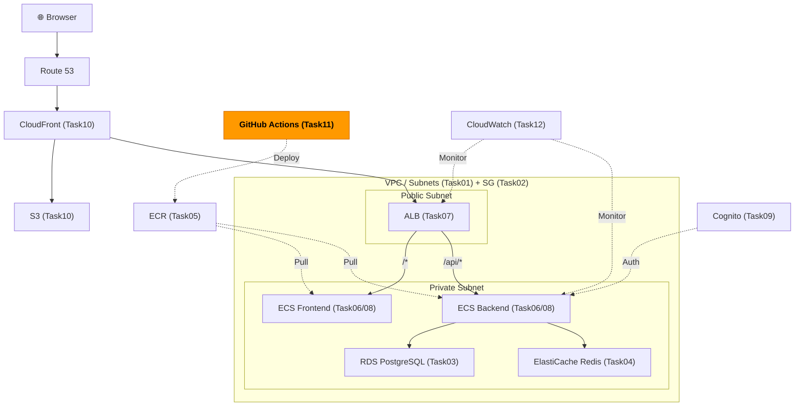
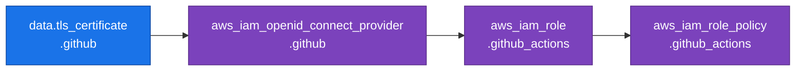
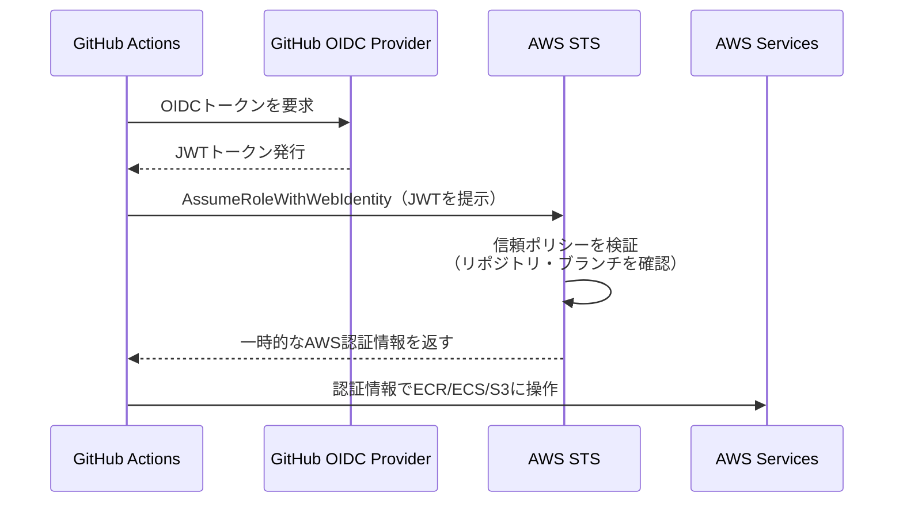

# Task 11: GitHub Actions CI/CD（IaC）

## 全体構成における位置づけ

> 図: TaskFlow全体アーキテクチャ（オレンジ色が今回構築するコンポーネント）



**今回構築する箇所:** GitHub Actions OIDC + IAM Roles for CI/CD - パスワードなしでGitHub ActionsがAWSにアクセスできるOIDC連携をTerraformで管理する

---

> 前提: [コンソール版 Task 11](../console/11_cicd.md) を完了済みであること
> 参照ナレッジ: [11_cicd.md](../knowledge/11_cicd.md)

## このタスクのゴール

GitHub Actions用のIAMロール（OIDC連携）をTerraformで管理する。ワークフローファイル自体はTerraformの管理外（`.github/workflows/` に配置）。

---

## 新しいHCL文法：スプラット式（`[*]`）と追加プロバイダー

### スプラット式 `[*]`

リストの全要素から特定の属性を取り出す。

```hcl
data.tls_certificate.github.certificates[*].sha1_fingerprint
#                                        ↑
#   certificates はリスト。[*] で全要素の sha1_fingerprint を取り出す（リストが返る）
```

イメージ：
```
certificates = [
  { sha1_fingerprint = "abc123", ... },
  { sha1_fingerprint = "def456", ... },
]

certificates[*].sha1_fingerprint
# → ["abc123", "def456"]  （全要素の sha1_fingerprint を集めたリスト）
```

`[0].sha1_fingerprint` なら最初の1つだけ、`[*].sha1_fingerprint` なら全要素。

### 複数プロバイダーの追加

Task 1 で AWS プロバイダーを設定した。Task 11 では TLS プロバイダーも必要になる。`required_providers` に追加して `terraform init` を再実行する。

```hcl
terraform {
  required_providers {
    aws = { source = "hashicorp/aws", version = "~> 5.0" }
    tls = { source = "hashicorp/tls", version = "~> 4.0" }
    # ↑ TLSプロバイダーを追加。GitHubの証明書フィンガープリントを取得するために使う
  }
}
```

新しいプロバイダーを追加したら **必ず `terraform init` を再実行**する（プラグインのダウンロードが必要）。

### `data "tls_certificate"` データソース

```hcl
data "tls_certificate" "github" {
  url = "https://token.actions.githubusercontent.com/.well-known/openid-configuration"
}
# ↑ GitHubのOIDCエンドポイントからSSL証明書情報を取得する
# ↑ フィンガープリントをハードコードすると、GitHub側の証明書更新時に手動対応が必要になる
# ↑ data ソースで動的に取得することで自動追従できる
```

---

## Terraformリソース依存グラフ

> 図: Task11 で作成するTerraformリソースの依存関係



> 図: GitHub Actions から AWS へのデプロイフロー（OIDCトークン認証）



---

## ハンズオン手順

### GitHub OIDC プロバイダー

```hcl
# File: infra/environments/dev/cicd.tf
data "tls_certificate" "github" {
  url = "https://token.actions.githubusercontent.com/.well-known/openid-configuration"
}

resource "aws_iam_openid_connect_provider" "github" {
  url = "https://token.actions.githubusercontent.com"    # GitHubのOIDCエンドポイント

  client_id_list = ["sts.amazonaws.com"]
  # ↑ このOIDCプロバイダーを使えるクライアント（AWSのSTSサービス）

  thumbprint_list = data.tls_certificate.github.certificates[*].sha1_fingerprint
  # ↑ スプラット式で全証明書のフィンガープリントを取得
  # ↑ GitHubの証明書が更新されてもTerraformが自動で追従する

  tags = merge(local.common_tags, {
    Name = "github-oidc-provider"
  })
}
```

### GitHub Actions用IAMロール

```hcl
# File: infra/environments/dev/variables.tf
variable "github_repository" {
  description = "GitHub repository in format 'owner/repo'"
  type        = string
  default     = "yourname/aws-demo"    # 実際のリポジトリ名に変更すること
}
```

```hcl
# File: infra/environments/dev/cicd.tf
resource "aws_iam_role" "github_actions" {
  name = "github-actions-taskflow"

  tags = merge(local.common_tags, {
    Name = "github-actions-taskflow"
  })

  assume_role_policy = jsonencode({
    Version = "2012-10-17"
    Statement = [{
      Effect = "Allow"
      Principal = {
        Federated = aws_iam_openid_connect_provider.github.arn
        # ↑ "AWS"（IAMユーザー/ロール）ではなく "Federated"（外部IDプロバイダー）から
      }
      Action = "sts:AssumeRoleWithWebIdentity"
      # ↑ OIDCトークン（WebIdentity）でロールを引き受ける
      Condition = {
        StringEquals = {
          "token.actions.githubusercontent.com:aud" = "sts.amazonaws.com"
          # ↑ トークンのaud（対象者）がSTSであることを確認
        }
        StringLike = {
          "token.actions.githubusercontent.com:sub" = "repo:${var.github_repository}:ref:refs/heads/main"
          # ↑ mainブランチからのpushのみロールを使えるよう制限
          # ↑ StringLike を使うのでワイルドカード * も使える（例: refs/heads/* で全ブランチ）
        }
      }
    }]
  })
}
```

**`StringLike` vs `StringEquals` の使い分け：**
- `StringEquals`: 完全一致。`refs/heads/main` のみ許可したい場合
- `StringLike`: ワイルドカード（`*`）使用可。`refs/heads/*` で全ブランチ許可したい場合

本番デプロイはmainブランチのみに絞るのがベストプラクティス。

### IAMポリシー（最小権限）

```hcl
# File: infra/environments/dev/cicd.tf
resource "aws_iam_role_policy" "github_actions" {
  name = "github-actions-taskflow-policy"
  role = aws_iam_role.github_actions.id

  policy = jsonencode({
    Version = "2012-10-17"
    Statement = [
      {
        # ECSのデプロイに必要な権限
        Effect   = "Allow"
        Action   = [
          "ecs:UpdateService",
          "ecs:DescribeServices",
          "ecs:RegisterTaskDefinition",
        ]
        Resource = "*"    # 本番では特定のクラスター・サービスのARNに絞る
      },
      {
        # ECRへのイメージpushに必要な権限
        Effect   = "Allow"
        Action   = [
          "ecr:GetAuthorizationToken",
          "ecr:BatchCheckLayerAvailability",
          "ecr:PutImage",
          "ecr:InitiateLayerUpload",
          "ecr:UploadLayerPart",
          "ecr:CompleteLayerUpload",
        ]
        Resource = "*"
      },
      {
        # S3へのフロントエンドデプロイに必要な権限
        Effect   = "Allow"
        Action   = ["s3:PutObject", "s3:DeleteObject", "s3:ListBucket"]
        Resource = [
          aws_s3_bucket.frontend.arn,
          "${aws_s3_bucket.frontend.arn}/*",
          # ↑ バケット自体のARN（ListBucket用）
          # ↑ バケット内オブジェクトのARN（PutObject/DeleteObject用）
        ]
      },
      {
        # CloudFrontキャッシュ無効化の権限
        Effect   = "Allow"
        Action   = ["cloudfront:CreateInvalidation"]
        Resource = aws_cloudfront_distribution.frontend.arn
      },
    ]
  })
}
```

### outputs.tf

```hcl
# File: infra/environments/dev/outputs.tf
output "github_actions_role_arn" {
  value = aws_iam_role.github_actions.arn
  # このARNをGitHub Secretsに設定する（AWS_ROLE_ARN として登録）
}
```

---

## 実行

```bash
# main.tf の required_providers に tls を追加したら必ず init を再実行
terraform init

terraform apply

# 出力されたARNをGitHub Secretsに設定
terraform output github_actions_role_arn
```

---

## よくあるエラー

| エラー | 原因 | 対処 |
|--------|------|------|
| `tls provider not found` | tls プロバイダーが未設定 | `required_providers` に `tls` を追加して `terraform init` |
| GitHub ActionsがアクセスできないとOIDCエラー | 信頼ポリシーのリポジトリが間違っている | `github_repository` 変数の値を確認 |

---

**次のタスク:** [Task 12: CloudWatch監視設定（IaC版）](12_monitoring.md)
