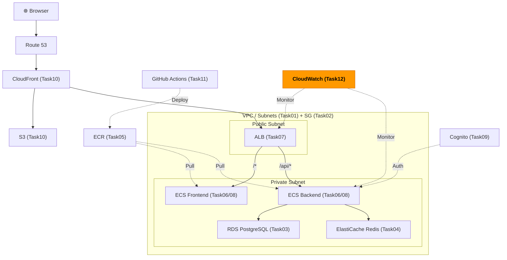
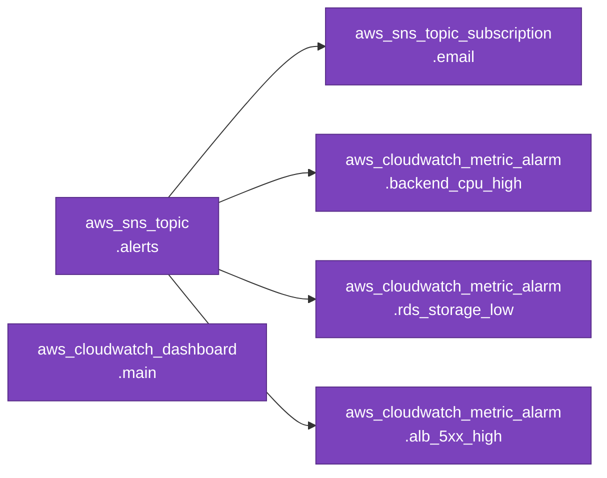

# Task 12: CloudWatch 監視設定（IaC）

## 全体構成における位置づけ

> 図: TaskFlow全体アーキテクチャ（オレンジ色が今回構築するコンポーネント）



**今回構築する箇所:** CloudWatch Dashboards + Alarms + SNS - インフラ全体の監視・アラート通知をTerraformで管理する

---

> 前提: [コンソール版 Task 12](../console/12_monitoring.md) を完了済みであること
> 参照ナレッジ: [12_observability.md](../knowledge/12_observability.md)

## このタスクのゴール

CloudWatchアラーム・SNSトピック・ダッシュボードをTerraformで管理する。コード化することで監視設定がレビュー可能・再現可能になる。

---

## 新しいHCL文法：`arn_suffix` と複雑な `jsonencode()`

### `arn_suffix` について

CloudWatchのディメンション（メトリクスのフィルター条件）では、ARN全体ではなく **ARNのサフィックス部分** を指定する必要がある。

```hcl
# NG: ARN全体を渡すとエラーになる
LoadBalancer = aws_lb.main.arn
# → "arn:aws:elasticloadbalancing:ap-northeast-1:123456789012:loadbalancer/app/taskflow-alb/xxx"

# OK: arn_suffix でサフィックス部分だけ取得
LoadBalancer = aws_lb.main.arn_suffix
# → "app/taskflow-alb/xxx"  （CloudWatchが期待する形式）
```

`arn_suffix` は `aws_lb`（ALB）リソースが持つ特別な属性。

### `jsonencode()` で大きなJSONを書く

CloudWatchダッシュボードの設定は複雑なJSON。`jsonencode()` を使えばHCLとして書けてTerraformの参照式も使える。

```hcl
dashboard_body = jsonencode({
  widgets = [
    {                          # ← リストの要素（1つのウィジェット）
      type = "metric"
      x = 0; y = 0            # ← セミコロンで同一行に複数引数を書ける（HCLの機能）
      properties = {           # ← ネストされたマップ
        metrics = [
          ["AWS/ECS", "CPUUtilization", "ClusterName", aws_ecs_cluster.main.name],
          # ↑ jsonencode 内でも Terraform 参照式が使える（重要）
        ]
      }
    },
    { ... },                   # ← 複数のウィジェット
  ]
})
```

---

## Terraformリソース依存グラフ

> 図: Task12 で作成するTerraformリソースの依存関係



---

## ハンズオン手順

### variables.tf

```hcl
variable "alert_email" {
  description = "Email address for CloudWatch alerts"
  type        = string
  # アラート通知を受け取るメールアドレスを変数化
}
```

### SNSトピック

```hcl
resource "aws_sns_topic" "alerts" {
  name = "taskflow-alerts"

  tags = { Name = "taskflow-alerts" }
}

resource "aws_sns_topic_subscription" "email" {
  topic_arn = aws_sns_topic.alerts.arn
  protocol  = "email"
  endpoint  = var.alert_email    # 通知先メールアドレス
}
```

**注意：** `aws_sns_topic_subscription` でメールを登録した後、確認メールが届く。**Terraformでは確認操作を自動化できない**ため、手動でメール内のリンクをクリックする必要がある。確認前はアラームが発火してもメールが届かない。

### ECS CPUアラーム

```hcl
resource "aws_cloudwatch_metric_alarm" "backend_cpu_high" {
  alarm_name          = "taskflow-backend-cpu-high"
  comparison_operator = "GreaterThanThreshold"    # threshold より大きい場合にALARM
  evaluation_periods  = 3        # 3データポイント連続でALARMになる
  metric_name         = "CPUUtilization"
  namespace           = "AWS/ECS"
  period              = 300      # 1データポイント = 5分
  statistic           = "Average"
  threshold           = 80       # 80% を超えたらアラーム

  dimensions = {
    ClusterName = aws_ecs_cluster.main.name      # どのクラスターのメトリクスか
    ServiceName = aws_ecs_service.backend.name   # どのサービスのメトリクスか
  }

  alarm_description = "Backend ECS service CPU utilization is too high"
  alarm_actions     = [aws_sns_topic.alerts.arn]    # アラーム時にSNSに通知
  ok_actions        = [aws_sns_topic.alerts.arn]    # 復旧時にも通知

  treat_missing_data = "notBreaching"
  # ↑ データが来ない期間（タスク停止中など）をOKと見なす
  # ↑ "breaching" にすると、起動直後にデータがない期間も全部アラームになる
}
```

**`treat_missing_data` の選択：**
- `notBreaching`: データなし = 正常（ECSタスクが0の場合など）
- `breaching`: データなし = 異常（監視がきちんと動いているか確認したい場合）
- `missing`: データ不足のままアラーム状態にしない

### RDS ストレージアラーム

```hcl
resource "aws_cloudwatch_metric_alarm" "rds_storage_low" {
  alarm_name          = "taskflow-rds-storage-low"
  comparison_operator = "LessThanThreshold"    # threshold より小さい場合にALARM
  evaluation_periods  = 1        # 1回でも下回ったらアラーム（ストレージ不足は即対応が必要）
  metric_name         = "FreeStorageSpace"
  namespace           = "AWS/RDS"
  period              = 300
  statistic           = "Minimum"
  threshold           = 5000000000    # 5GB（バイト単位。5 * 1000 * 1000 * 1000）

  dimensions = {
    DBInstanceIdentifier = aws_db_instance.main.identifier    # どのDBインスタンスか
  }

  alarm_description = "RDS free storage space is running low"
  alarm_actions     = [aws_sns_topic.alerts.arn]

  treat_missing_data = "notBreaching"
}
```

### ALB 5xxアラーム

```hcl
resource "aws_cloudwatch_metric_alarm" "alb_5xx_high" {
  alarm_name          = "taskflow-alb-5xx-high"
  comparison_operator = "GreaterThanThreshold"
  evaluation_periods  = 1
  metric_name         = "HTTPCode_ELB_5XX_Count"
  namespace           = "AWS/ApplicationELB"
  period              = 300
  statistic           = "Sum"
  threshold           = 10    # 5分間で10件以上の5xxエラー

  dimensions = {
    LoadBalancer = aws_lb.main.arn_suffix
    # ↑ .arn ではなく .arn_suffix を使う（CloudWatchの仕様）
    # ↑ "app/taskflow-alb/xxxx" 形式の文字列
  }

  alarm_description = "ALB 5xx error rate is too high"
  alarm_actions     = [aws_sns_topic.alerts.arn]

  treat_missing_data = "notBreaching"
}
```

### CloudWatch ダッシュボード

```hcl
resource "aws_cloudwatch_dashboard" "main" {
  dashboard_name = "TaskFlow-Overview"

  dashboard_body = jsonencode({
    widgets = [
      {
        type   = "metric"
        x      = 0; y = 0; width = 12; height = 6
        # ↑ セミコロンで同一行に複数引数を書ける（見やすくなる）
        properties = {
          title   = "ECS Backend - CPU & Memory"
          metrics = [
            # CloudWatchのメトリクス配列形式: [名前空間, メトリクス名, ディメンション1キー, 値, ...]
            ["AWS/ECS", "CPUUtilization",    "ClusterName", aws_ecs_cluster.main.name, "ServiceName", aws_ecs_service.backend.name],
            ["AWS/ECS", "MemoryUtilization", "ClusterName", aws_ecs_cluster.main.name, "ServiceName", aws_ecs_service.backend.name],
          ]
          period = 300
          stat   = "Average"
          view   = "timeSeries"    # 時系列グラフ
        }
      },
      {
        type   = "metric"
        x      = 12; y = 0; width = 12; height = 6
        properties = {
          title   = "ALB - Traffic Overview"
          metrics = [
            ["AWS/ApplicationELB", "RequestCount",              "LoadBalancer", aws_lb.main.arn_suffix],
            ["AWS/ApplicationELB", "HTTPCode_Target_5XX_Count", "LoadBalancer", aws_lb.main.arn_suffix],
          ]
          period = 300
          stat   = "Sum"
          view   = "timeSeries"
        }
      },
      {
        type   = "metric"
        x      = 0; y = 6; width = 12; height = 6
        properties = {
          title   = "RDS - Database Status"
          metrics = [
            ["AWS/RDS", "CPUUtilization",      "DBInstanceIdentifier", aws_db_instance.main.identifier],
            ["AWS/RDS", "DatabaseConnections", "DBInstanceIdentifier", aws_db_instance.main.identifier],
          ]
          period = 300
          stat   = "Average"
          view   = "timeSeries"
        }
      },
    ]
  })
}
```

---

## 実行

```bash
terraform apply
# メールのサブスクリプション確認を忘れずに実施
```

---

## よくあるエラー

| エラー | 原因 | 対処 |
|--------|------|------|
| `Invalid dimension value` | ALBのarn_suffixが間違っている | `.arn_suffix` を使っているか確認 |
| アラーム通知が来ない | SNSサブスクリプションが未確認 | メールのConfirmリンクをクリック |
| `InvalidParameterValue: Namespace` | メトリクスのNamespaceが間違っている | `AWS/ECS`・`AWS/RDS`・`AWS/ApplicationELB` のスペルを確認 |

---

**全IaCタスク完了！** これでTaskFlowの全インフラがTerraformコードで管理される状態になった。

次のステップ：
- `terraform.tfstate` をS3 + DynamoDBでリモート管理に移行（チーム開発の前提）
- dev環境とprod環境の設定をモジュール化して再利用する
