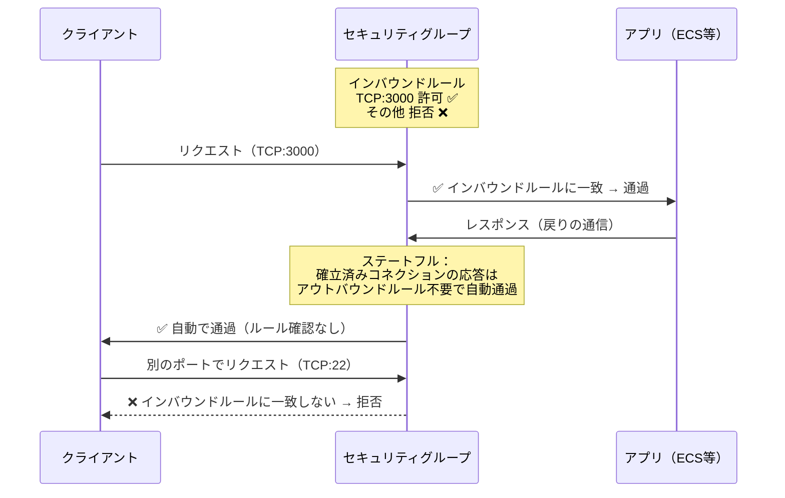
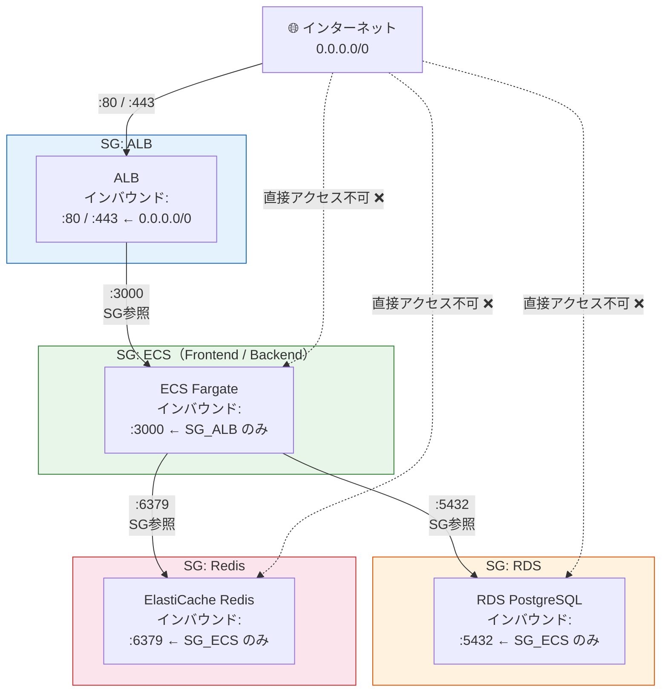

# Knowledge 02: セキュリティグループ

Task 2（セキュリティグループ設定）の前に理解しておくべき概念。

---

## セキュリティグループとは

AWSリソース（EC2・ECS・RDS・ALBなど）に付ける**仮想ファイアウォール**。リソースレベルで「どこからの通信を許可するか」を制御する。

VPCレベルで制御するNACL（ネットワークACL）と違い、SGはリソース個別に付ける。実務ではSGで制御するのが主流。

---

## インバウンドとアウトバウンド

| 方向 | 意味 | デフォルト |
|------|------|----------|
| インバウンド | 外から当該リソースへの通信（受信） | 全て**拒否** |
| アウトバウンド | 当該リソースから外への通信（送信） | 全て**許可** |

**ステートフル**な仕組みなので、インバウンドで許可した通信の応答（レスポンス）はアウトバウンドルールを見ずに自動で通る。逆も同様。「リクエストを許可すればレスポンスは気にしなくていい」。

アウトバウンドのデフォルト「全許可」を変える必要はほぼない。セキュリティ要件が特に厳しい環境でのみ制限する。

> 図: セキュリティグループのステートフル動作（リクエストを許可するとレスポンスは自動で通る）



---

## ソースの指定方法

SGのインバウンドルールで「どこからの通信を許可するか」を指定する方法は2種類ある。

**① CIDRブロック（IPアドレス範囲）**
```
0.0.0.0/0  → 全世界のIPから許可
203.0.113.0/24 → 特定のIPレンジから許可
```
インターネットからのアクセス（ALBの80/443）には `0.0.0.0/0` を使う。

**② 別のセキュリティグループID**
```
sg-0abc123def（ECSのSGのID）→ そのSGを持つリソースからの通信を許可
```
ECS→RDS、ALB→ECSのような「AWS内部の通信」にはSG参照を使う。ECSコンテナのIPはデプロイごとに変わるため、IPアドレスで指定すると毎回ルールを更新しなければならない。**SG参照なら変更不要で安全**。

---

## SGチェーン設計の考え方

TaskFlowでは「外→ALB→ECS→DB/Redis」というチェーンを構成する。各SGは**直前レイヤーのSGからのみ受け付ける**ように設計する。

```
[インターネット]
    │ :80, :443 (0.0.0.0/0)
    ▼
[SG: ALB]
    │ :3000 (ALBのSGから)
    ▼
[SG: ECS]
    ├── :5432 (ECSのSGから)   → [SG: RDS]
    └── :6379 (ECSのSGから)   → [SG: Redis]
```

> 図: TaskFlow の SG チェーン（各レイヤーが直前のSGからのみアクセスを受け付ける設計）



このチェーン設計の利点：
- RDSに直接アクセスできるのはECSだけに限定される
- 開発者PCやインターネットから直接DBに繋ぐことができない
- 横方向の侵害（あるリソースが侵害されても他への波及を限定）を防ぐ

---

## 各レイヤーの設計基準

**ALB SG**
- インバウンド: HTTP(80), HTTPS(443) を `0.0.0.0/0` から
- 公開サービスなので全世界からのアクセスを受け付ける

**ECS SG**
- インバウンド: ALBのSGからのみ
- アプリのポート（Node.jsなら3000、Nginxなら80）を開ける
- 直接インターネットからECSにアクセスさせない

**RDS SG**
- インバウンド: ECSのSGから PostgreSQL(5432) のみ
- 絶対に `0.0.0.0/0` を設定しない

**Redis SG**
- インバウンド: ECSのSGから Redis(6379) のみ
- 同上

---

## SGに関するよくある設計ミス

| ミス | リスク | 正しい対処 |
|------|--------|-----------|
| RDS/Redisのインバウンドに `0.0.0.0/0` | DBがインターネットから直接攻撃される | ECSのSGのみに限定 |
| VPC全体のCIDR(10.0.0.0/16)を指定 | VPC内の全リソースからアクセス可能になる | 必要なSGのみ指定 |
| SGを1つに統合する | どのリソースからでもアクセスできてしまう | リソース種別ごとにSGを分ける |
| ポート範囲を0-65535で広く開ける | 不要なポートへのアクセスも許可してしまう | 必要なポートだけ開ける |

---

## よくある疑問

**Q. 1つのリソースに複数のSGを付けられる？**
付けられる（最大5個）。複数SGのルールは全てORで評価される。「どれか1つが許可すれば通る」。

**Q. SGのルールはリアルタイムで反映される？**
はい。反映に再起動は不要。ただし既存の確立済みコネクションには影響しない場合がある。

**Q. NACLとの使い分けは？**
NACLはステートレス（戻りの通信も別途許可が必要）で、サブネット単位で動作する。SGで十分にカバーできるため、特別な理由がない限りSGだけで設計する。
