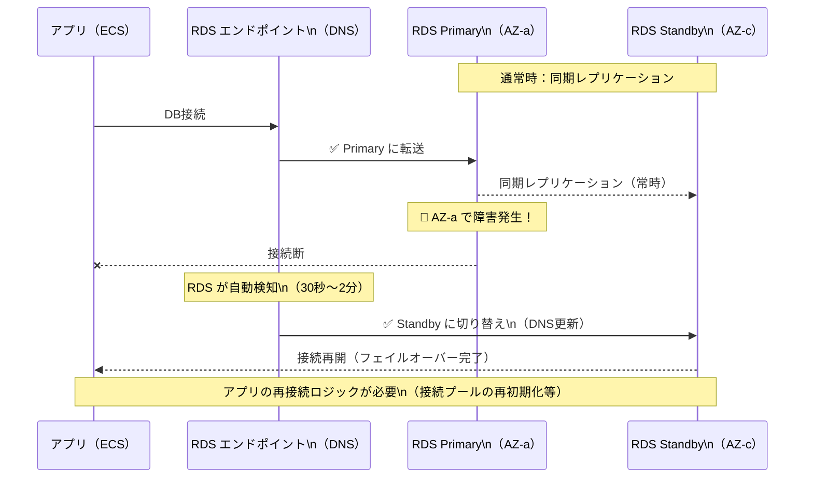
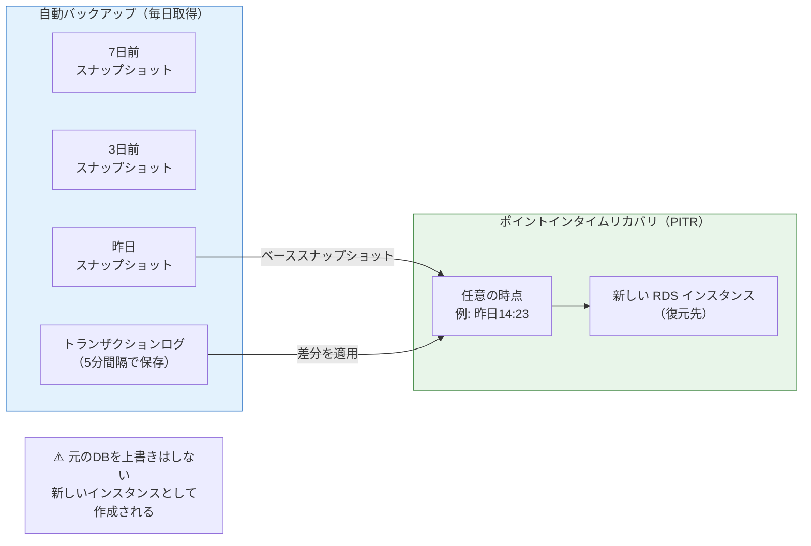

# Knowledge 03: RDSとマネージドデータベース

Task 3（RDS PostgreSQL構築）の前に理解しておくべき概念。

---

## マネージドDBとは

EC2にDBをインストールして自前管理する場合、「パッチ適用・バックアップ設定・フェイルオーバー構築・ディスク拡張」などを全て自分で行う必要がある。RDSはこれらをAWSが代行するマネージドサービス。

| 作業 | EC2 + 自前DB | RDS |
|------|------------|-----|
| OSパッチ/DBバージョンアップ | 自分で実施 | 自動（メンテナンスウィンドウで制御） |
| 自動バックアップ | 自分で設定 | 組み込み（保持期間を指定するだけ） |
| フェイルオーバー | Pacemaker等で構築 | Multi-AZ設定で自動 |
| ストレージ拡張 | 手動 or LVMで対応 | オートスケーリング設定で自動 |
| モニタリング | CloudWatch Agent設定 | 組み込み |

---

## RDSの主要パラメータの意味

### インスタンスクラス

CPUとメモリのスペックを決める。`db.t4g.micro` のような命名規則：
- `db` : RDS用プレフィックス
- `t4g` : インスタンスファミリー（t=バースト可能、m=汎用、r=メモリ最適化）
- `micro` : サイズ（nano < micro < small < medium < large < xlarge ...）

学習環境では `db.t3.micro` または `db.t4g.micro`（ARM）で十分。本番で高負荷が予想される場合は `db.r7g.large`（メモリ最適化）を検討。

### ストレージタイプ

| タイプ | 特徴 | 用途 |
|--------|------|------|
| gp2 | 汎用SSD（旧世代） | 特に理由がなければgp3に |
| gp3 | 汎用SSD（現行、gp2より安く高性能） | ほぼこれを選ぶ |
| io1/io2 | プロビジョンドIOPS（高IOPS保証） | IOPS要件が厳しい本番DB |

### Multi-AZ

プライマリDBと同じデータをリアルタイムで別AZのスタンバイDBに同期する。障害時は自動フェイルオーバー（数十秒〜数分）。

- 開発環境: `false`（コスト約2倍になるため不要）
- 本番環境: `true`（稼働率SLAの要件次第）

フェイルオーバー時のダウンタイムはゼロではない（DNS切り替えの時間がある）。完全なゼロダウンタイムが必要な場合はAurora等の別サービスを検討。

> 図: RDS Multi-AZ フェイルオーバーの流れ（プライマリ障害時にスタンバイへ自動切り替え）

### バックアップ保持期間

自動バックアップは毎日取得され、指定した日数分保持される。0にすると無効化（非推奨）。
- 開発: 7日
- 本番: 30〜35日（DBの重要度に応じて）

ポイントインタイムリカバリ（PITR）で、保持期間内の任意の時点に復元できる。

> 図: RDS バックアップとポイントインタイムリカバリ（PITR）の仕組み

### 削除保護・skip_final_snapshot

- `deletion_protection = true` : コンソール/Terraform両方からの削除をブロック。本番では必ず有効化。
- `skip_final_snapshot = false` : 削除時に最終スナップショットを取得。本番では必ず取得する。

---

## DBサブネットグループ

「RDSを配置できるサブネットの集合」を定義するもの。**必ずプライベートサブネットを指定する**。

2つ以上のAZのサブネットを含める必要がある理由：
- Multi-AZ構成でスタンバイを別AZに置くため
- `single-AZ`設定でもAWSがサブネットの選択肢を必要とするため

---

## publicly_accessibleの意味

`false`（推奨）: VPC外からのネットワーク接続を完全にブロック。プライベートサブネット内のリソースからのみ接続可能。

`true`: インターネット経由での接続を許可（SGで制限はできるが、誤設定リスクが高い）。開発中に自分のPCから直接つなぎたいだけなら、踏み台EC2か Session Manager Portforwardingを使う方が安全。

---

## シークレット管理

DBパスワードは絶対にコードにハードコードしない。

| 方法 | 適した場面 |
|------|-----------|
| `terraform.tfvars`（gitignore）| 学習・個人開発 |
| 環境変数（`TF_VAR_db_password`）| CI/CDパイプライン |
| AWS Secrets Manager | 本番（ローテーション自動化も可能） |
| AWS SSM Parameter Store（SecureString）| 本番（シンプルな構成向け） |

---

## パラメータグループ

RDSの設定値をカスタマイズするもの。デフォルトパラメータグループは変更不可のため、変更したい場合は独自のパラメータグループを作成してアタッチする。

よく変更する設定例：
- `client_encoding = UTF8` : 日本語データを扱う際に明示的に指定
- `log_min_duration_statement` : 指定ミリ秒以上かかったクエリをログ出力（スロークエリ調査）
- `max_connections` : 接続数の上限（インスタンスサイズに依存）
