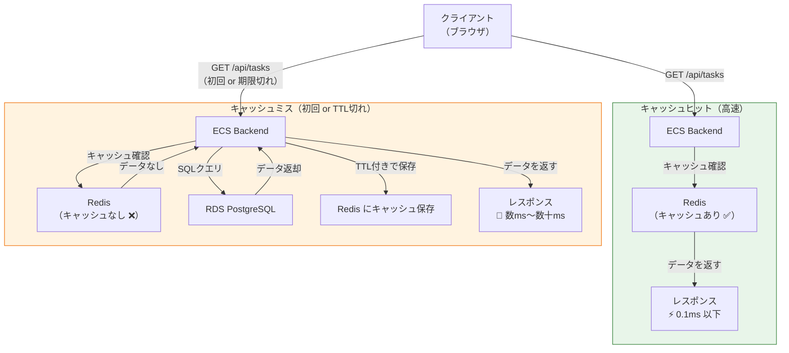
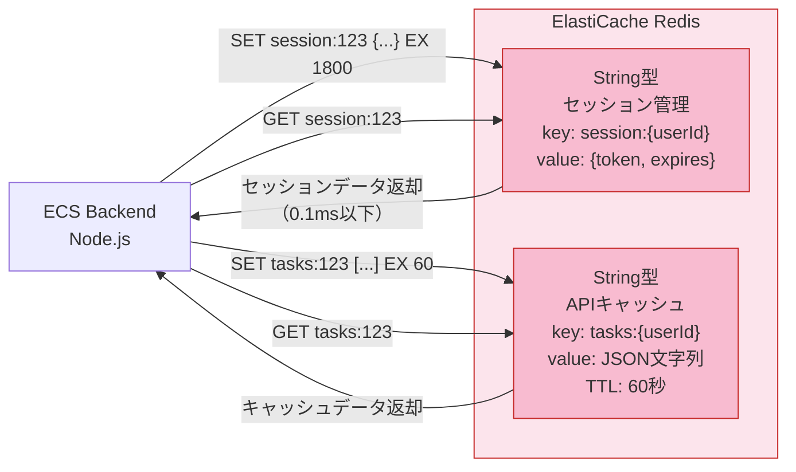

# Knowledge 04: キャッシュとRedis

Task 4（ElastiCache Redis構築）の前に理解しておくべき概念。

---

## キャッシュとは

「一度取得したデータを手元に保持しておき、次回は保持済みのものを返す」仕組み。同じデータのために何度も重い処理（DB問い合わせ等）をしなくて済む。

**なぜ必要か：**
- RDSへのSQLクエリは数ms〜数十msかかる
- Redisへのアクセスは0.1ms以下
- 同じデータが何度も参照されるAPIにキャッシュを挟むとレスポンスタイムが10〜100倍改善できる

> 図: キャッシュヒット / キャッシュミスのフロー（Redisがある場合と無い場合の違い）

---

## Redisとは

インメモリ（RAM上）で動作するデータストア。データをメモリに保持するため超高速だが、サーバー再起動でデータが消える（揮発性）。

TaskFlowでの用途：

| 用途 | 説明 |
|------|------|
| セッション管理 | ユーザーのログイン状態をJWT検証なしに素早く確認 |
| APIレスポンスキャッシュ | タスク一覧など変化が少ないデータをキャッシュ |

---

## InMemoryとDiskの使い分け

| 観点 | Redis（メモリ） | RDS（ディスク） |
|------|----------------|----------------|
| 速度 | 0.1ms以下 | 1〜100ms |
| 永続性 | 揮発性（再起動で消える） | 永続的 |
| 容量 | GBオーダー（高コスト） | TB以上 |
| 用途 | キャッシュ、セッション、リアルタイム処理 | マスタデータ、トランザクション |

「消えても再生成できるデータ」がRedisに適している。タスクの作成・更新履歴などRDSにしか存在しないデータはRedisに置かない。

---

## ElastiCacheのRedis vs Memcached

AWSのElastiCacheは2種類のエンジンを提供する。

| 項目 | Redis | Memcached |
|------|-------|-----------|
| データ型 | 豊富（String, Hash, List, Set, Sorted Set...） | 単純なKey-Valueのみ |
| レプリケーション | あり（リードレプリカ・クラスター） | なし |
| 永続化 | オプションあり（AOF/RDB） | なし |
| Pub/Sub | あり | なし |
| 用途 | ほぼ全てのユースケース | シンプルなキャッシュのみ |

特別な理由がない限り**Redisを選ぶ**。

> 図: Redis の読み書きフローとデータ型の活用例（TaskFlow での用途）

---

## ノードタイプの選び方

`cache.t4g.micro`（学習用）、`cache.r7g.large`（本番）のような命名規則：
- `t` 系: バースト可能（低コスト、平均負荷が低い場合）
- `r` 系: メモリ最適化（大量データキャッシュ、本番向け）

キャッシュサイズは「保持したいデータ量の1.5〜2倍」を目安に設定する。

---

## maxmemory-policyの選択基準

メモリが満杯になったときの動作を決める重要な設定。

| ポリシー | 動作 | 適した用途 |
|---------|------|-----------|
| `noeviction` | 新規書き込みをエラーで拒否 | キャッシュより「消えてはいけないデータ」用 |
| `allkeys-lru` | 全キーの中でLRU（最も古く使われていない）を削除 | 一般的なキャッシュ（おすすめ） |
| `volatile-lru` | TTLが設定されたキーのみLRU削除 | TTL設定済みキャッシュ |
| `allkeys-random` | ランダムに削除 | アクセス頻度の予測が難しい場合 |

キャッシュ用途では `allkeys-lru` が最もよく使われる。「よく使われるものは残り、使われないものは消える」という自然なキャッシュの挙動。

---

## TTL（Time To Live）

キャッシュデータに有効期限を設定する仕組み。期限切れになると自動削除される。

TTLを設定する理由：
- データの鮮度を保つ（古いキャッシュを返し続けないように）
- メモリを節約する

適切なTTLはデータの「更新頻度」と「古くなってもいい許容範囲」で決める：
- ユーザー情報: 5〜15分
- タスク一覧: 30秒〜5分
- マスタデータ（カテゴリ等）: 1〜24時間

---

## ElastiCache vs セルフホストRedis（EC2）

| 項目 | ElastiCache | EC2上のRedis |
|------|------------|-------------|
| 管理コスト | 低（パッチ・監視がマネージド） | 高 |
| フェイルオーバー | 自動 | 自前構築が必要 |
| コスト | やや高い | 安い（管理コスト除く） |
| カスタマイズ性 | 限定的 | 自由 |

学習・本番ともにElastiCacheを使うのが標準的。
