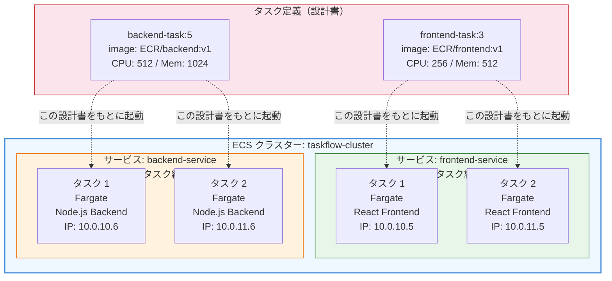
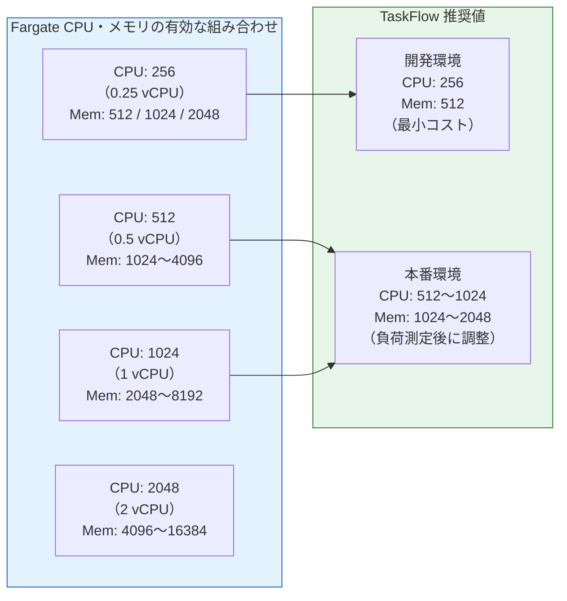

# Knowledge 06: ECSとFargate

Task 6（ECSクラスター構築）・Task 8（ECSサービス・タスク定義）の前に理解しておくべき概念。

---

## ECSの全体像

ECS（Elastic Container Service）は「どのコンテナを、何個、どこで動かすか」を管理するオーケストレーターサービス。

構成要素の関係：

```
クラスター（論理グループ）
    └── サービス（台数管理・ローリングデプロイ）
          └── タスク（実行中のコンテナの集合）
                └── タスク定義（コンテナの設計書）
```

| 概念 | 役割 | 例え |
|------|------|------|
| タスク定義 | コンテナの仕様を記述したJSON | レシピ |
| タスク | タスク定義から起動した実際のコンテナ | できあがった料理 |
| サービス | タスクの台数を維持・デプロイを管理 | 厨房マネージャー |
| クラスター | サービスをまとめる論理グループ | レストラン |

> 図: ECS Cluster / Service / Task / タスク定義の階層構造（TaskFlow の構成例）



---

## EC2モードとFargateの違い

ECSでコンテナを動かす「実行基盤」として2つの選択肢がある。

| 項目 | EC2モード | Fargateモード |
|------|----------|-------------|
| サーバー管理 | EC2の起動・スケーリング・パッチを自分で管理 | 不要（AWSが管理） |
| スケーリング | EC2台数とコンテナ台数の両方を考える | コンテナの台数だけ考える |
| コスト | EC2の稼働時間課金（安くなりやすい） | コンテナのCPU/メモリ時間課金 |
| 学習コスト | 高い | 低い |
| 向いている場面 | 大規模・コスト最適化が必要 | 初期構築・小〜中規模 |

**最初はFargateを選ぶ理由：** サーバー管理を気にせずコンテナの設定に集中できる。EC2の空きリソース管理やAMIのパッチ適用といった運用作業が発生しない。

---

## Fargate Spot

通常Fargateの最大70%オフで使えるオプション。AWSの余剰リソースを使うため、需要が高まると突然中断（数分前に通知）される可能性がある。

| 用途 | 向き・不向き |
|------|------------|
| バッチ処理・CI実行 | 向いている（中断されても再実行できる） |
| Webサービス（常時稼働） | 向いていない（中断するとユーザーへの影響が出る） |

開発環境のコスト削減には活用できる。本番の重要サービスには使わない。

---

## タスク定義の主要パラメータ

**CPU・メモリの指定：**
Fargateでは256CPU単位（0.25vCPU）〜16384単位（16vCPU）の範囲で指定する。
- CPUとメモリには有効な組み合わせが決まっている（例: CPU 256 → メモリ 512〜2048）
- 余裕を持ちすぎるとコスト増。最初は最小で試してCloudWatchで使用率を見ながら調整する

> 図: Fargate の CPU / メモリ有効な組み合わせと選び方の目安



**network_mode = "awsvpc"：**
FargateではこのモードのみサポートされているためENI（Elastic Network Interface）が各タスクに付き、個別のIPとSGが割り当てられる。「コンテナが自分のIPを持つ」イメージ。

**environment vs secrets：**
- `environment`: プレーンテキストの環境変数（DBホスト名・ポート番号など）
- `secrets`: AWS Secrets ManagerまたはSSMからの安全な値の注入（パスワード・APIキーなど）

パスワードを`environment`に平文で書くのはセキュリティ上NGに近い。学習中は許容するが、本番では必ず`secrets`を使う。

---

## IAMロール（2種類）

ECSには2種類のIAMロールが必要で、混同しやすいので注意。

**タスク実行ロール（execution_role_arn）：**
ECS**自体**がAWSを操作するための権限。
- ECRからイメージをpull
- CloudWatch Logsにログを書き込む
- Secrets Managerからシークレットを取得

`AmazonECSTaskExecutionRolePolicy`という管理ポリシーをアタッチするだけで基本的なユースケースに対応できる。

**タスクロール（task_role_arn）：**
コンテナの中で動く**アプリケーション**がAWSを操作するための権限。
- S3バケットへのアクセス
- SQSへのメッセージ送信
- DynamoDBへの読み書き

アプリがAWSサービスを呼ばない場合は不要。アプリケーションのコード内で`aws-sdk`を使う場合は設定が必要。

---

## ECSサービスのデプロイ戦略

**ローリングアップデート（デフォルト）：**
古いタスクを少しずつ新しいタスクに置き換える。
- デプロイ中も一部のリクエストは旧バージョンで処理される
- 最小ヘルシー率・最大率を設定する（例: min 50% / max 200%）

**Blue/Greenデプロイ（CodeDeploy連携）：**
新旧2つの環境を並行して動かし、切り替えはALBのトラフィック制御で一瞬で行う。問題があればすぐに切り戻せる。実装が複雑だが本番での安全性が高い。

---

## Container Insights

ECSの標準メトリクス（タスク数・CPU/メモリ使用率）に加えて、コンテナ単位のより詳細なメトリクスを収集する機能。

有効化するとCloudWatchのコストが若干上がるが、問題調査の際に非常に有益。本番では有効推奨。

---

## Auto Scaling

サービスのタスク数を自動で増減する仕組み。

| スケーリングポリシー | 動作 |
|--------------------|------|
| ターゲット追跡 | 「CPU 70%を維持」のように目標値を設定するだけ。自動でスケール |
| ステップスケーリング | 「CPU 80%超えたら2台追加、60%以下になったら1台削除」と細かく設定 |
| スケジュール | 「毎朝9時に5台、22時に2台」と時刻で設定 |

最初はターゲット追跡が最も設定が簡単でおすすめ。
