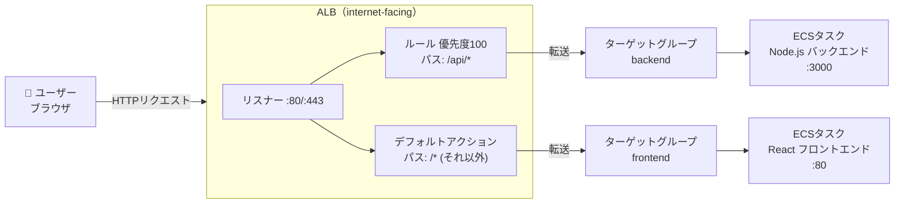
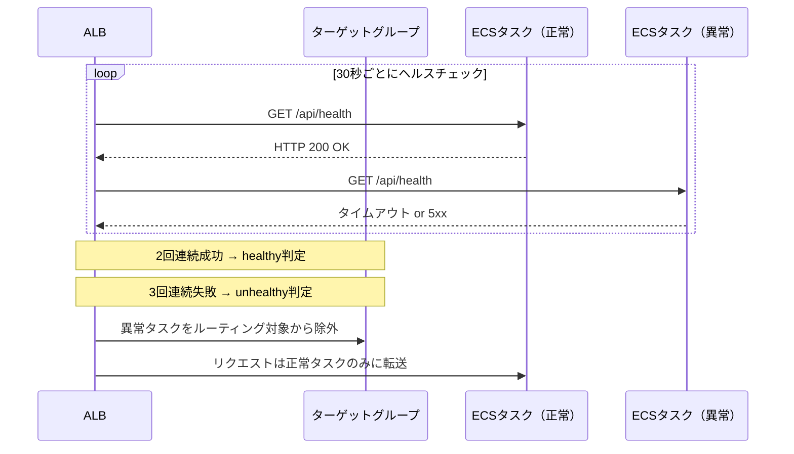

# Knowledge 07: ロードバランサーとALB

Task 7（ALB構築・パスベースルーティング）の前に理解しておくべき概念。

---

## なぜロードバランサーが必要か

複数のコンテナ（ECSタスク）にリクエストを均等に分散させるため。また：
- タスクが起動・停止するたびにIPが変わるが、ALBのDNS名は固定
- ヘルスチェックで異常なタスクにはルーティングしない
- SSL終端（HTTPSの処理）をALBで行いコンテナの負荷を軽減

---

## AWSのロードバランサー3種類

| タイプ | OSIレイヤー | プロトコル | 主な用途 |
|--------|-----------|----------|---------|
| ALB（Application LB） | L7（アプリ層） | HTTP/HTTPS/gRPC/WebSocket | WebアプリのHTTPルーティング（TaskFlowはこれ） |
| NLB（Network LB） | L4（トランスポート層） | TCP/UDP/TLS | 超低レイテンシ・固定IP・TCPベースのサービス |
| GLB（Gateway LB） | L3（ネットワーク層） | IP（全プロトコル） | ファイアウォール・IDS/IPSなどセキュリティアプライアンスの挿入 |

---

### ALB（Application Load Balancer）

**仕組み：**
HTTPリクエストの中身（URLパス・ホスト名・ヘッダー・クエリパラメータなど）を見てルーティングを決める。「インテリジェントな交通整理員」。

**できること：**
- パスベースルーティング（`/api/*` → バックエンド、`/*` → フロントエンド）
- ホストベースルーティング（`api.example.com` → バックエンド、`app.example.com` → フロントエンド）
- HTTPSのSSL終端（証明書をALBに持たせ、ALB→ECS間はHTTPに）
- WebSocket・HTTP/2・gRPC対応
- 認証（Cognitoやソーシャルログインと連携）
- WAF（Web Application Firewall）のアタッチ

**ターゲット：** EC2インスタンス / コンテナIP（Fargate必須） / Lambda関数 / 別のALB

**ユースケース：**
- WebアプリケーションのHTTP/HTTPSトラフィック分散（最も一般的）
- マイクロサービスのAPIゲートウェイ代わり
- ECS Fargate + ALBの組み合わせ（TaskFlowはこれ）
- 1つのALBで複数サービスを捌くパスベース構成

**デメリット：**
- NLBと比べてレイテンシがやや高い（L7処理のオーバーヘッド）
- 固定IPを持てない（DNSで名前解決するため）
- TCPの生ソケット通信には使えない

---

### NLB（Network Load Balancer）

**仕組み：**
TCPパケットのIPアドレスとポートだけを見てルーティングする。HTTPの中身は見ない。「超高速で宛先だけ書き換える転送装置」。

**できること：**
- **固定IP（Elastic IP）を持てる** ← ALBとの最大の違い
- 毎秒数百万リクエストを処理できる超高スループット
- **レイテンシが非常に低い**（ALBの数分の1）
- TLS終端（TCPレベルの暗号化終端）
- クライアントIPをそのまま転送できる（ALBはX-Forwarded-Forヘッダーで渡す）
- UDP対応（ALBはUDPを扱えない）

**ターゲット：** EC2インスタンス / コンテナIP / ALB

**ユースケース：**
- ゲームサーバー（UDP通信・超低レイテンシが必要）
- IoTデバイスとのTCP/UDP通信
- 固定IPが必要な場合（取引先のIPホワイトリスト登録など）
- NLB → ALBの2段構成（固定IP + L7ルーティングの両立）
- DNS以外でIPで直接アクセスさせたい場合

**デメリット：**
- HTTPの中身を見られないため、パスベースルーティングが不可
- ヘルスチェックがL4レベルのみ（HTTPの200チェックなどL7レベルは限定的）
- WAFをアタッチできない（NLB + ALBの2段構成なら可能）

---

### GLB（Gateway Load Balancer）

**仕組み：**
ネットワークトラフィックをまるごとサードパーティのセキュリティアプライアンス（仮想ファイアウォール・IDS/IPSなど）に通してから転送する。「トラフィックをセキュリティ検査装置に強制的に通す門」。

**できること：**
- 全トラフィック（IPレベル）をセキュリティ仮想アプライアンスへ透過転送
- アプライアンスをスケールアウト（複数台に分散）
- 検査済みトラフィックを元の経路に戻す（透過型）

**ターゲット：** セキュリティアプライアンスのEC2インスタンス（Palo Alto・Fortinet・CheckPoint等）

**ユースケース：**
- 金融・医療・官公庁など規制要件でネットワーク全体の検査が必要な環境
- AWSマーケットプレイスのサードパーティ製ファイアウォール・IDS/IPS製品の導入
- セキュリティ監査ログのためにトラフィックをミラーリング

**デメリット：**
- 一般的なWebアプリには不要（大幅なコスト増・構成の複雑化）
- セキュリティアプライアンスのライセンス費用が別途必要
- レイテンシがALB/NLBより高い（全トラフィックが検査を通るため）

---

### 選択基準フローチャート

```
HTTPの中身（パス・ヘッダー等）を見てルーティングしたいか？
  → YES: ALB ✅

固定IPが必要か / UDP通信が必要か / 超低レイテンシが必要か？
  → YES: NLB ✅

固定IP + L7ルーティングの両方が必要か？
  → YES: NLB（前段）+ ALB（後段）の2段構成 ✅

サードパーティのファイアウォール/IDS/IPSを全トラフィックに適用したいか？
  → YES: GLB ✅
```

### 選択基準まとめ表

| 判断軸 | ALB | NLB | GLB |
|--------|-----|-----|-----|
| HTTP/HTTPSのWebアプリ | **最適** | 不向き | 不向き |
| パス・ホストでルーティング | **可能** | 不可 | 不可 |
| 固定IPが必要 | 不可 | **可能** | 不可 |
| 超低レイテンシ（1ms以下） | 不向き | **最適** | 不向き |
| UDP対応 | 不可 | **可能** | 可能 |
| WAFのアタッチ | **可能** | 不可 | 不可 |
| セキュリティアプライアンス挿入 | 不可 | 不可 | **最適** |
| ECS Fargate | **最適** | 可能 | 不可 |
| コスト感 | 中 | 中 | 高 |

**HTTPSのWebアプリにはほぼ必ずALBを選ぶ。** NLBはゲーム・IoT・固定IPが必要な特殊ケース、GLBはエンタープライズのセキュリティ要件がある場合のみ検討する。

---

## ALBの構成要素

```
ALB（受付）
 └── リスナー（:80や:443で待ち受ける）
       └── リスナールール（条件に合うリクエストをどこに転送するか）
             └── ターゲットグループ（転送先のコンテナ群）
                   └── ターゲット（個々のコンテナIP:ポート）
```

**リスナー：** どのポートでリクエストを受け付けるかの定義。HTTP(80)とHTTPS(443)で別々のリスナーを作る。

**リスナールール：** 条件（パス・ホスト名・ヘッダー等）に合致するリクエストをどのターゲットグループに転送するかを定義。優先度順に評価され、最初にマッチしたルールが適用される。

**ターゲットグループ：** 転送先の集合。実際のコンテナIPは動的に登録・解除される（ECSサービスがALBと連携して自動で行う）。

---

## パスベースルーティング

1つのALBで複数のサービスを受け付ける仕組み。TaskFlowでの設計：

| 条件 | 転送先 | 優先度 |
|------|--------|--------|
| パスが `/api/*` | Backend ECS | 100（先に評価） |
| デフォルト（それ以外全て） | Frontend ECS | - |

> 図: ALBのパスベースルーティング構成（/api/* → Backend ECS、/* → Frontend ECS）



**優先度の考え方：**
- 数値が小さいほど先に評価される
- より限定的なルールを先に（`/api/users`などの具体的なパスを先に、`/*`は最後に）
- デフォルトアクションには優先度がなく、全ルールに一致しなかった場合に適用

---

## ターゲットタイプ

| タイプ | 登録方法 | 使う場面 |
|--------|---------|---------|
| `ip` | コンテナのIPアドレスで登録 | Fargate（必須） |
| `instance` | EC2インスタンスIDで登録 | EC2モード |
| `lambda` | Lambda関数ARNで登録 | Lambda |

Fargateではコンテナに動的にIPが割り当てられ、EC2インスタンスIDがないため `ip` を指定する必要がある。

---

## ヘルスチェックの設計

ALBは定期的にターゲット（コンテナ）にリクエストを送り、正常かどうかを確認する。異常なターゲットにはリクエストを送らない。

> 図: ALBのヘルスチェックフロー（正常・異常それぞれの挙動）



**設定パラメータの意味：**

| パラメータ | 推奨値 | 意味 |
|-----------|--------|------|
| `path` | `/api/health`（バック）, `/`（フロント） | チェック先のエンドポイント |
| `interval` | 30秒 | チェックの間隔 |
| `timeout` | 5秒 | レスポンスを待つ時間 |
| `healthy_threshold` | 2 | N回連続成功でhealthy判定 |
| `unhealthy_threshold` | 3 | N回連続失敗でunhealthy判定 |
| `matcher` | 200 | 成功とみなすHTTPステータスコード |

**ヘルスチェック専用エンドポイントを用意する理由：**
`/` はHTMLを返すが、`/api/health` は `{"status":"ok"}` のような軽いJSONを返すだけで良い。DBへの死活監視も組み込んだ「Deep Health Check」にするかは要件次第。

---

## internal vs internet-facing

| 設定 | 意味 | 用途 |
|------|------|------|
| `internet-facing`（`internal=false`） | パブリックIPが付き、インターネットからアクセス可能 | ユーザー向けのフロントエンドALB |
| `internal`（`internal=true`） | VPC内からのみアクセス可能 | マイクロサービス間通信、バックエンドだけ公開したくない場合 |

TaskFlowでは全てのリクエストをこの1つのALBで受けるため `internet-facing`。

---

## ALBとHTTPS

本番では443(HTTPS)リスナーを使い、ACM（AWS Certificate Manager）の証明書をアタッチする。
- 証明書はACMで無料取得・自動更新
- 80→443のリダイレクトもリスナーのアクションで設定できる（80のデフォルトアクションを「HTTPSにリダイレクト」に設定）
- SSL終端はALBで行い、ALB→ECS間はHTTPで通信するのが一般的（VPC内は信頼できるネットワーク）
