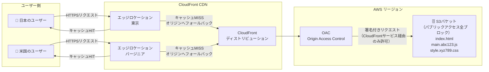
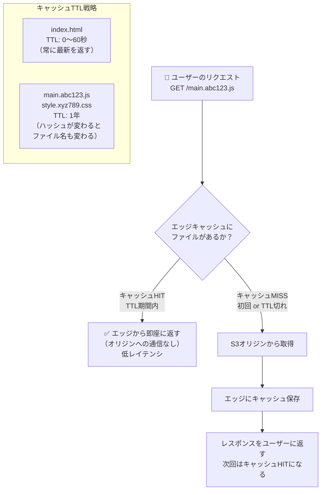

# Knowledge 10: S3とCloudFront

Task 10（S3 + CloudFront設定）の前に理解しておくべき概念。

---

## なぜReactアプリをS3 + CloudFrontで配信するのか

Reactアプリを `npm run build` するとHTML・CSS・JavaScriptの**静的ファイル**が生成される。静的ファイルはWebサーバー（ECS上のNginx等）で配信することもできるが、S3 + CloudFrontの方が優れている。

| 比較軸 | ECSで配信 | S3 + CloudFront |
|--------|----------|----------------|
| スケール | ECSタスク数に依存 | 自動（事実上無制限） |
| コスト | ECS稼働時間の課金 | 保存容量 + 転送量のみ |
| レイテンシ | ALBのリージョンのみ | 世界中のエッジで低レイテンシ |
| 管理 | コンテナの運用が必要 | ファイルをS3に置くだけ |

---

## S3とは

**Simple Storage Service** — AWSのオブジェクトストレージ。ファイルを「バケット」に「オブジェクト」として保存する。

**重要な特性：**
- バケット名はAWS全体でグローバルに一意（全ユーザー共通）
- 容量制限なし（1オブジェクトは5TBまで）
- デフォルトでプライベート（パブリックアクセスは明示的に許可が必要）
- リージョンを選んで作成する（CloudFrontと組み合わせる場合は任意のリージョンで良い）

**バケット名のベストプラクティス：**
`taskflow-frontend-<アカウントID>` のようにアカウントIDを含めると一意性を確保しやすい。

---

## CloudFrontとは

**CDN（Content Delivery Network）** — 世界中の「エッジロケーション（中継サーバー）」にコンテンツをキャッシュし、ユーザーに最も近い場所から配信する仕組み。

東京のユーザーが東京のエッジから受け取るのと、米国のS3バケットから直接受け取るのでは体感速度が大きく違う。

**ディストリビューション：** CloudFrontの設定単位。オリジン（コンテンツの取得元）・キャッシュ設定・ドメイン等を定義する。

---

## OAC（Origin Access Control）

CloudFrontだけがS3にアクセスできるように制限する仕組み。S3のバケットポリシーと組み合わせて使う。

> 図: S3 + CloudFrontの静的ファイル配信構成（OACを使ったアクセス制御）



**なぜS3を直接公開しないのか：**
- S3の直接URLでもアクセスできてしまうと、CloudFrontのキャッシュや認証（WAF等）をバイパスできてしまう
- CloudFront経由に統一することでアクセスログも一元管理できる

**設定の流れ：**
1. CloudFrontにOACを作成
2. S3バケットポリシーで「CloudFrontサービスプリンシパルかつ特定のディストリビューションからのアクセスのみ許可」
3. S3のパブリックアクセスはブロックしたまま

---

## パブリックアクセスブロックの設定

S3には4種類のパブリックアクセスブロック設定がある。CloudFront + OAC構成では全てブロック（全てtrue）に設定する。

| 設定 | 意味 |
|------|------|
| BlockPublicAcls | ACLによるパブリック許可をブロック |
| IgnorePublicAcls | 既存のパブリックACLを無視 |
| BlockPublicPolicy | パブリックを許可するバケットポリシーをブロック |
| RestrictPublicBuckets | パブリックバケットポリシー経由のアクセスを制限 |

「全部ブロックしたらCloudFrontからも見えないのでは？」→ OACを使ったCloudFrontからのアクセスはサービスプリンシパル（CloudFrontサービス）経由なので、パブリックアクセスブロックとは別の経路で許可される。

---

## SPAのルーティング問題とエラードキュメント

Reactアプリは **SPA（Single Page Application）** のため、全てのURLのルーティングをJavaScriptが担う。

問題：ユーザーが `/tasks/123` を直接開くと、S3は `tasks/123` というオブジェクトを探して見つからず**404エラー**を返す。

解決策：CloudFrontのエラーページ設定で「404エラーが返ってきたら、代わりに `/index.html` を返す（ステータス200で）」を設定する。これでReactのルーターが `/tasks/123` を処理できる。

---

## キャッシュ設計

CloudFrontのキャッシュにより、コンテンツをエッジに保持する。静的ファイルのキャッシュ戦略：

> 図: CloudFrontのキャッシュフロー（エッジキャッシュヒットとオリジンフォールバック）



**HTMLファイル（`index.html`）：**
キャッシュしないか、非常に短いTTL（0〜60秒）。HTMLは最新の状態を返す必要がある。

**JS/CSSファイル（`main.abc123.js`等）：**
ビルドするたびにファイル名にハッシュが付く（コンテンツハッシュ）ため、長いTTL（1年）でキャッシュして良い。ファイルが変われば名前も変わるので古いキャッシュが使われる心配がない。

---

## CloudFrontのキャッシュ無効化（Invalidation）

デプロイ後にCloudFrontのキャッシュに古いファイルが残っていると、ユーザーに古いバージョンが見える。

解決策：デプロイ後にインバリデーション（キャッシュクリア）を実行する。
```bash
aws cloudfront create-invalidation \
  --distribution-id EXXXXXXXXX \
  --paths "/*"
```

`/*` は全ファイルのキャッシュを削除。`/index.html` だけ指定することも可能。CI/CDパイプラインの最後に自動実行するのが定番。

---

## 静的ウェブサイトホスティングをオフにする選択肢

S3には「静的ウェブサイトホスティング」機能があるが、CloudFront + OACを使う場合は**有効にしなくて良い**。

- 有効にすると: S3のウェブサイトエンドポイント経由でアクセス可能（OACが使えなくなる）
- 有効にしない: S3のオブジェクトストレージとして使い、CloudFront経由のみアクセス

SPAのルーティング問題はCloudFrontのエラーページ設定で解決できるため、静的ウェブサイトホスティングを有効にする必要はない。
