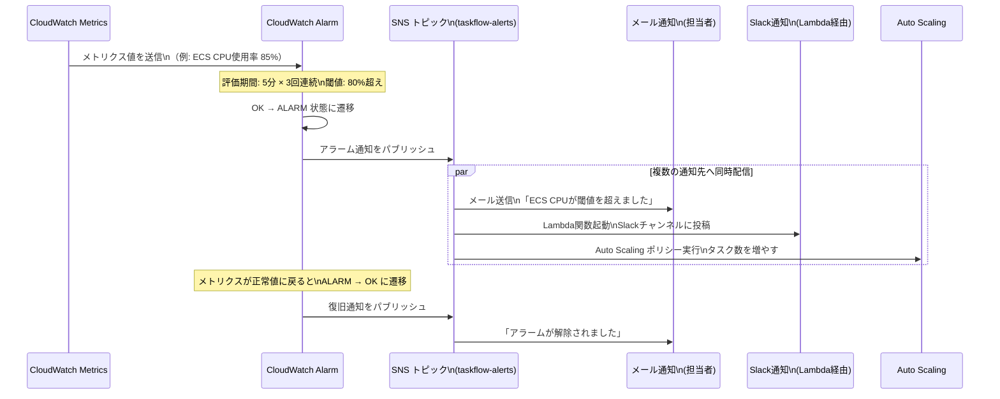

# Knowledge 12: 監視とオブザーバビリティ

Task 12（CloudWatch監視設定）の前に理解しておくべき概念。

---

## なぜ監視が必要か

デプロイしたシステムが「正常に動いているか」「パフォーマンスが劣化していないか」「エラーが出ていないか」をリアルタイムで把握するため。監視がないと：

- ユーザーからのクレームで初めて障害を知る
- どのコンポーネントが問題か特定に時間がかかる
- 問題が発生した時刻のデータがなく原因調査ができない

---

## オブザーバビリティの3本柱

| 柱 | 説明 | AWSでの実現 |
|----|------|-----------|
| メトリクス | 時系列の数値データ（CPU・メモリ・リクエスト数） | CloudWatch Metrics |
| ログ | アプリの出力テキスト（エラーログ・アクセスログ） | CloudWatch Logs |
| トレース | リクエストが各コンポーネントを通る経路と時間 | AWS X-Ray |

TaskFlowではメトリクスとログを中心に設定する。大規模サービスではトレースも重要。

---

## CloudWatchの主要機能

**Metrics（メトリクス）：**
AWSの各サービスが自動的に送信する数値データ。ECSのCPU使用率、ALBのリクエスト数、RDSの接続数など。カスタムメトリクスを送信することもできる。

**Logs（ログ）：**
アプリケーションが出力したテキストを収集・保存・検索する。ECSコンテナのログはタスク定義の `logConfiguration` で設定すると自動でCloudWatch Logsに送られる。

**Alarms（アラーム）：**
メトリクスが閾値を超えたときにアクション（SNS通知・Auto Scaling）を実行する仕組み。

**Dashboard（ダッシュボード）：**
複数のメトリクスやグラフを1画面に表示する。インシデント対応時に状況を素早く把握するために使う。

> 図: CloudWatch監視の全体構成図（メトリクス/ログ/アラーム/ダッシュボードの関係）

```mermaid
graph TD
    subgraph AWSサービス（データ送信元）
        ECS["ECSタスク\nコンテナログ・CPUメトリクス"]
        ALB["ALB\nリクエスト数・レイテンシ・5xx"]
        RDS["RDS\nCPU・接続数・ストレージ"]
        Cache["ElastiCache\nキャッシュヒット率・CPU"]
    end

    subgraph CloudWatch
        Metrics["📊 Metrics\n時系列数値データ"]
        Logs["📄 Logs\nアプリログ・アクセスログ"]
        LogFilter["🔍 メトリクスフィルター\nERROR出現数をカウント"]
        Alarms["🔔 Alarms\n閾値監視"]
        Dashboard["🖥 Dashboard\n全体可視化"]
    end

    ECS -->|メトリクス自動送信| Metrics
    ECS -->|ログ転送\n(logConfiguration)| Logs
    ALB -->|メトリクス自動送信| Metrics
    RDS -->|メトリクス自動送信| Metrics
    Cache -->|メトリクス自動送信| Metrics

    Logs --> LogFilter
    LogFilter -->|カスタムメトリクス化| Metrics
    Metrics -->|閾値チェック| Alarms
    Metrics --> Dashboard
    Alarms --> Dashboard
```

---

## アラームの状態

| 状態 | 意味 |
|------|------|
| OK | メトリクスが正常範囲内 |
| ALARM | 閾値を超えた（アクションが実行される） |
| INSUFFICIENT_DATA | データが足りない（リソース起動直後など） |

**評価期間（EvaluationPeriods）と期間（Period）：**
「Period=5分間のデータポイントをEvaluationPeriods=3回連続してALARMと判定されたらアラーム発火」のように設定できる。単発のスパイクで誤検知しないよう、連続してN回超えた場合のみ発火させる。

---

## SNSとは

**Simple Notification Service** — メール・SMS・HTTPエンドポイント等への通知配信サービス。

**トピック：** 通知チャンネルの単位。「taskflow-alertsというトピックに送ると、登録した全員にメールが届く」という使い方。

**サブスクリプション：** トピックに対する通知先（メールアドレス・電話番号・Lambda等）の登録。メールサブスクリプションは作成後に確認メールのリンクをクリックするまで有効にならない。

---

## 監視すべきメトリクス（TaskFlow）

**ECSサービス：**
- `CPUUtilization`: 80%超えで警戒。継続して高い場合はスケールアウトを検討
- `MemoryUtilization`: 90%超えはOOM（メモリ不足でコンテナが落ちる）のリスク

**ALB：**
- `RequestCount`: トラフィックの急増・急減の検知
- `HTTPCode_ELB_5XX_Count`: ALB自体のエラー（ターゲットが全部unhealthy等）
- `HTTPCode_Target_5XX_Count`: バックエンドアプリのエラー（5xx応答）
- `TargetResponseTime`: レスポンスタイムの劣化検知

**RDS：**
- `CPUUtilization`: 80%超えは深刻。クエリの最適化かインスタンスアップグレードを検討
- `DatabaseConnections`: 上限に近づくと接続エラーが発生する
- `FreeStorageSpace`: 0になるとDBが停止する（要アラーム設定）

**ElastiCache：**
- `CacheHitRate`: 低下するとキャッシュが効いていない（TTL設定や容量を見直す）
- `EngineCPUUtilization`: 高い場合はコマンドの効率化やスケールアップを検討

---

> 図: アラーム発火からSNS通知までのフロー



## ログのメトリクスフィルター

CloudWatch Logsのログテキストを監視し、特定のパターン（`ERROR`・`WARN`等）が出現した回数をメトリクス化できる。

```
[ECS Backend のログ] → CloudWatch Logs → メトリクスフィルター（ERROR出現数をカウント）
                                               → CloudWatch Alarm（閾値超えでSNS通知）
```

ログを見に行くのではなく、「エラーが○回出たら通知」という形にすることで問題を自動検知できる。

---

## ダッシュボードの設計原則

- **1画面で全体像を把握できる**：5〜8個のウィジェットが目安
- **リクエスト → サービス → DB の流れで並べる**：問題の追跡がしやすい
- **正常時の値を知っておく**：ベースラインを把握していないと「異常かどうか」が判断できない
- **インシデント対応で使う**：作って終わりではなく実際のトラブルシューティングで参照する習慣を付ける

---

## アラーム閾値の決め方

「何%でアラームを上げるべきか」はシステムの特性によって異なる。

**方針：**
1. まずシステムを動かしてCloudWatchで正常時の値のレンジを把握する
2. 正常値の上限 + バッファで閾値を設定する
3. 誤検知が多い場合は閾値を上げるか評価回数を増やす
4. 本番インシデント後に閾値が適切だったか振り返って調整する

最初から完璧な閾値は設定できない。運用しながら調整していく。
