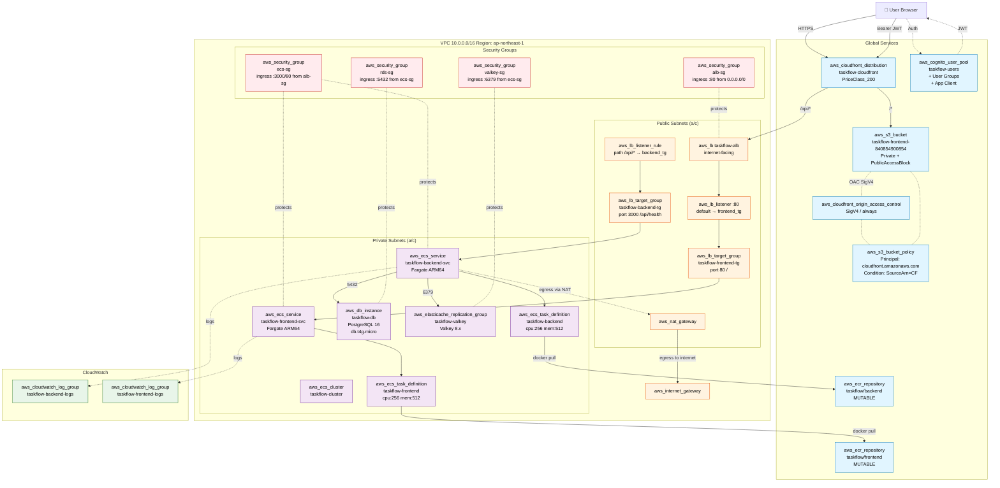
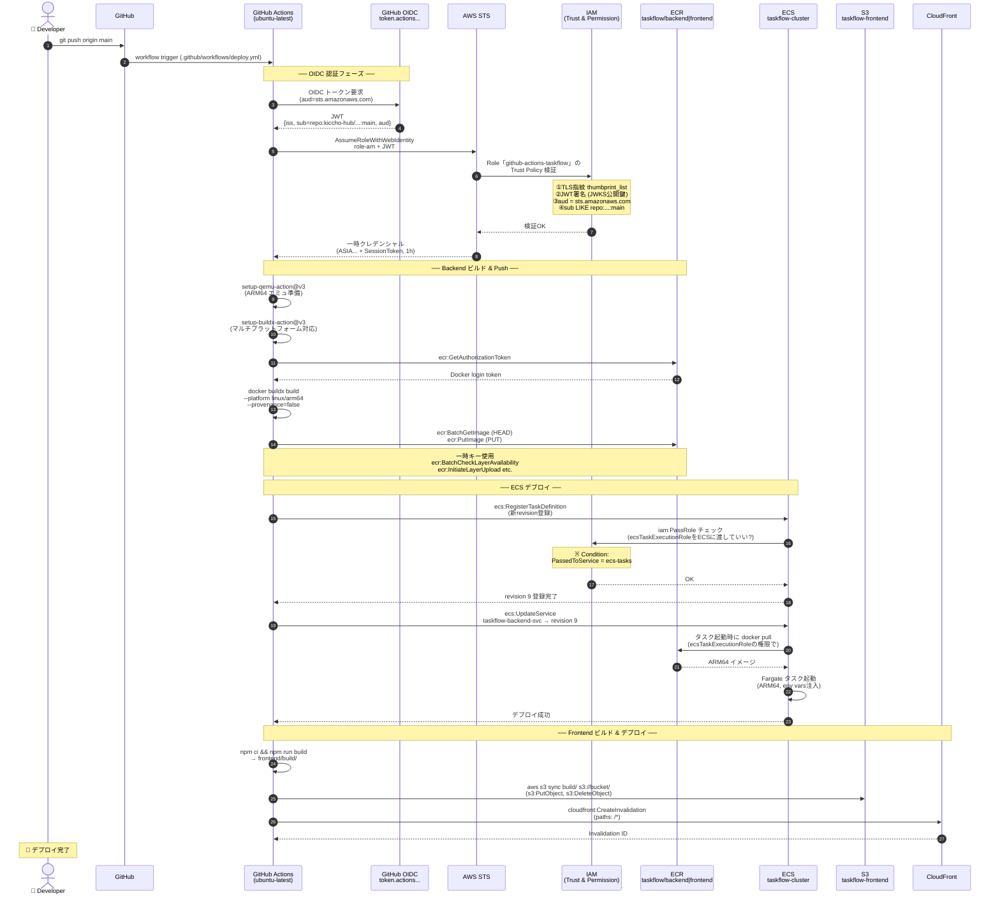
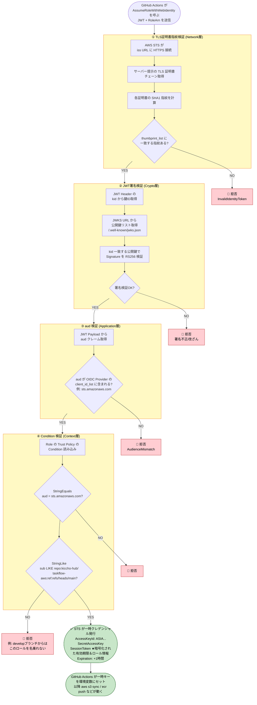

# TaskFlow アーキテクチャ図解集

> 全 12 タスクで構築した TaskFlow の全体像を 4 枚の Mermaid 図で視覚化。
> 目的：各 Terraform リソースがどこに配置され、どう連動し、IAM がどう作用するかを一望する。

---

## 目次

1. [図 1：全体アーキテクチャ（Terraform リソース粒度）](#図-1全体アーキテクチャterraform-リソース粒度)
2. [図 2：CI/CD フロー（GitHub Actions → AWS）](#図-2cicd-フローgithub-actions--aws)
3. [図 3：IAM 関係図（誰が誰にどう権限を与える）](#図-3iam-関係図誰が誰にどう権限を与える)
4. [図 4：OIDC 認証の 4 段階ガード（ズームイン）](#図-4oidc-認証の-4-段階ガードズームイン)
5. [読み解きのガイド](#読み解きのガイド)
6. [Terraform リソースとのマッピング](#terraform-リソースとのマッピング)

---

## 図 1：全体アーキテクチャ（Terraform リソース粒度）

ユーザーリクエストの通り道と、各 Terraform リソースがどこに配置されるかの全景。



### ポイント

- **CloudFront** はグローバルサービスで、`/api/*` を ALB に、`/*` を S3 に振り分ける
- **ECS タスク** は Private Subnet に配置し、ALB 経由でのみ外部到達可能（セキュリティ原則）
- **Security Group** は色分け表示：SG 同士の参照（`from alb-sg` など）が重要
- **NAT Gateway** は Private → 外への出口（ECR pull など）

---

## 図 2：CI/CD フロー（GitHub Actions → AWS）

git push から本番デプロイまでの全ステップ。



### ポイント

- **OIDC フェーズ**：GitHub → JWT → STS → 一時クレデンシャル発行（永続鍵ゼロ）
- **ビルドフェーズ**：QEMU + Buildx で x86_64 ランナーから ARM64 イメージを生成
- **デプロイフェーズ**：タスク定義登録時に `iam:PassRole` がチェックされる
- **並列フェーズ**：Backend と Frontend は独立ジョブとして同時進行

---

## 図 3：IAM 関係図（誰が誰にどう権限を与える）

CI/CD と ECS で動く**全ロール・全ポリシー**の関係を一望。

```mermaid
graph TB
    subgraph "外部ID発行者"
        GH[GitHub OIDC Provider<br/>token.actions.githubusercontent.com]
    end

    subgraph "IAM OIDC Provider (AWS内に登録)"
        OIDCR[aws_iam_openid_connect_provider<br/>github<br/>━━━━━━━━━━━━━<br/>client_id_list: sts.amazonaws.com<br/>thumbprint_list: 動的 TLS 指紋]
    end

    subgraph "IAM Roles (空の着ぐるみ)"
        RoleGH[aws_iam_role<br/>github-actions-taskflow<br/>━━━━━━━━━━━━━<br/>信頼ポリシー:<br/>Principal.Federated = OIDCR<br/>Action: sts:AssumeRoleWithWebIdentity<br/>Condition:<br/>・aud=sts.amazonaws.com<br/>・sub LIKE repo:kiccho-hub/taskflow-aws:<br/>　ref:refs/heads/main]

        RoleExec[ecsTaskExecutionRole<br/>━━━━━━━━━━━━━<br/>信頼ポリシー:<br/>Principal.Service = ecs-tasks.amazonaws.com<br/>Action: sts:AssumeRole]

        RoleTask[ecsTaskRole<br/>(タスク内から使う権限用<br/>現状未使用)]
    end

    subgraph "IAM Policies (権利書)"
        PolGH[aws_iam_role_policy<br/>github-actions-taskflow-policy<br/>━━━━━━━━━━━━━<br/>Statement:<br/>① ecr:GetAuthorizationToken 他<br/>② ecr:BatchGetImage / PutImage 他<br/>③ ecs:UpdateService / Register...<br/>④ s3:PutObject / Delete / ListBucket<br/>⑤ cloudfront:CreateInvalidation<br/>⑥ iam:PassRole to ecs-tasks]

        PolExec[AmazonECSTaskExecutionRolePolicy<br/>(AWSマネージド)<br/>━━━━━━━━━━━━━<br/>ecr:GetAuthorizationToken<br/>ecr:BatchGetImage<br/>ecr:GetDownloadUrlForLayer<br/>logs:CreateLogStream<br/>logs:PutLogEvents]
    end

    subgraph "変身するモノ (Principal)"
        GHA[GitHub Actions Workflow<br/>deploy.yml]
        ECSTask[ECS Fargate Task<br/>taskflow-backend container]
    end

    subgraph "アクセス先リソース"
        ECR2[ECR<br/>taskflow/backend|frontend]
        ECSSvc[ECS Service<br/>taskflow-backend-svc]
        S3Buck[S3<br/>taskflow-frontend bucket]
        CFDist[CloudFront Distribution]
        LG[CloudWatch Log Group<br/>taskflow-backend-logs]
    end

    GH -.発行.- OIDCR
    OIDCR -.信頼登録.- RoleGH

    GHA -->|① OIDC JWT提示| OIDCR
    OIDCR -->|② 認証OK| GHA
    GHA -->|③ AssumeRoleWithWebIdentity<br/>で変身| RoleGH

    RoleGH -.宛名.- PolGH
    PolGH -->|ecr権限で| ECR2
    PolGH -->|ecs権限で| ECSSvc
    PolGH -->|s3権限で| S3Buck
    PolGH -->|cloudfront権限で| CFDist
    PolGH -->|iam:PassRole で ECSに<br/>ecsTaskExecutionRoleを指定| ECSSvc

    ECSSvc -->|タスク起動時<br/>ecsTaskExecutionRole を着せる| ECSTask
    ECSTask -.変身.-> RoleExec
    RoleExec -.宛名.- PolExec
    PolExec -->|ECR pull| ECR2
    PolExec -->|logs書き込み| LG

    classDef external fill:#ffecb3,stroke:#ff6f00,color:#000
    classDef role fill:#c5e1a5,stroke:#33691e,color:#000
    classDef policy fill:#b3e5fc,stroke:#01579b,color:#000
    classDef principal fill:#f8bbd0,stroke:#880e4f,color:#000
    classDef resource fill:#d1c4e9,stroke:#4527a0,color:#000

    class GH,OIDCR external
    class RoleGH,RoleExec,RoleTask role
    class PolGH,PolExec policy
    class GHA,ECSTask principal
    class ECR2,ECSSvc,S3Buck,CFDist,LG resource
```

### この図の読み方（重要 3 原則）

| 関係 | 矢印の意味 | 例 |
|------|-----------|-----|
| **信頼ポリシー** | 点線「信頼登録」「変身」 | GitHub Actions → github-actions-taskflow ロール |
| **権限ポリシー** | 点線「宛名」（ポリシー → ロール） | github-actions-taskflow-policy の宛先は github-actions-taskflow ロール |
| **PassRole** | 実線「指定」 | GitHub Actions がECSに「ecsTaskExecutionRoleを使え」と**指示** |

**ポイント**：
- 変身するのは **人（GitHub Actions, ECS Task）**
- 着る着ぐるみは **ロール**
- ロールに付く権利書が **ポリシー**
- **PassRole は「他人のロールを別サービスに渡す特殊権限」**

---

## 図 4：OIDC 認証の 4 段階ガード（ズームイン）

`AssumeRoleWithWebIdentity` で AWS STS が行う検証の詳細。



### ポイント

- **4 つの独立したガード**が順に評価される（どれか 1 つでもコケたら拒否）
- **①②は TLS/JWT レイヤー、③④は IAM レイヤー**という階層の違いを意識
- **SessionToken には暗号化された有効期限とロール情報が含まれる**（一時キーは3点セット必須の理由）

---

## 読み解きのガイド

### 各図の使い分け

| 図 | 主な用途 | 見るとわかること |
|----|---------|---------------|
| **図1 全体アーキ** | 紙の設計図として | どのリソースがどこに配置され、何と繋がっているか |
| **図2 CI/CD 時系列** | デバッグ・動作確認時 | push から deploy 完了までの全ステップ |
| **図3 IAM 関係** | 権限設計を考えるとき | ロールとポリシーが誰から誰へ、どう付与されているか |
| **図4 OIDC 4段階** | 認証エラー発生時 | どのガードでコケたか特定 |

### 図 3 の「覚えるべき 5 つ」

```
① OIDC Provider = 信頼登録（ARN を生成）
② Role の Trust Policy = 誰が着られるか（Principal + Action + Condition）
③ Role の Permission Policy = 着た人が何できるか（Action + Resource）
④ PassRole = 他人のロールを別サービスに指定する特殊権限
⑤ Service Role (ecsTaskExecutionRole) = ECSが勝手に着るロール
```

---

## Terraform リソースとのマッピング

| Mermaid のノード名 | Terraform リソースタイプ |
|------------------|----------------------|
| `aws_cloudfront_distribution` | `aws_cloudfront_distribution.frontend` |
| `aws_cloudfront_origin_access_control` | `aws_cloudfront_origin_access_control.frontend` |
| `aws_s3_bucket_policy` | `aws_s3_bucket_policy.frontend` |
| `aws_iam_openid_connect_provider` | `aws_iam_openid_connect_provider.github` |
| `aws_iam_role` (github-actions-taskflow) | `aws_iam_role.github_actions` |
| `aws_iam_role_policy` | `aws_iam_role_policy.github_actions` |
| `aws_ecs_cluster` | `aws_ecs_cluster.main` |
| `aws_ecs_service` (backend) | `aws_ecs_service.backend` |
| `aws_ecs_task_definition` (backend) | `aws_ecs_task_definition.backend` |
| `aws_lb` | `aws_lb.main` |
| `aws_lb_listener` | `aws_lb_listener.http` |
| `aws_lb_listener_rule` | `aws_lb_listener_rule.api` |
| `aws_lb_target_group` | `aws_lb_target_group.backend` / `frontend` |
| `aws_security_group` (alb-sg) | `aws_security_group.alb` |
| `aws_db_instance` | `aws_db_instance.main` |
| `aws_elasticache_replication_group` | `aws_elasticache_replication_group.main` |
| `aws_ecr_repository` | `aws_ecr_repository.backend` / `frontend` |
| `aws_cognito_user_pool` | `aws_cognito_user_pool.main` |

---

## 使い方Tips

この 4 枚セットで理解できること：

```
「何がどこに配置されてるか」      → 図1
「コミットからデプロイまでの流れ」  → 図2
「誰が何の権限を持ってるか」       → 図3
「OIDCの認証はどう動くか」         → 図4
```

- **GitHub の Markdown preview** で mermaid が直接レンダリングされる
- **VS Code の Markdown Preview** でも確認可能
- 紙にプリントアウトして壁に貼ると常時参照できる学習ダッシュボードに
- Task 12（監視）の実装時、図 1 を見ながら「どのリソースにアラームを付けるか」を判断できる

---

## 関連ドキュメント

- [IAM 振り返りシート](iam_review.md) — IAM の詳細解説と理解度チェック
- [PROGRESS.md](../PROGRESS.md) — 全 12 タスクの進捗
- [CLAUDE.md](../../CLAUDE.md) — プロジェクト全体ガイド
